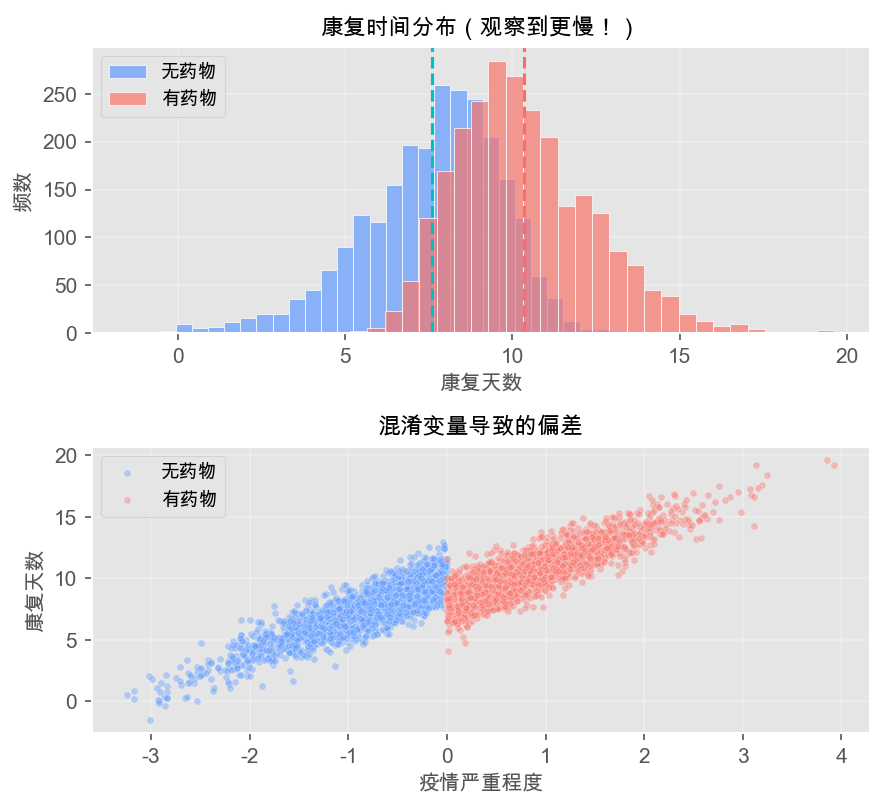

## 自我介绍

::: {.columns}
::: {.column width="65%"}
**陈志远**
 中国人民大学商学院  
助理教授（贸易经济系）
教育部重大青年人才项目
[https://zhiyuanryanchen.github.io](https://zhiyuanryanchen.github.io)  

**教育背景**

- 📜 经济学博士 (2020) — 美国宾州州立大学
  - 导师：Jonathan Eaton, Mark Roberts
  
- 📚 经济学硕士 (2017) — 中国人民大学
  
- 🎓 经济学学士 (2013) — 中国人民大学

:::

::: {.column width="35%"}
**研究专长**

🔬 **主要领域与研究方向**

- **产业经济学**: 创新、产业政策、生产率、数字经济
  
- **国际贸易**: 创新与贸易、全球价值链、贸易政策
  
- **宏观发展**: 金融发展与经济增长

🏆 **研究成果**

论文发表于《经济研究》、RAND Journal of Economics、 Journal of Development Economics 等顶级期刊
:::
:::

::: {.research-mission}
**💡研究理念**

> 致力于将精确的微观估计与有意义的宏观含义相结合，强调理论模型构建和方法论开发。
:::


# 课程介绍 {background-color="#AE0B2A"}
## 这门课讲什么？

::: {.intro-mermaid}
{fig-align="center" width="94%" alt="课程流程图：从机器学习到因果推断的循环"}
:::

::: {.concept-box}
**核心目标**
培养用数据回答"**为什么**"的能力，而不只是"**是什么**"
:::

## 为什么要学这门课？

::: {.columns}
::: {.column width="50%"}
**现实需求**：

- 营销投入真的带来销量增长了吗？
- 新产品上线提升了用户留存吗？
- 培训项目提高了员工绩效吗？
- 政策调整促进了经济发展吗？
:::

::: {.column width="50%"}
**技术趋势**：

- AI时代的核心技能
- 数据驱动决策的标配
- 学术界与业界的通用语言
- 从"跑数"到"洞察"的跃迁
:::
:::

::: {.example-box}
**课程思政**

- 用数据讲好中国故事（政策评估案例）
- 算法公平性与社会责任
- 科技向善的商业伦理观
:::

## 课程安排

::: {.smaller}
| 周次 | 主题 | 内容要点 | 周次 | 主题 | 内容要点 |
|:---:|:---|:---|:---:|:---|:---|
| 1 | 课程导入 | 相关vs因果，课程框架 | 9-10 | ML基础 | 回归，决策树，随机森林 |
| 2-3 | 因果推断基础 | 潜在结果框架，混淆变量 | 11-12 | 广义随机森林 | 异质性处理效应 |
| 4 | 匹配法 | 倾向得分匹配，精确匹配 | 13 | 因果森林 | 异质性分析与应用 |
| 5-6 | 双重差分 | DID原理，平行趋势 | 14 | 双重机器学习 | Double ML原理与应用 |
| 7 | 合成控制法 | 合成控制与应用案例 | 15-16 | 项目答辩 | 期末展示与点评 |
| 8 | 工具变量法 | IV原理，两阶段最小二乘 | | | |
:::
# 核心问题：相关 vs 因果 {background-color="#AE0B2A"}

## 一个看似简单的例子

::: {.example-box}
**案例：新冠停特效药**

某公司研发了新冠治疗特效药"新冠停"。临床数据显示：

::: {style="width: 80%; margin: 0 auto;"}
| 城市类型 | 样本量 | 康复天数 | 标准误 |
|:---|:---:|:---:|:---:|
| 有售卖点城市 | 5,678 | 15.3天 | 1.1 |
| 无售卖点城市 | 131,415 | 10.1天 | 2.1 |
:::
:::

. . .

::: {style="text-align: center; font-size: 1.5em; color: #AE0B2A; margin: 40px 0;"}
**为什么有药的城市康复反而更慢？**
:::

. . .

::: {.warning-box}
**关键洞察**

- 药物只在疫情*严重*地区销售
- 疫情*严重*地区本身康复就*慢*
- 简单比较混淆了*药物效果*和*疫情严重程度*
:::

## 传统编程：Python模拟

让我们用**Python**模拟这个场景，看看选择偏误是如何产生的：

::: {.columns}
::: {.column width="48%"}
::: {style="font-size: 0.78em;"}
```{code}
#| echo: true
#| eval: false
#| fig-width: 6
#| fig-height: 4
#| python.reticulate: false
import numpy as np
import pandas as pd
import matplotlib.pyplot as plt
import matplotlib
matplotlib.rcParams['font.sans-serif'] = ['Arial Unicode MS', 'SimHei']
matplotlib.rcParams['axes.unicode_minus'] = False

np.random.seed(42)
n = 5000
true_effect = -2  # 真实药物效果：减少2天

# 生成混淆变量（疫情严重程度）
severity = np.random.normal(0, 1, n)

# 处理分配：严重程度>0的城市获得药物
treatment = (severity > 0).astype(int)

# 康复时间 = 基础 + 严重程度影响 + 药物效果 + 噪声
recovery = 10 + severity * 3 + treatment * true_effect + \
           np.random.normal(0, 1, n)

data = pd.DataFrame({
    'severity': severity,
    'treatment': treatment,
    'recovery': recovery
})

# 计算结果
treated_mean = data[data['treatment']==1]['recovery'].mean()
control_mean = data[data['treatment']==0]['recovery'].mean()
observed_effect = treated_mean - control_mean

print(f"观察到的差异: {observed_effect:.2f}天")
print(f"真实药物效果: {true_effect:.2f}天")
print(f"选择偏误: {observed_effect - true_effect:.2f}天")
```
:::
:::

::: {.column width="48%"}
```{code}
#| echo: false
#| eval: false
#| fig-width: 6
#| fig-height: 5
#| python.reticulate: false
# 创建可视化
fig, axes = plt.subplots(2, 1, figsize=(6, 5))

# 图1: 康复时间分布
axes[0].hist(data[data['treatment']==0]['recovery'], 
             bins=30, alpha=0.6, label='无药物', color='blue')
axes[0].hist(data[data['treatment']==1]['recovery'], 
             bins=30, alpha=0.6, label='有药物', color='red')
axes[0].axvline(control_mean, color='blue', linestyle='--', linewidth=2)
axes[0].axvline(treated_mean, color='red', linestyle='--', linewidth=2)
axes[0].set_xlabel('康复天数', fontsize=10)
axes[0].set_ylabel('频数', fontsize=10)
axes[0].legend(fontsize=9)
axes[0].set_title('康复时间分布（观察到更慢！）', fontsize=11)

# 图2: 混淆变量的影响
axes[1].scatter(data[data['treatment']==0]['severity'], 
                data[data['treatment']==0]['recovery'], 
                alpha=0.3, s=10, label='无药物', color='blue')
axes[1].scatter(data[data['treatment']==1]['severity'], 
                data[data['treatment']==1]['recovery'], 
                alpha=0.3, s=10, label='有药物', color='red')
axes[1].set_xlabel('疫情严重程度', fontsize=10)
axes[1].set_ylabel('康复天数', fontsize=10)
axes[1].legend(fontsize=9)
axes[1].set_title('混淆变量导致的偏差', fontsize=11)

plt.tight_layout()
plt.show()
```
**📊 上图：康复时间分布**

- 蓝色：无药物城市（均值 ≈ 10天）
- 红色：有药物城市（均值 ≈ 11.85天）
- **反直觉**：有药城市康复更慢！

**📊 下图：混淆变量效应**

- X轴：疫情严重程度
- Y轴：康复天数
- 严重程度高的城市才获得药物
:::
:::

## 用 **R** 验证同样的现象

::: {.columns}
::: {.column width="50%"}
::: {style="font-size: 0.82em;"}
**Step 1: 安装必要的 R 包**

```{r}
#| echo: true
#| eval: false
# 首次运行需要安装（只需执行一次）
install.packages("tidyverse")
install.packages("ggplot2")
install.packages("patchwork")
```

**Step 2: 运行模拟分析**

```{r}
#| echo: true
#| eval: false
#| fig-width: 6
#| fig-height: 3.5
library(tidyverse)

set.seed(42)
n <- 5000
true_effect <- -2

# 生成数据
data <- tibble(
  severity = rnorm(n),
  treatment = ifelse(severity > 0, 1, 0),
  recovery = 10 + severity * 3 +
             treatment * true_effect + rnorm(n)
)

# 计算观察到的平均康复时间
summary_data <- data |>
  group_by(treatment) |>
  summarise(mean_recovery = mean(recovery))

mean_treated <- summary_data$mean_recovery[2]
mean_control <- summary_data$mean_recovery[1]
naive_effect <- mean_treated - mean_control
```


:::
:::

::: {.column width="48%"}
::: {style="font-size: 0.8em;"}
**R 代码生成的可视化结果：**

{fig-align="center" width="95%" alt="R模拟结果：上图显示有药物城市康复时间反而更长，下图显示混淆变量的影响"}

**📋 运行结果：**

::: {style="background: #f5f5f5; padding: 12px; border-radius: 6px; font-family: monospace; font-size: 0.95em;"}
```
观察到的差异: 1.85天
真实药物效果: -2.00天
选择偏误: 3.85天
```
:::

:::
:::
:::


## 传统编程的特点
::: {.concept-box style="font-size: 1.3em;"}
*传统编程的优势与挑战*

✅ *优势*

- 完全控制代码逻辑
- 深入理解算法原理
- 便于调试和优化
- 可重复性高

⚠️ *挑战*

- 需要熟练掌握语法
- 编写时间较长
- 调试可能耗时
- 对初学者门槛较高
:::

## Vibe Coding（氛围编程）：用AI加速 {.smaller}

现在让我们看看**AI时代**的编程方式——"Vibe Coding"（氛围编程，即通过与AI自然对话来编程）：

::: {.columns}
::: {.column width="55%"}
::: {style="font-size: 0.82em;"}
**给Claude的提示词：**

> 帮我写一个Python模拟，展示"新冠停"药物的效果评估中存在的选择偏误问题。
>
> 场景：有一种新冠特效药，但只在疫情严重的城市销售。严重程度会影响康复时间。
>
> 要求：
> 1. 模拟5000个城市
> 2. 药物真实效果是减少2天康复时间
> 3. 疫情严重程度是混淆变量
> 4. 展示简单比较会产生什么偏差
> 5. 画两个图：严重程度分布 + 康复时间分布
> 6. 输出观察到的"效果"vs真实效果

**Claude生成的代码（约10秒）：**
:::

::: {style="font-size: 2em;"}
```{code}
#| echo: true
#| eval: false
#| python.reticulate: false

import numpy as np
import pandas as pd
import matplotlib.pyplot as plt

np.random.seed(42)

# 模拟参数
n = 5000
true_effect = -2

# 生成混淆变量（疫情严重程度）
severity = np.random.normal(0, 1, n)

# 处理分配：严重地区获得药物
treatment = (severity > 0).astype(int)

# 结果：基础时间 + 严重程度影响
# + 药物效果 + 随机误差
recovery = 10 + 3 * severity + \
           true_effect * treatment + \
           np.random.normal(0, 1, n)

# 数据分析
data = pd.DataFrame({
    'severity': severity,
    'treatment': treatment,
    'recovery': recovery
})
obs_effect = data.groupby('treatment')[
    'recovery'].mean().diff().iloc[-1]

print(f"观察到的效果: {obs_effect:.2f}天")
print(f"真实药物效果: {true_effect:.2f}天")
print(f"选择偏误程度: " +
      f"{abs(obs_effect - true_effect):.2f}天")
```
:::
:::

::: {.column width="45%"}
::: {style="font-size: 0.9em; margin-top: 0;"}
**📝 关键代码说明**：

- `np.random.seed(42)`
  - 固定随机种子保证可重复性

- `severity = np.random.normal(0,1,n)`
  - 生成混淆变量（疫情严重程度）

- `treatment = (severity > 0).astype(int)`
  - 处理分配规则：严重→获得治疗

- `recovery = 10 + 3*severity + ...`
  - 结果生成方程
  - 基础：10天
  - 严重程度影响：×3
  - 药物效果：×(-2)
  - 随机误差：正态分布

**💡 核心洞察**：

观察到的"效果"包含两部分：

- ✅ 真实药物效果（-2天）
- ❌ 选择偏误（严重程度的偏差）

**结果：观察到的效果 ≠ 真实效果！**

---

**📋 运行结果示例**：

```
观察到的效果: +1.85天
真实药物效果: -2.00天
选择偏误程度: 3.85天
```

::: {.warning-box style="font-size: 0.85em;"}
⚠️ **注意**：药物本应缩短2天康复时间，但由于选择偏误，观察结果显示反而延长了1.85天！
:::
:::
:::
:::


## 三种编程方式对比

::: {style="width: 95%; margin: 0 auto; font-size:  1.2em"}
| 维度 | 传统Python/R | Vibe Coding (AI辅助) | 说明 |
|:---|:---|:---|:---|
| **编写时间** | 15-30分钟 | 1-2分钟 | AI生成代码速度提升10倍+ |
| **代码质量** | 依赖个人经验 | 标准化、文档完整 | AI自动添加注释和错误处理 |
| **调试时间** | 可能较长 | 通常较短 | AI代码经过大规模训练优化 |
| **学习曲线** | 陡峭 | 平缓 | 降低编程门槛 |
| **适用场景** | 复杂定制需求 | 快速原型、标准分析 | 两者互补而非替代 |
| **核心能力要求** | 语法精通 | 问题描述、提示工程 | AI时代的新技能 |

:::

::: {.callout-tip}
::: {style="font-size:1.3em"}
**课程理念**：本课程将展示**传统编程**与**AI辅助编程**的结合，培养AI时代的因果推断能力。
:::
:::


## 思考题

::: {.example-box style="font-size: 0.95em;"}
*讨论问题*

1. *什么时候应该坚持传统编程？*
   - 提示：考虑代码审查、算法创新、系统稳定性等场景

2. *AI生成的代码可能有哪些隐藏风险？*
   - 提示：数据隐私、错误处理、可解释性

3. *如何验证AI生成代码的正确性？*
   - 提示：模拟检验、边界条件、与理论预期对比
:::

## 模拟实验 {.smaller}

::: {style="font-size: 2em;"}
```{code}
#| echo: true
#| eval: false
#| fig-width: 6
#| fig-height: 4
#| python.reticulate: false
import numpy as np
import pandas as pd
import matplotlib.pyplot as plt
import matplotlib
from ipywidgets import interact, FloatSlider, IntSlider
import ipywidgets as widgets
matplotlib.rcParams['font.sans-serif'] = ['Arial Unicode MS', 'SimHei', 'STHeiti']
matplotlib.rcParams['axes.unicode_minus'] = False
# 导入交互式组件（可选）
try:

    INTERACTIVE_MODE = True
    print("✅ 交互式模式已启用")
except ImportError:
    INTERACTIVE_MODE = False
    print("⚠️  请安装 ipywidgets: pip install ipywidgets")
    print("   或使用手动修改参数的方式")

if not INTERACTIVE_MODE:
    print("⚠️  请先安装 ipywidgets:")
    print("   pip install ipywidgets")
    print("   jupyter nbextension enable --py widgetsnbextension")
else:
    def simulate_and_plot(n_cities=5000, true_drug_effect=-2.0, confound_strength=3.0, random_seed=42):
        """交互式模拟函数"""
        
        np.random.seed(random_seed)
        severity = np.random.normal(0, 1, n_cities)
        treatment = (severity > 0).astype(int)
        recovery = 10 + severity * confound_strength + treatment * true_drug_effect + np.random.normal(0, 1, n_cities)
        
        data = pd.DataFrame({
            'severity': severity,
            'treatment': treatment,
            'recovery': recovery
        })
        
        control_mean = data[data['treatment'] == 0]['recovery'].mean()
        treated_mean = data[data['treatment'] == 1]['recovery'].mean()
        observed_effect = treated_mean - control_mean
        selection_bias = observed_effect - true_drug_effect
        
        # 简化版可视化（4图）
        fig, axes = plt.subplots(2, 2, figsize=(11, 9))
        
        # 图1
        axes[0, 0].hist(data[data['treatment'] == 0]['severity'], bins=25, alpha=0.6, color='blue', label='未获药')
        axes[0, 0].hist(data[data['treatment'] == 1]['severity'], bins=25, alpha=0.6, color='red', label='获得药')
        axes[0, 0].set_title('疫情严重程度分布', fontsize=11, fontweight='bold')
        axes[0, 0].legend()
        
        # 图2
        axes[0, 1].bar(['未获药', '获得药'], [control_mean, treated_mean], color=['blue', 'red'], alpha=0.7)
        axes[0, 1].axhline(10, color='gray', linestyle='--', alpha=0.5)
        axes[0, 1].set_ylabel('平均天数')
        axes[0, 1].set_title('康复时间对比', fontsize=11, fontweight='bold')
        
        # 图3
        axes[1, 0].barh(['观察', '真实', '偏误'], 
                       [observed_effect, true_drug_effect, selection_bias],
                       color=['orange', 'green', 'red'], alpha=0.7)
        axes[1, 0].axvline(0, color='black', linewidth=1)
        axes[1, 0].set_xlabel('天数')
        axes[1, 0].set_title('效应分解', fontsize=11, fontweight='bold')
        
        # 图4
        axes[1, 1].scatter(data[data['treatment'] == 0]['severity'], 
                          data[data['treatment'] == 0]['recovery'],
                          alpha=0.3, s=15, color='blue', label='未获药')
        axes[1, 1].scatter(data[data['treatment'] == 1]['severity'],
                          data[data['treatment'] == 1]['recovery'],
                          alpha=0.3, s=15, color='red', label='获得药')
        axes[1, 1].set_xlabel('严重程度')
        axes[1, 1].set_ylabel('康复天数')
        axes[1, 1].set_title('混淆效应', fontsize=11, fontweight='bold')
        axes[1, 1].legend()
        
        plt.tight_layout()
        plt.show()
        
        print(f"\n📊 观察效应: {observed_effect:.2f} 天")
        print(f"✅ 真实效应: {true_drug_effect:.2f} 天")
        print(f"⚠️  选择偏误: {selection_bias:.2f} 天\n")
    
    # 创建交互式界面
    interact(
        simulate_and_plot,
        n_cities=IntSlider(value=5000, min=1000, max=10000, step=500, description='城市数量:'),
        true_drug_effect=FloatSlider(value=-2.0, min=-5.0, max=2.0, step=0.5, description='真实药效:'),
        confound_strength=FloatSlider(value=3.0, min=0.0, max=6.0, step=0.5, description='混淆强度:'),
        random_seed=IntSlider(value=42, min=1, max=100, step=1, description='随机种子:')
    )
```
:::

:::{.warning-box}
:::{style="font-size:1em"}
**核心启示**

在观察性研究中，*简单比较两组均值是危险的*！我们必须考虑：

- 处理组和对照组是否可比？
- 是否存在混杂变量？
- 如何处理选择偏误？

这正是因果推断方法（匹配、DID、IV等）要解决的问题！
:::
:::


## 相关性不等于因果性

::: {.columns}
::: {.column width="48%"}
::: {.concept-box}
**相关关系**

$X$与$Y$同时变化

- 冰淇淋销量 $\uparrow$
- 溺水事故 $\uparrow$

**但**：吃冰淇淋不会导致溺水！
:::
:::

::: {.column width="48%"}
::: {.concept-box}
**因果关系**

改变$X$导致$Y$变化

- 强制每人吃冰淇淋
- 溺水事故 $\rightarrow$ 不变

**真正原因**：气温（混淆变量）
:::
:::
:::

::: {style="text-align: center; margin-top: 30px;"}
{fig-align="center" width="94%" alt="相关关系vs因果关系流程图：混淆变量如何造成虚假相关"}
:::

## 更多"相关 $\neq$ 因果"的陷阱

1. **反向因果**：警察越多 $\rightarrow$ 犯罪越多？
   - 可能是：犯罪越多 $\rightarrow$ 部署更多警察

2. **选择偏差**：名校毕业生收入更高？
   - 可能是：能力强的人才能进名校

3. **遗漏变量**：戴眼镜的人更聪明？
   - 可能是：读书多 $\rightarrow$ 近视+知识增长

. . .

::: {.warning-box}
**核心挑战**

**选择性偏误（Selection Bias）** 接受处理的人与未接受处理的人*本身就不一样*！
:::

## 如何识别因果？ {.smaller}

::: {.example-box style="font-size: 0.95em;"}
**讨论问题**

1. **如何判断一个相关性可能是因果关系？**
   - 提示：时间顺序、排除混淆变量、机制解释

2. **为什么随机实验是"黄金标准"？**
   - 提示：随机化如何消除选择偏误

3. **现实中不能做随机实验怎么办？**
   - 提示：观察性研究的替代方法
:::

# 潜在结果框架入门 {background-color="#AE0B2A"}

## 从具体例子开始

::: {.example-box}
**思考题**

假设我们想评估"参加GRE培训"对考试成绩的因果效应：

- 张三参加了培训，考了320分
- 李四没参加培训，考了310分

**问**培训对张三的效应是10分吗？为什么？
:::

. . .

::: {.concept-box}
**关键问题**

我们需要知道：

- 如果张三*没参加*培训，他会考多少分？
- 如果李四*参加*了培训，他会考多少分？

但现实中，一个人*不可能同时*处于两种状态！
:::

## Rubin因果模型

::: {.concept-box}
**核心思想**

每个个体都有**两种潜在状态**：接受处理 vs 不接受处理
:::

::: {style="width: 85%; margin: 0 auto;"}
| 学生 | 处理$D$ | 潜在结果$Y(1)$ | 潜在结果$Y(0)$ | 因果效应 |
|:---:|:---:|:---:|:---:|:---:|
| 张三 | 1（参加培训） | 85 | ? | ? |
| 李四 | 0（未参加） | ? | 78 | ? |
| 王五 | 1（参加培训） | 92 | ? | ? |
:::

::: {.example-box}
**因果效应定义**

个体$i$的处理效应：$\tau_i = Y_i(1) - Y_i(0)$

- 但我们*永远无法同时观测*到$Y_i(1)$和$Y_i(0)$
- 这就是*因果推断的基本问题*
:::

## 观察到的结果

我们实际能看到的是：

$$
Y_i = \begin{cases}
Y_i(1) & \text{if } D_i = 1 \text{（参加处理）} \\
Y_i(0) & \text{if } D_i = 0 \text{（未参加）}
\end{cases}
$$

或等价地写成：

$$
Y_i = Y_i(0) + D_i \times [Y_i(1) - Y_i(0)] \text{（个体因果效应）}
$$

. . .

::: {.warning-box}
**观察陷阱**

简单比较观察到的均值不等于因果效应，因为接受处理的人和未接受处理的人*本身就不一样*！
:::

## 分解观察差异

::: {.concept-box}
**数学分解**

观察到的差异可以分解为两部分：

$$\underbrace{E[Y|D=1] - E[Y|D=0]}_{\text{观察差异}} = \underbrace{E[Y(1)-Y(0)|D=1]}_{\text{ATT}} + \underbrace{E[Y(0)|D=1] - E[Y(0)|D=0]}_{\text{选择偏误}}$$
:::

. . .

::: {.example-box style="font-size: 0.9em;"}
**直观解释**

| 成分 | 含义 | 例子 |
|:---|:---|:---|
| **ATT** | 培训对参加者的真实效应 | 参加培训使成绩提高20分 |
| **选择偏误** | 参加者的"先天优势" | 本来就更努力的学生才参加培训 |
:::


## 随机实验：因果推断的黄金标准

::: {.concept-box}
**随机化的魔力**

如果$D$是随机分配的，则：

$$D \perp Y(0), Y(1) \quad \Rightarrow \quad E[Y(0)|D=1] = E[Y(0)|D=0]$$

选择偏误消失了！
:::

. . .

::: {.example-box}
**A/B测试**

互联网公司常用随机实验：

- 随机将用户分配到A组（旧版页面）或B组（新版页面）
- 比较两组的转化率差异
- 这就是*随机对照试验*（RCT）
:::

. . .

::: {.callout-note}
**但现实中...**

很多情况下无法做随机实验（成本、伦理、可行性），这时需要**观察性研究方法**：

匹配法、双重差分、工具变量、合成控制...
:::

# 课程方法预览 {background-color="#AE0B2A"}

## 我们将学习什么方法？

::: {style="text-align: center;"}
{fig-align="center" width="94%" alt="方法路线图：从RCT到DID、IV、合成控制，再到机器学习方法"}
:::

- **前8周**：经典因果推断方法（经济学主流）
- **后6周**：机器学习与因果推断结合（前沿方法）

## 学习路径

1. **理解原理**：每种方法背后的识别逻辑
2. **掌握应用**：什么时候用、怎么用
3. **代码实现**：Python和R双语言实践
4. **批判思考**：判断方法使用的合理性

. . .

::: {.example-box}
**期末项目**

选择一个真实商业问题：

- 评估某营销活动的真实效果
- 分析某政策的经济影响
- 研究某干预措施的异质性效应

用所学方法完成分析报告，并进行课堂答辩。
:::

# 课程要求 {background-color="#AE0B2A"}

## 考核方式

::: {style="width: 80%; margin: 0 auto;"}
| 考核项目 | 占比 |
|:---|:---:|
| 平时表现（出勤+参与） | 10% |
| 作业（共4次） | 40% |
| 期末项目 | 50% |
| **总计** | **100%** |
:::

. . .

- **作业**：理论题+编程实践，双语言可选
- **期末项目**：小组完成（3-4人），课堂答辩
- **加分项**：高质量课堂参与、优秀项目展示

## 学习资源

**推荐教材**：

- [Angrist \& Pischke:《基本无害的计量经济学》](https://book.douban.com/subject/37285329/)
- [Huntington-Klein《The Effect》](https://book.douban.com/subject/35632221/)
- *[Chernozhukov, V.& Hansen, C. & Kallus, N. & Spindler, M. & Syrgkanis: V. Applied Causal Inference Powered by ML and AI](https://causalml-book.org/)

. . .

**在线资源**：

- Mixtape（Scott Cunningham）：[https://mixtape.scunning.com/](https://mixtape.scunning.com/)
- EconML文档（微软）：[https://econml.azurewebsites.net/](https://econml.azurewebsites.net/)
- 课程GitHub仓库(TBD)：代码、数据、课件 [本科生](https://gitee.com/zhiyuanryanchen/causal-inference-machine-learning) [研究生](https://gitee.com/zhiyuanryanchen/econ-research-methods)[https://gitee.com/zhiyuanryanchen/causal-inference-machine-learning](https://gitee.com/zhiyuanryanchen/causal-inference-machine-learning)
  - [Gitee入门教程](https://gitee.com/xuequnzhu/start_with_Gitee)

. . .

::: {.concept-box}
**Office Hours**

- 时间：周四下午2-3点
- 地点：919办公室
- 邮箱：chenzhiyuan@rmbs.ruc.edu.cn
- 欢迎预约讨论问题！
:::

# 互动演示：参数调整 {background-color="#AE0B2A"}

## Python 交互式模拟器

```{code}
#| echo: true
#| eval: false
#| python.reticulate: false

import numpy as np
import pandas as pd
import matplotlib.pyplot as plt

try:
  from ipywidgets import interact, FloatSlider, IntSlider
  INTERACTIVE_MODE = True
except ImportError:
  INTERACTIVE_MODE = False

if not INTERACTIVE_MODE:
    print("⚠️  请先安装 ipywidgets:")
    print("   pip install ipywidgets")
    print("   jupyter nbextension enable --py widgetsnbextension")
else:
    def simulate_and_plot(n_cities=5000, true_drug_effect=-2.0, confound_strength=3.0, random_seed=42):
        """交互式模拟函数"""
        
        np.random.seed(random_seed)
        severity = np.random.normal(0, 1, n_cities)
        treatment = (severity > 0).astype(int)
        recovery = 10 + severity * confound_strength + treatment * true_drug_effect + np.random.normal(0, 1, n_cities)
        
        data = pd.DataFrame({
            'severity': severity,
            'treatment': treatment,
            'recovery': recovery
        })
        
        control_mean = data[data['treatment'] == 0]['recovery'].mean()
        treated_mean = data[data['treatment'] == 1]['recovery'].mean()
        observed_effect = treated_mean - control_mean
        selection_bias = observed_effect - true_drug_effect
        
        # 简化版可视化（4图）
        fig, axes = plt.subplots(2, 2, figsize=(11, 9))
        
        # 图1
        axes[0, 0].hist(data[data['treatment'] == 0]['severity'], bins=25, alpha=0.6, color='blue', label='未获药')
        axes[0, 0].hist(data[data['treatment'] == 1]['severity'], bins=25, alpha=0.6, color='red', label='获得药')
        axes[0, 0].set_title('疫情严重程度分布', fontsize=11, fontweight='bold')
        axes[0, 0].legend()
        
        # 图2
        axes[0, 1].bar(['未获药', '获得药'], [control_mean, treated_mean], color=['blue', 'red'], alpha=0.7)
        axes[0, 1].axhline(10, color='gray', linestyle='--', alpha=0.5)
        axes[0, 1].set_ylabel('平均天数')
        axes[0, 1].set_title('康复时间对比', fontsize=11, fontweight='bold')
        
        # 图3
        axes[1, 0].barh(['观察', '真实', '偏误'], 
                       [observed_effect, true_drug_effect, selection_bias],
                       color=['orange', 'green', 'red'], alpha=0.7)
        axes[1, 0].axvline(0, color='black', linewidth=1)
        axes[1, 0].set_xlabel('天数')
        axes[1, 0].set_title('效应分解', fontsize=11, fontweight='bold')
        
        # 图4
        axes[1, 1].scatter(data[data['treatment'] == 0]['severity'], 
                          data[data['treatment'] == 0]['recovery'],
                          alpha=0.3, s=15, color='blue', label='未获药')
        axes[1, 1].scatter(data[data['treatment'] == 1]['severity'],
                          data[data['treatment'] == 1]['recovery'],
                          alpha=0.3, s=15, color='red', label='获得药')
        axes[1, 1].set_xlabel('严重程度')
        axes[1, 1].set_ylabel('康复天数')
        axes[1, 1].set_title('混淆效应', fontsize=11, fontweight='bold')
        axes[1, 1].legend()
        
        plt.tight_layout()
        plt.show()
        
        print(f"\n📊 观察效应: {observed_effect:.2f} 天")
        print(f"✅ 真实效应: {true_drug_effect:.2f} 天")
        print(f"⚠️  选择偏误: {selection_bias:.2f} 天\n")
    
    # 创建交互式界面
    interact(
        simulate_and_plot,
        n_cities=IntSlider(value=5000, min=1000, max=10000, step=500, description='城市数量:'),
        true_drug_effect=FloatSlider(value=-2.0, min=-5.0, max=2.0, step=0.5, description='真实药效:'),
        confound_strength=FloatSlider(value=3.0, min=0.0, max=6.0, step=0.5, description='混淆强度:'),
        random_seed=IntSlider(value=42, min=1, max=100, step=1, description='随机种子:')
    )
```


# 总结 {background-color="#AE0B2A"}

## 本讲要点

1. **课程定位**：机器学习（预测）+ 因果推断（归因）$\rightarrow$ 科学决策

2. **核心问题**：相关性 $\neq$ 因果性
   - 混淆变量、选择偏差、反向因果

3. **分析框架**：潜在结果模型
   - 每个个体有两种"潜在"状态
   - 因果推断的基本问题：无法同时观测
   - 随机实验可以消除选择偏误

4. **学习内容**：从经典方法到前沿ML+因果推断

. . .

::: {style="text-align: center; margin-top: 30px;"}
**下一讲：因果推断基础——潜在结果框架深入**
:::

## 

::: {style="text-align: center; margin-top: 80px; font-size: 1.8em;"}
感谢聆听！

欢迎提问与讨论！

chenzhiyuan@rmbs.ruc.edu.cn
:::


:::
