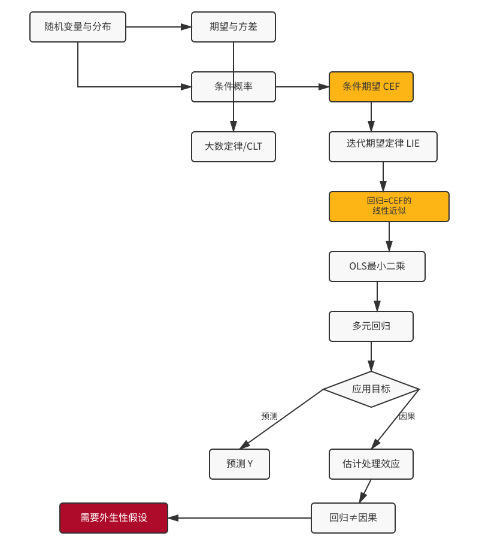

## 上节课回顾

::: {.concept-box}
**核心概念**

- *相关性 ≠ 因果性*：混淆变量会导致虚假相关
- *潜在结果框架*：$Y_i(1)$ vs $Y_i(0)$，个体处理效应不可观测
- *选择偏误*：$E[Y_0|D=1]$ ≠  $E[Y_0|D=0]$
:::

. . .

**本节课目标**：

1. 复习概率与统计基础
2. 理解回归的本质——条件期望
3. 区分"预测"与"因果"两种目标
4. 为后续因果推断方法打下数学基础


# 概率论基础 {background-color="#AE0B2A"}

## 为什么要学概率？

::: {.columns}
::: {.column width="50%"}
**因果推断的不确定性**

- 我们无法同时观察到 $Y_i(1)$ 和 $Y_i(0)$
- 只能基于样本推断总体因果效应
- 需要量化估计的不确定性

::: {.example-box}
**例子**
新药试验中，100人服药、100人服安慰剂

- 观察到的差异可能是"真实效果"或"随机波动"？
- 概率帮助我们回答这个问题
:::
:::

::: {.column width="50%"}
**本节课路线图**

{width=100%}
:::
:::


## 随机变量与分布

::: {.concept-box}
**随机变量 (Random Variable)**

将随机结果映射为数值的函数。分为：

- *离散型*：取值可数（如二项分布、泊松分布）
- *连续型*：取值不可数（如正态分布、均匀分布）
:::

. . .

**正态分布（高斯分布）**

$$X \sim N(\mu, \sigma^2)$$

概率密度函数：
$$f(x) = \frac{1}{\sqrt{2\pi\sigma^2}} \exp\left(-\frac{(x-\mu)^2}{2\sigma^2}\right)$$

::: {.columns}
::: {.column width="50%"}

- 均值：$E[X] = \mu$
- 方差：$Var(X) = \sigma^2$
:::
::: {.column width="50%"}

- 68-95-99.7 规则
- 中心极限定理的基础
:::
:::


## Python：模拟随机变量

::: {.columns}
::: {.column width="55%" style="font-size: 0.85em;"}
```{python}
#| echo: true
#| eval: true
#| fig-width: 8
#| fig-height: 2.8
#| code-line-numbers: "5-6,8-11"
import numpy as np
import matplotlib.pyplot as plt
from scipy import stats

np.random.seed(42)
n = 10000

# Generate samples
normal = np.random.normal(0, 1, n)
binomial = np.random.binomial(10, 0.3, n)
poisson = np.random.poisson(3, n)

# Create 1x3 subplot
fig, axes = plt.subplots(1, 3, figsize=(8, 2.8))

# Normal distribution
x = np.linspace(-4, 4, 1000)
axes[0].hist(normal, bins=30, density=True, alpha=0.6, color='steelblue', edgecolor='white')
axes[0].plot(x, stats.norm.pdf(x, 0, 1), 'r-', lw=2, label='PDF')
axes[0].set_title('Normal N(0,1)')
axes[0].set_xlabel('Value')
axes[0].set_ylabel('Density')
axes[0].legend()

# Binomial distribution
axes[1].hist(binomial, bins=range(12), density=True, alpha=0.6, color='forestgreen', edgecolor='white')
axes[1].set_title('Binomial(10, 0.3)')
axes[1].set_xlabel('Value')
axes[1].set_ylabel('Probability')

# Poisson distribution
axes[2].hist(poisson, bins=range(15), density=True, alpha=0.6, color='coral', edgecolor='white')
axes[2].set_title('Poisson(3)')
axes[2].set_xlabel('Value')
axes[2].set_ylabel('Probability')

plt.tight_layout()
plt.show()

print(f"Normal: mean={normal.mean():.3f}, std={normal.std():.3f}")
print(f"Binomial: mean={binomial.mean():.3f}, var={binomial.var():.3f}")
print(f"Poisson: mean={poisson.mean():.3f}, var={poisson.var():.3f}")
```
:::

::: {.column width="45%"}
::: {.callout-tip style="font-size: 0.85em;"}
*要点*

- `np.random.seed()` 确保结果可重复——科学研究的基本要求！
- 直方图显示样本分布，红线显示理论密度
- 样本统计量接近理论值，体现大数定律
:::

::: {style="font-size: 0.75em; margin-top: 10px;"}
**分布特征：**

| 分布 | 概率函数 | 均值 | 方差 |
|:---|:---|:---:|:---:|
| 正态分布 | $\frac{1}{\sqrt{2\pi\sigma^2}}e^{-\frac{(x-\mu)^2}{2\sigma^2}}$ | $\mu$ | $\sigma^2$ |
| 二项分布 | $\binom{n}{k}p^k(1-p)^{n-k}$ | $np$ | $np(1-p)$ |
| 泊松分布 | $\frac{\lambda^k e^{-\lambda}}{k!}$ | $\lambda$ | $\lambda$ |
:::
:::
:::

::: {.callout-tip}
*要点*：`np.random.seed()` 确保结果可重复——科学研究的基本要求！
:::


## R：同样的模拟

::: {style="font-size: 1em;"}
```{r}
#| eval: true
#| code-line-numbers: "3,6,8,10,12"
# 设置随机种子
set.seed(42)

n_samples <- 10000

# 正态分布 N(0, 1)
normal_data <- rnorm(n_samples, mean = 0, sd = 1)

# 二项分布 Binomial(n=10, p=0.3)
binomial_data <- rbinom(n_samples, size = 10, prob = 0.3)

# 泊松分布 Poisson(λ=3)
poisson_data <- rpois(n_samples, lambda = 3)

# 均匀分布 Uniform(0, 1)
uniform_data <- runif(n_samples, min = 0, max = 1)

# 计算统计量
cat("正态分布 - 均值:", round(mean(normal_data), 3),
    ", 标准差:", round(sd(normal_data), 3), "\n")
cat("二项分布 - 均值:", round(mean(binomial_data), 3),
    ", 方差:", round(var(binomial_data), 3), "\n")
cat("泊松分布 - 均值:", round(mean(poisson_data), 3),
    ", 方差:", round(var(poisson_data), 3), "\n")
```
:::


## 期望与方差

::: {.concept-box}
**期望 (Expected Value)**

随机变量的“长期平均值”：

- 离散型：$E[X] = \sum_i x_i \cdot P(X=x_i)$
- 连续型：$E[X] = \int_{-\infty}^{\infty} x \cdot f(x) dx$
:::

. . .

::: {.concept-box}
**方差 (Variance)**

衡量随机变量的"离散程度"：
$$Var(X) = E[(X - E[X])^2] = E[X^2] - (E[X])^2$$
:::

. . .

**重要性质**

- $E[aX + b] = aE[X] + b$
- $Var(aX + b) = a^2 Var(X)$
- $E[X + Y] = E[X] + E[Y]$
- $Var(X + Y) = Var(X) + Var(Y)$ （若 $X, Y$ 独立）


## 大数定律与中心极限定理

::: {.columns}
::: {.column width="50%"}
**大数定律 (LLN)**

随着样本量增加，样本均值收敛于总体期望：
$$\bar{X}_n = \frac{1}{n}\sum_{i=1}^n X_i \xrightarrow{p} E[X]$$

::: {.example-box}
*直观理解*：抛硬币次数越多，正面比例越接近 50%
:::
:::

::: {.column width="50%"}
**中心极限定理 (CLT)**

无论总体分布如何，样本均值的分布趋近正态：
$$\sqrt{n}(\bar{X}_n - \mu) \xrightarrow{d} N(0, \sigma^2)$$

::: {.example-box}
*直观理解*：大量独立随机因素叠加，结果趋于正态分布
:::
:::
:::

. . .

::: {.warning-box}
**为什么重要？**

- LLN 保证估计的一致性
- CLT 让我们可以构建置信区间、进行假设检验
- 这是统计推断的数学基础
:::


# 条件概率与条件期望 {background-color="#AE0B2A"}

## 条件概率

::: {.concept-box}
**条件概率 (Conditional Probability)**

在事件 $B$ 发生的条件下，事件 $A$ 发生的概率：
$$P(A|B) = \frac{P(A \cap B)}{P(B)}$$
:::

. . .

**贝叶斯定理**：
$$P(A|B) = \frac{P(B|A) \cdot P(A)}{P(B)}$$

. . .

**条件概率与因果推断**：

在因果推断中，我们经常问：

- "给定处理状态 $D=1$，结果 $Y$ 的分布是什么？"
- 但这不等于 "处理/政策/行为 $D$ 对 $Y$ 的因果效应"
- 原因：$P(Y|D=1)$ 和 $P(Y|D=0)$ 的比较可能包含选择偏误


## 条件期望函数 (CEF)

::: {.concept-box}
**条件期望 (Conditional Expectation)**

在给定 $X=x$ 的条件下，$Y$ 的期望：
$$E[Y|X=x]$$

**条件期望函数 (CEF)**
$$g(x) = E[Y|X=x]$$
:::

. . .

**关键洞见**

- CEF 是 $X$ 的函数，描述了 $Y$ 如何随 $X$ 系统性地变化
- 我们可以将 $Y$ 分解为：
  $$Y = E[Y|X] + \varepsilon$$
  其中 $\varepsilon = Y - E[Y|X]$ 满足 $E[\varepsilon|X] = 0$

. . .

::: {.example-box}
**例子**
给定教育年限，收入的期望

- $E[\text{收入}|\text{教育}=12]$：高中毕业生的平均收入
- $E[\text{收入}|\text{教育}=16]$：大学毕业生的平均收入
- 差异：教育的"相关关系"，但未必是"因果效应"
:::


## Python：计算条件期望

::: {style="font-size: 1em;"}
```{python}
#| eval: true
#| code-line-numbers: "3,6,8,11,14,16"
import numpy as np
import pandas as pd
import matplotlib.pyplot as plt

# 设置随机种子
np.random.seed(42)
n = 10000

# 模拟数据：教育年限与收入
education = np.random.choice([12, 14, 16, 18], size=n,
                              p=[0.3, 0.2, 0.35, 0.15])

# 收入 = 基础 + 教育回报 + 能力因素 + 噪声
ability = np.random.normal(0, 1, n)
income = 20000 + education * 3000 + ability * 10000 + np.random.normal(0, 5000, n)

data = pd.DataFrame({'education': education, 'income': income, 'ability': ability})

# 计算条件期望 E[收入|教育]
conditional_means = data.groupby('education')['income'].mean()
print("条件期望 E[收入|教育]:")
print(conditional_means)

# 计算条件方差
conditional_vars = data.groupby('education')['income'].var()
print("\n条件方差 Var(收入|教育):")
print(conditional_vars)
```
:::


## R：计算条件期望

::: {style="font-size: 1em;"}
```{r}
#| eval: true
#| code-line-numbers: "3,6,9,13,16"
# 设置随机种子
set.seed(42)
n <- 10000

# 模拟数据：教育年限与收入
education <- sample(c(12, 14, 16, 18), size = n,
                    prob = c(0.3, 0.2, 0.35, 0.15), replace = TRUE)

# 收入 = 基础 + 教育回报 + 能力因素 + 噪声
ability <- rnorm(n, mean = 0, sd = 1)
income <- 20000 + education * 3000 + ability * 10000 + rnorm(n, mean = 0, sd = 5000)

data <- data.frame(education = education, income = income, ability = ability)

# 计算条件期望 E[收入|教育]
library(dplyr)
conditional_stats <- data %>%
  group_by(education) %>%
  summarise(
    mean_income = mean(income),
    var_income = var(income),
    n = n()
  )

print("条件期望 E[收入|教育]:")
print(conditional_stats)
```
:::


## 迭代期望定律 (Law of Iterated Expectations)

::: {.concept-box}
**迭代期望定律 (LIE)**

$$E[Y] = E[E[Y|X]]$$

"期望的期望等于期望"
:::

. . .

**直观理解**：

总体的平均收入 = 各教育组的平均收入的加权平均

$$E[\text{收入}] = \sum_{e} E[\text{收入}|\text{教育}=e] \cdot P(\text{教育}=e)$$

. . .

::: {.columns}
::: {.column width="50%"}
**为什么重要？**

- 允许我们"分而治之"
- 是许多计量经济学推导的基础
- 理解缺失数据、选择模型的关键
:::
::: {.column width="50%"}
**与因果推断的联系**：

$$E[Y] = E[Y|D=1] \cdot P(D=1) + E[Y|D=0] \cdot P(D=0)$$

但这不等于潜在结果的期望！
:::
:::


# 回归分析基础 {background-color="#AE0B2A"}

## 什么是回归？

::: {.concept-box}
**回归的两种视角**

1. *预测视角*：找到最好的函数 $f(X)$ 来预测 $Y$
2. *因果视角*：估计 $X$ 对 $Y$ 的因果效应

这两种目标需要不同的假设和方法！
:::

. . .

**线性回归模型**：
$$Y = \beta_0 + \beta_1 X + \varepsilon$$

其中：

- $\beta_0$：截距（当 $X=0$ 时 $Y$ 的期望值）
- $\beta_1$：斜率（$X$ 增加 1 单位，$Y$ 的期望变化）
- $\varepsilon$：误差项

. . .

::: {.warning-box}
**关键问题**
OLS 估计的 $\hat{\beta}_1$ 在什么条件下可以解释为因果效应？
:::


## 普通最小二乘法 (OLS)

::: {.concept-box}
**OLS 的目标**

最小化残差平方和：
$$\min_{\beta_0, \beta_1} \sum_{i=1}^n (Y_i - \beta_0 - \beta_1 X_i)^2$$
:::

. . .

**OLS 估计量**：
$$\hat{\beta}_1 = \frac{\sum_{i=1}^n (X_i - \bar{X})(Y_i - \bar{Y})}{\sum_{i=1}^n (X_i - \bar{X})^2} = \frac{Cov(X, Y)}{Var(X)}$$

$$\hat{\beta}_0 = \bar{Y} - \hat{\beta}_1 \bar{X}$$

. . .

**OLS 与 CEF 的关系**：

- OLS 提供了对 CEF 的最佳线性近似
- 如果真实的 CEF 是线性的，OLS 估计的是真实的条件期望
- 即使 CEF 非线性，OLS 仍是最优线性预测


## 回归的性质

::: {.columns}
::: {.column width="50%"}
**代数性质**：

1. 残差和为零：$\sum_{i=1}^n \hat{\varepsilon}_i = 0$
2. $X$ 与残差正交：$\sum_{i=1}^n X_i \hat{\varepsilon}_i = 0$
3. 回归线通过均值点 $(\bar{X}, \bar{Y})$
4. 拟合值的均值等于 $Y$ 的均值
:::
::: {.column width="50%"}
**统计性质**（在高斯-马尔可夫假设下）：

1. **无偏性**：$E[\hat{\beta}] = \beta$
2. **有效性**：BLUE（最佳线性无偏估计）
3. **一致性**：$\hat{\beta} \xrightarrow{p} \beta$
4. **渐近正态性**：$\sqrt{n}(\hat{\beta} - \beta) \xrightarrow{d} N(0, V)$
:::
:::

. . .

## Python：OLS 回归

::: {style="font-size: 1em;"}
```{python}
#| eval: true
#| code-line-numbers: "3,6,9,13,15,16,18"
import numpy as np
import pandas as pd
import statsmodels.api as sm
import matplotlib.pyplot as plt

# 设置随机种子
np.random.seed(42)
n = 1000

# 生成数据
X = np.random.normal(10, 2, n)  # 解释变量
epsilon = np.random.normal(0, 5, n)  # 误差项
Y = 2 + 3 * X + epsilon  # 真实模型：Y = 2 + 3X + ε

# 添加常数项（截距）
X_const = sm.add_constant(X)

# 拟合 OLS 模型
model = sm.OLS(Y, X_const)
results = model.fit()

# 输出结果
print(results.summary())

# 提取关键统计量
print(f"\n估计系数:")
print(f"  截距 (β₀): {results.params[0]:.4f} (真实值: 2)")
print(f"  斜率 (β₁): {results.params[1]:.4f} (真实值: 3)")
print(f"\n标准误:")
print(f"  β₀: {results.bse[0]:.4f}")
print(f"  β₁: {results.bse[1]:.4f}")
print(f"\nR²: {results.rsquared:.4f}")
```
:::


## R：OLS 回归

::: {style="font-size: 1em;"}
```{r}
#| eval: true
#| code-line-numbers: "3,6,8,9,13,14,15,17"
# 设置随机种子
set.seed(42)
n <- 1000

# 生成数据
X <- rnorm(n, mean = 10, sd = 2)  # 解释变量
epsilon <- rnorm(n, mean = 0, sd = 5)  # 误差项
Y <- 2 + 3 * X + epsilon  # 真实模型：Y = 2 + 3X + ε

# 拟合 OLS 模型
model <- lm(Y ~ X)

# 输出结果
summary(model)

# 提取关键统计量
coef_est <- coef(model)
se_est <- summary(model)$coefficients[, "Std. Error"]
r_squared <- summary(model)$r.squared

cat("\n估计系数:\n")
cat("  截距 (β₀):", round(coef_est[1], 4), "(真实值: 2)\n")
cat("  斜率 (β₁):", round(coef_est[2], 4), "(真实值: 3)\n")
cat("\n标准误:\n")
cat("  β₀:", round(se_est[1], 4), "\n")
cat("  β₁:", round(se_est[2], 4), "\n")
cat("\nR²:", round(r_squared, 4), "\n")
```
:::


## 多元回归

::: {.concept-box}
**多元线性回归**

当有多个解释变量时：
$$Y = \beta_0 + \beta_1 X_1 + \beta_2 X_2 + \cdots + \beta_k X_k + \varepsilon$$
:::

. . .

**矩阵形式**：
$$\mathbf{Y} = \mathbf{X}\boldsymbol{\beta} + \boldsymbol{\varepsilon}$$

**OLS 估计量**：
$$\hat{\boldsymbol{\beta}} = (\mathbf{X}'\mathbf{X})^{-1}\mathbf{X}'\mathbf{Y}$$

. . .

**偏回归系数**：

- $\beta_j$ 表示：在保持其他变量不变的情况下，$X_j$ 增加 1 单位，$Y$ 的期望变化
- 这是"控制其他因素"的数学实现
- **但要注意**：控制变量只能控制观测到的因素！


## 多元回归示例
::: {style="font-size: 1em;"}
```{python}
#| eval: true
#| code-line-numbers: "3,6,9,10,11,15,17,18,19"
import numpy as np
import pandas as pd
import statsmodels.api as sm

# 设置随机种子
np.random.seed(42)
n = 1000

# 生成数据
education = np.random.normal(12, 3, n)  # 教育年限
experience = np.random.normal(10, 5, n)  # 工作经验
ability = np.random.normal(0, 1, n)  # 能力（通常不可观测）

# 收入由教育、经验和能力决定
income = 10000 + 2000 * education + 1500 * experience + 10000 * ability + np.random.normal(0, 8000, n)

data = pd.DataFrame({
    'income': income,
    'education': education,
    'experience': experience,
    'ability': ability
})

# 模型1：简单回归（遗漏能力）
X1 = sm.add_constant(data['education'])
model1 = sm.OLS(data['income'], X1).fit()

# 模型2：多元回归（控制经验，但仍遗漏能力）
X2 = sm.add_constant(data[['education', 'experience']])
model2 = sm.OLS(data['income'], X2).fit()

# 模型3：包含能力（现实中通常不可观测）
X3 = sm.add_constant(data[['education', 'experience', 'ability']])
model3 = sm.OLS(data['income'], X3).fit()

print("模型1（简单回归）教育系数:", model1.params['education'])
print("模型2（控制经验）教育系数:", model2.params['education'])
print("模型3（包含能力）教育系数:", model3.params['education'])
```
:::


# 预测 vs 因果 {background-color="#AE0B2A"}

## 预测的目标

::: {.concept-box}
**预测 (Prediction)**

目标：最小化预测误差，准确预测 $Y$

关心的是：$\hat{Y}$ 与 $Y$ 有多接近？
:::

. . .

**预测中的“黑箱”是可以接受的**：

- **机器学习模型**（随机森林、神经网络)中的具体机制是黑箱
- 只要预测准确，我们**不关心内部机制**
- **交叉验证**是评估预测性能的金标准

. . .

**预测问题的例子**：

- 预测明天的股价
- 预测客户是否会流失
- 预测贷款违约概率
- 推荐系统（预测用户喜欢的商品）


## 因果推断的目标

::: {.concept-box}
**因果推断 (Causal Inference)**

目标：估计 $X$ 对 $Y$ 的因果效应

关心的是：如果改变 $X$，$Y$ 会如何变化？
:::

. . .

**因果推断需要“白箱”**：

- 必须理解为什么估计量有效
- 需要明确的识别假设
- **统计相关性 ≠ 因果效应**

. . .

**因果问题的例子**：

- 广告投入是否增加销量？
- 教育是否提高收入？
- 新药是否改善健康？
- 政策是否减少贫困？


## 预测与因果的对比

| 维度 | 预测 | 因果推断 |
|:---|:---|:---|
| **核心问题** | $Y$ 是什么？ | 如果改变 $X$，$Y$ 会如何？ |
| **目标** | 最小化预测误差 | 无偏、一致地估计因果效应 |
| **过拟合** | 需要避免 | 不是主要问题 |
| **可解释性** | 可以黑箱 | 必须可解释 |
| **假设** | 数据分布稳定 | 需要因果识别假设 |
| **方法** | ML、交叉验证 | 实验、准实验、IV、DID 等 |
| **外推** | 需要谨慎 | 需要更强的假设 |

. . .

::: {.warning-box}
**常见错误**
用预测的方法做因果推断，或用因果的方法做预测，都会导致错误结论！
:::


## 为什么回归系数不等于因果效应？

::: {.example-box}
**例子：教育与收入**

回归结果：每多受一年教育，收入平均增加 8%

但这*不一定*是教育的因果效应，因为：

1. *能力偏误*：能力强的人既爱学习又能赚钱
2. *家庭背景*：富裕家庭的孩子教育更多、收入也更高
3. *信号效应*：文凭可能只是能力的信号
4. *选择效应*：选择继续上学的人本来就有更高的收入潜力
:::

. . .

::: {.concept-box}
**遗漏变量偏误 (Omitted Variable Bias)**

如果遗漏的变量 $Z$ 既影响 $X$ 又影响 $Y$，则：
$$\text{偏误方向} = \text{Corr}(X, Z) \times \text{Corr}(Z, Y)$$

只有当遗漏变量与 $X$ 无关时，才不会有偏误。
:::


## Socratic Questions

::: {.columns}
::: {.column width="50%"}
**思考问题 1**：

假设你发现：喝咖啡的人心脏病发病率更高。

能否得出"喝咖啡导致心脏病"的结论？

可能遗漏了哪些变量？
:::
::: {.column width="50%"}
**思考问题 2**：

一家公司发现：使用其产品培训的员工业绩更好。

能否得出"培训有效"的结论？

为什么业绩好的员工更可能参加培训？
:::
:::

. . .

::: {.concept-box}
**核心洞见**

观察到的相关关系 = 因果效应 + 选择偏误 + 混杂因素

因果推断的目标是*剥离*后两者，只留下*因果效应*。
:::


## 火鸡悖论
::: {.example-box}
**罗素的火鸡悖论 (Russell's Turkey)**

有一只火鸡，它发现每天上午9点，主人都会准时来喂食。经过100天的观察，火鸡得出结论："主人会在每天上午9点给我喂食。" 火鸡用这个“模型”预测第101天、第102天...都会如此。预测一直很准确，火鸡对自己的“机器学习模型”充满信心。直到感恩节那天，上午9点，主人来了——但这次带来的是一把刀。
:::

**问题出在哪里？**

. . .

- *预测视角*：过去100天的数据支持"9点有食物"的预测
- *因果视角*：主人喂食的目的是养肥火鸡过节，而非关爱

. . .

> "机器学习可以完美预测过去，但唯有因果理解才能预见未来。"

. . .

**对研究的启示**：

- 历史数据中的相关性可能在某个“感恩节”突然断裂
- 只有理解背后的因果机制，才能判断何时可以**外推**
- 这是**因果推断优于纯预测方法的关键所在**


# 从回归到因果推断 {background-color="#AE0B2A"}

## 回归的因果解释需要什么？

::: {.concept-box}
**关键假设：条件独立假设 (CIA)**

给定控制变量 $X$，处理分配 $D$ 与潜在结果独立：
$$(Y_0, Y_1) \perp D | X$$

或更弱的形式：$E[Y_0|D=1, X] = E[Y_0|D=0, X]$
:::

. . .

**直观理解**：

- 在相同的 $X$ 水平下，处理组和控制组是可比较的
- 控制 $X$ 后，处理分配“就像是随机的”
- 这时，回归系数可以解释为因果效应

. . .

::: {.warning-box}
**问题**

- 我们永远不知道是否控制了所有混杂因素
- 需要理论指导哪些变量应该控制
- 需要排除"坏控制变量"（中介变量、碰撞变量）
:::


## 本讲总结

::: {.columns}
::: {.column width="50%"}
**概率与统计基础**：

- 随机变量、期望、方差
- 条件概率与条件期望
- 大数定律与中心极限定理
- 迭代期望定律
:::
::: {.column width="50%"}
**回归分析**：

- OLS 估计与性质
- 多元回归与偏效应
- 预测 vs 因果的区别
- 遗漏变量偏误问题
:::
:::
. . .

**下节课预告**：

::: {.concept-box}
**第三讲：有向无环图 (DAGs)——因果推断的可视化语言**

- 如何用图形表示因果关系
- 识别混杂因素、中介变量、工具变量
- d-分离与后门准则
- 为后续方法打下图形化基础
:::


## 练习与作业

::: {.smaller}
**理论题**：

1. 证明 $Var(X) = E[X^2] - (E[X])^2$
2. 解释迭代期望定律的直观含义
3. 推导 OLS 估计量的无偏性条件
4. 分析以下情境中的遗漏变量偏误方向：
   - 估计教育对收入的影响，遗漏能力变量
   - 估计广告对销量的影响，遗漏季节因素

**编程题（Python 或 R）**：

1. 模拟数据验证中心极限定理
2. 用 OLS 复现课堂示例，展示遗漏变量偏误
3. 绘制条件期望函数的可视化
:::

. . .

**推荐阅读**：

- Cunningham (2021): "Causal Inference: The Mixtape" - Chapter 2
- Angrist & Pischke: "Mostly Harmless Econometrics" - Chapter 1-2
- Huntington-Klein: "The Effect" - Chapter 1


## 

::: {style="text-align: center; margin-top: 80px; font-size: 1.8em"}
感谢聆听！
欢迎提问与讨论！

chenzhiyuan@rmbs.ruc.edu.cn
:::

