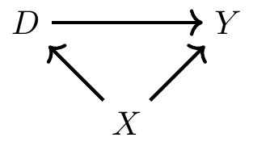
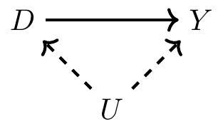
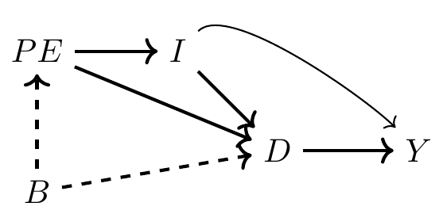
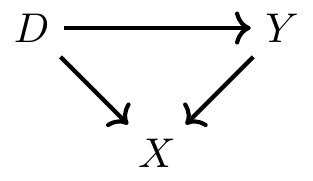
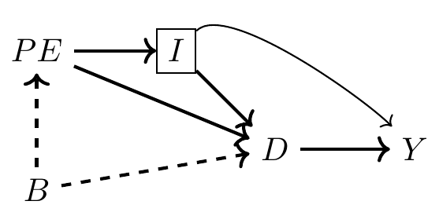
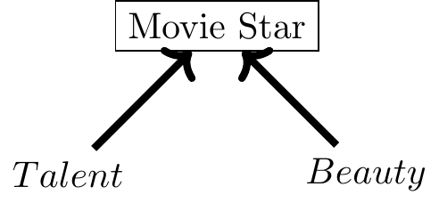
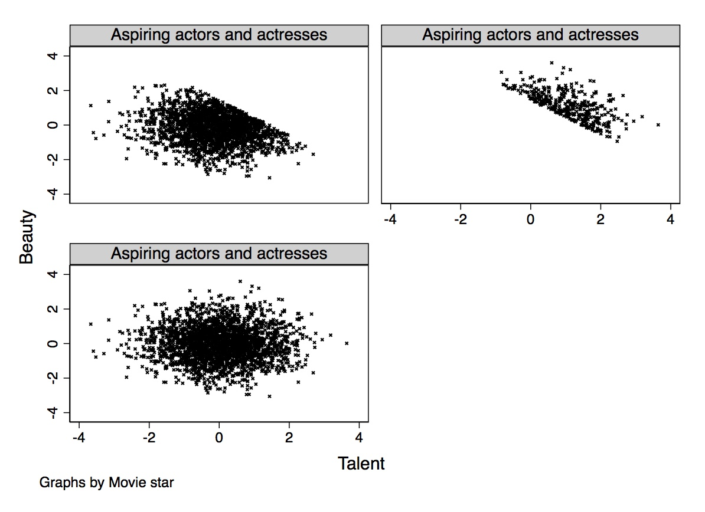

## 上节课回顾

::: {.concept-box}
**核心概念**

- *概率与统计基础*：随机变量、分布、条件期望
- *回归的本质*：$E[Y|X]$ 是条件期望，不只是拟合线
- *预测 vs 因果*：预测关注相关性，因果需要识别策略
:::

. . .

**本节课目标**：

1. 理解**有向无环图（DAG）**的基本符号
2. 掌握**后门准则（Backdoor Criterion）**
3. 识别**碰撞节点（Collider）**及其偏误
4. 学会用DAG指导研究设计

# 为什么需要DAG？ {background-color="#AE0B2A"}

## 从混淆变量到图形化思考

::: {.columns}
::: {.column width="50%"}
**之前的问题**

- *混淆变量(Confounder)*导致选择偏误
- *遗漏变量(Omitted Variable)*使估计有偏
- 如何判断需要那些*控制变量(Control Variables)*？

::: {.warning-box}
**关键问题**

*控制更多变量总是更好吗？*
:::
:::

::: {.column width="50%"}
**DAG的解决方案**

- 用图形明确表示变量关系
- 系统化识别因果路径
- 指导需要控制哪些变量

::: {.concept-box}
**核心优势**

DAG让因果假设*可视化*、*可讨论*、*可检验*
:::
:::
:::

## 真实案例：教育回报研究

::: {.example-box}
**研究问题** 上大学对收入的因果效应

传统方法：控制所有可观测变量？

- 年龄、性别、种族
- 父母教育、家庭收入
- 高中成绩、能力测试
- 职业选择、婚姻状况
:::

. . .

::: {.warning-box}
**潜在陷阱** 控制“职业选择”或“婚姻状况”可能引入*碰撞偏误*！

- 这些变量可能是*教育*和*收入*的共同结果
- 控制它们会打开虚假路径
:::

# DAG基础符号 {background-color="#AE0B2A"}

## DAG的基本要素

::: {.concept-box}
**有向无环图（Directed Acyclic Graph, DAG）**

- *节点（Nodes）*：表示随机变量
- *有向边（Directed Edges）*：表示直接的因果效应
- *无环（Acyclic）*：因果只沿时间向前，不能形成循环
:::

. . .

**简单DAG示例**：

- $D \longrightarrow Y$: 教育直接影响收入
- $D \longrightarrow X \longrightarrow Y$：教育通过*中介变量*职业技能(或能力）影响收入
- $D \longleftarrow X \longrightarrow Y$：能力同时影响教育和收入, 混淆因果关系！


## 链式结构：中介变量

::: {.concept-box}
**链式路径：$D \rightarrow Z \rightarrow Y$**

- $D$：处理变量（如教育）
- $Z$：中介变量（如职业技能）
- $Y$：结果变量（如收入）

控制$Z$会*阻断$D$对$Y$的真实因果效应*
:::

. . .

::: {.example-box}
**教育回报的例子**

上大学($D$) → 获得技能($Z$) → 更高收入($Y$)

- 总效应 = 直接效应 + 间接效应（通过技能）
- 如果控制“职业技能”($Z$)，会低估教育总回报
- 若想估计*直接*效应，才需要*控制中介变量*
:::

## 分叉结构：混淆变量

::: {.concept-box}
**分叉路径：$D \leftarrow Z \rightarrow Y$**

- $Z$ 是$D$和$Y$的*共同原因*
- 造成$D$和$Y$的统计相关，但非因果
- 必须控制$Z$才能识别因果效应
:::

. . .

::: {.example-box}
**教育回报中的混淆因素**

能力($Z$) → 上大学($D$)

能力($Z$) → 高收入($Y$)

- 能力强的人更可能上大学*且*收入更高
- 如果不控制能力，会高估教育效应
- 这就是*遗漏变量偏误*的DAG表示
:::


# 后门准则 {background-color="#AE0B2A"}

## 后门路径(Backdoor Path)

{fig-align="center" width="60%"}   

::: {.concept-box}
**后门路径（Backdoor Path）**

- *因果效应*：$D\longrightarrow Y$
- *后门路径*：$D \longleftarrow X \longrightarrow Y$
- $X$是混淆变量，造成$D$与$Y$的*虚假相关性(Spurious Correlation)*
:::

## 定义后门路径

::: {.concept-box}
**后门路径（Backdoor Path）**

从处理变量$D$到结果变量$Y$的*非因果路径*，满足：

1. 以指向$D$的箭头开始（“进入后门”）：$D \leftarrow \dots$
2. 路径最终到达$Y$
3. 包含任何方向的边（$\rightarrow$ 或 $\leftarrow$）

若$Z$满足后门准则，则：
$$P(Y|do(D)) = \sum_z P(Y|D,Z)P(Z)$$

:::


    

## 后门路径的类型举例

::: {.columns}
::: {.column width="33%"}
**不可观测的混淆变量I**

{fig-align="center" width="85%"}

- $U$不可观测
- *后门路径*：$U \rightarrow D \rightarrow Y$
- 称后门路径是*开放的* (Open Backdoor Path)
:::

::: {.column width="33%"}
**不可观测的混淆变量II**

{fig-align="center" width="100%"}


- Becker 人力资本模型(Becker, 1964): *教育投资*($D$)受*家庭收入*（$I$)、*父母教育水平*($E$)和其他*不可观测因素*（$B$，e.g.,能力，基因，家庭氛围等）影响
- *教育水平与家庭收入共同作用于收入*($Y$)。
- $B$ 是混淆变量
- *思考*: $B$会直接影响$Y$吗？
:::

::: {.column width="33%"}
**碰撞结构**

{fig-align="center" width="85%"}

- 后门路径：$D \leftarrow X \rightarrow Y$
- $X$是*碰撞节点*: 当有两个变量共同影响一个结果变量时，称该变量是*碰撞节点（Collider）*
- 当控制碰撞节点$X$时，$D$和$Y$会变得相关，即使它们原本没有任何关系！
:::
:::

. . .

::: {.warning-box}
**练习**
在人力资本模型中，针对教育回报的DAG，所有的后门路径有哪些?

*提示：后门路径以指向$D$的箭头开始*
:::

. . .

**答案**：

| 序号 | 路径 | 类型 |
|:---:|:---|:---|
| 1 | $D \rightarrow Y$ | ✓ 因果路径（我们要估计的） |
| 2 | $D \leftarrow I \rightarrow Y$ | ✗ 后门路径（需阻断） |
| 3 | $D \leftarrow PE \rightarrow I \rightarrow Y$ | ✗ 后门路径（需阻断） |
| 4 | $D \leftarrow B \rightarrow PE \rightarrow I \rightarrow Y$ | ✗ 后门路径（需阻断） |

**发现**：所有后门路径都经过$I$ → 控制$I$即可满足后门准则！


## 后门准则的直观理解

::: {.concept-box}
**为什么叫"后门"？**

想象你要从$D$走到$Y$：

- *前门*是因果路径：$D \rightarrow Y$（你想走的正路）
- *后门*是混淆路径：$D \leftarrow \dots \rightarrow Y$（偷偷绕进来的偏误）

:::

. . .

::: {.example-box}
**关键洞察**

后门路径造成$D$与$Y$的*虚假相关(spurious correlation)*：

- 我们看到$D$和$Y$相关
- 但这可能是通过后门路径的相关，而非真正的因果
- 控制适当的变量可以“关闭”后门，只留下因果路径
:::

## 回归视角：如何实现后门准则

::: {.concept-box}
**人力资本模型的回归实现**

Becker模型中，识别教育($D$)对收入($Y$)的因果效应：

**朴素回归（有偏误）**
$$Y_i = \alpha + \delta D_i + \varepsilon_i$$
$\widehat{\delta}$ 包含教育效应 + 所有后门路径的偏误
:::

. . .

::: {.callout-important}
**满足后门准则的回归**
$$Y_i = \alpha + \delta D_i + \beta_1 I_i + \varepsilon_i$$

通过控制家庭收入$I$，我们阻断了所有以$I$为节点的后门路径，$\widehat{\delta}$ 成为因果效应的无偏估计。
:::

## 回归如何“阻断”后门路径？

::: {.columns}
::: {.column width="50%"}
**直观理解：比较 vs 对比**

不控制$I$时：

- 比较"上大学者"和"没上大学者"的收入
- 两组在"家庭收入"上分布不同
- 观察到的差异 = 教育效应 + 家庭背景差异


控制$I$时：

- *在相同家庭收入$I$水平内*比较
- 剥离$I$对$D$和$Y$的共同影响
- 只剩教育→收入的因果路径
:::

::: {.column width="50%"}
::: {.example-box}
**数学机制**

回归$Y_i = \alpha + \delta D_i + \beta I_i + \varepsilon_i$ 中：

1. $\beta I_i$ 吸收$I$对$Y$的直接影响
2. 残差$\varepsilon_i$ 与$I$无关
3. $D$的变异分为两部分：
   - 与$I$相关的部分（后门路径）→ 被控制
   - 与$I$无关的部分（因果路径）→ 估计$\delta$

**结果** 
$\widehat{\delta}$ 反映$I$无法解释的那部分$D$对$Y$的影响
:::
:::
:::

## 人力资本模型：完整DAG分析

{fig-align="center" width="50%"}

::: {style="font-size: 0.85em; margin-top: 10px;"}
**变量说明**：$D$=大学教育, $Y$=收入, $PE$=父母教育, $I$=家庭收入, $B$=不可观测背景因素
:::

## 人力资本模型：识别所有路径

::: {.columns}
::: {.column width="60%"}
**从$D$到$Y$的四条路径**：

| 路径 | 类型 | 状态 |
|:---|:---|:---|
| $D \rightarrow Y$ | 因果路径 | ✓ 我们想要估计的 |
| $D \leftarrow I \rightarrow Y$ | 后门路径 | ✗ 需要通过控制关闭 |
| $D \leftarrow PE \rightarrow I \rightarrow Y$ | 后门路径 | ✗ 需要通过控制关闭 |
| $D \leftarrow B \rightarrow PE \rightarrow I \rightarrow Y$ | 后门路径 | ✗ 需要通过控制关闭 |
:::

::: {.column width="40%"}
::: {.example-box}
**关键发现**

所有后门路径都经过*家庭收入$I$*！

因此，*仅控制$I$就足以满足后门准则*。

这是*最小充分调整策略*。
:::
:::
:::

## 回归实现：逐步展示

::: {.columns}
::: {.column width="50%"}
**步骤1：朴素回归（有偏）**

$$Y_i = \alpha + \delta D_i + \varepsilon_i$$

估计结果：

- $\widehat{\delta}_{\text{ols}}$ = 教育相关效应
- 包含真实效应 + 后门路径偏误
- 可能高估或低估真实效应

**步骤2：控制家庭收入（满足后门准则）**

$$Y_i = \alpha + \delta D_i + \beta I_i + \varepsilon_i$$

估计结果：

- $\widehat{\delta}_{\text{causal}}$ = 因果效应
- 后门路径被阻断
- 无偏估计（假设无其他开放后门）
:::

::: {.column width="50%"}
::: {.concept-box}
**如何“阻断”后门路径？**

控制$I$相当于：

- 在$I$的每个水平内比较$D$对$Y$的影响
- 剥离$I$造成的$D$与$Y$的相关性
- 只剩下$D \rightarrow Y$的因果路径

**回归的魔法**
通过将$I$包含在模型中，我们实现了对$I$的条件化，从而阻断了所有经过$I$的后门路径。
:::
:::
:::

## 为什么控制$I$就够了？

::: {.columns}
::: {.column width="55%"}
**后门路径的阻断原理**

后门路径必须通过某个共同原因连接$D$和$Y$：

- 路径1：$D \leftarrow I \rightarrow Y$（经过$I$）
- 路径2：$D \leftarrow PE \rightarrow I \rightarrow Y$（经过$I$）
- 路径3：$D \leftarrow B \rightarrow PE \rightarrow I \rightarrow Y$（经过$I$）

**控制$I$的效果**

- 阻断所有经过$I$的路径
- 不满足后门准则的路径被关闭
- 只剩下因果路径开放
:::

::: {.column width="45%"}
{fig-align="center" width="95%"}

::: {style="text-align: center; font-size: 0.85em;"}
控制$I$后，所有后门路径被阻断
:::
:::
:::

## 反例：当控制策略失效时

::: {.concept-box}
**修改后的DAG：$B$直接影响$Y$**

如果在DAG中加入 $B \rightarrow Y$：

- 新后门路径：$D \leftarrow B \rightarrow Y$
- 这条路径*不经过$I$*
- 仅控制$I$ *无法*阻断这条路径
- 估计仍然有偏！
:::

. . .

**回归中的体现**：

$$Y_i = \alpha + \delta D_i + \beta I_i + \varepsilon_i$$

即使控制了$I$，如果$B$直接影响$Y$：

- $\varepsilon_i$ 包含$B$的影响
- $B$同时影响$D$和$Y$
- $D$与$\varepsilon_i$相关
- 内生性偏误仍然存在

## 人力资本模型：控制策略总结

::: {style="width: 95%; margin: 0 auto; font-size: 0.9em;"}
| 控制变量 | 阻断的后门路径 | 是否满足后门准则 | 备注 |
|:---|:---|:---:|:---|
| 无 | 无 | ✗ | 存在遗漏变量偏误 |
| $I$（家庭收入） | 所有经过$I$的路径 | ✓ | 最小充分集 |
| $I + PE$ | 所有经过$I$或$PE$的路径 | ✓ | 充分但非最小 |
| $PE$ 仅 | $D \leftarrow PE \rightarrow I \rightarrow Y$ | ✗ | 仍有$D \leftarrow I \rightarrow Y$开放 |
| $B$（若可观测） | 所有路径 | ✓ | 理想但通常不可行 |
:::

. . .

::: {.warning-box}
**实践启示**

- 找到*最小充分调整集*是关键
- 控制不必要的变量会降低统计功效
- 遗漏关键混淆变量会导致偏误
- DAG帮助我们系统化地识别关键变量
:::

## 应用：教育回报的DAG

{fig-align="center" width="75%"}

. . .

::: {.columns}
::: {.column width="50%"}
**后门路径识别**

从“教育”到“收入”：

- **后门路径1**：教育 ← 能力 → 收入
- **后门路径2**：教育 ← 家庭背景 → 收入
- 
**必须控制：** 能力、家庭背景
:::

::: {.column width="50%"}
**不能控制的变量**

- 职业选择（碰撞节点）
- 婚姻状况（可能是结果）
- 工作经验（部分中介）
:::
:::

# 碰撞节点与碰撞偏误 {background-color="#AE0B2A"}

## 什么是碰撞节点？

::: {.concept-box}
**碰撞结构：$D \rightarrow X \leftarrow Y$**

- $X$是碰撞节点（Collider）
- $D$和$Y$原本独立（无因果路径）
- 但一旦控制$X$，$D$和$Y$会虚假相关！
:::

. . .

{fig-align="center" width="35%"}

::: {style="text-align: center; margin-top: 15px;"}
**悖论**：控制碰撞节点会*创造*虚假相关
:::

## 名人效应：解释碰撞偏误

::: {.columns}
::: {.column width="55%"}
::: {.example-box}
**电影明星案例**

成为电影明星($X$)需要：

- 颜值($D$)
- 演技($Y$)

*如果已有颜值，演技可以差一些*

*如果已有演技，颜值可以差一些*
:::

::: {.callout-note}
在明星群体中：颜值与演技*负相关*, 但这只是选择效应！
:::
:::

::: {.column width="45%"}
{fig-align="center" width="90%"}
:::
:::

## 颜值与演技的“权衡”

{fig-align="center" width="70%"}

::: {style="text-align: center; margin-top: 20px;"}
**核心洞察**：在明星样本中，颜值和演技看似负相关，

但这只是碰撞偏误——两者都是成为明星的原因！
:::

## 更多碰撞偏误的例子

::: {.columns}
::: {.column width="50%"}

::: {.example-box}
**案例1: 研究幸福感对收入的影响** 

- 控制"婚姻状态"会引入偏误
- 因为幸福感和收入都影响婚姻
:::
:::

::: {.column width="50%"}
::: {.example-box}
**案例2: 研究教育对健康的效应**

- 控制"就业状态"需谨慎
- 可能是教育和健康的共同结果
:::
:::
:::

# 真实应用：歧视与碰撞偏误 {background-color="#AE0B2A"}

## 性别工资差距的争论

::: {.example-box}
**常见观点**

"控制职业后，性别工资差距消失或减小"

- 这是否证明不存在歧视？
- 还是职业本身就是歧视的结果？
:::

. . .

::: {.warning-box}
**DAG视角**

职业可能是碰撞节点：

- 性别 → 职业选择
- 能力/偏好 → 职业选择
- 歧视 → 职业选择

控制职业可能掩盖歧视的真实效应！
:::

## 样本选择作为碰撞偏误

::: {.concept-box}
**样本选择偏误**

当样本本身是基于碰撞节点选择时，即使不"控制"任何变量，偏误也已存在。

**例子**
只在明星样本中研究颜值与演技的关系
:::

. . .

::: {.example-box}
**研究建议**

使用DAG指导样本选择：

1. 明确目标总体
2. 识别选择机制
3. 评估选择是否基于碰撞节点
4. 必要时使用选择模型纠正
:::

# 两种因果框架的比较 {background-color="#AE0B2A"}

## 潜在结果框架 vs DAG框架

::: {.columns}
::: {.column width="50%"}
::: {.concept-box}
**潜在结果框架**

*Rubin因果模型*

**核心概念**

- 每个个体的$Y(0)$和$Y(1)$
- 因果效应：$\tau_i = Y_i(1) - Y_i(0)$
- 识别假设：无混淆、正向性、SUTVA

**优势**

- 精确的数学表达
- 清晰的识别条件
- 估计方法丰富
:::
:::

::: {.column width="50%"}
::: {.concept-box}
**DAG框架**

*Pearl因果图*

**核心概念**

- 节点和有向边
- 路径：链式、分叉、碰撞
- 后门准则、do-演算

**优势**

- 可视化因果关系
- 系统化识别偏误来源
- 指导变量选择
:::
:::
:::

## 两种框架的互补性

::: {style="width: 90%; margin: 0 auto;"}
| 维度 | 潜在结果框架 | DAG框架 |
|:---|:---|:---|
| *表达形式* | 数学公式 | 图形结构 |
| *核心问题* | 平均处理效应是多少？ | 哪些路径造成偏误？ |
| *识别条件* | 条件独立假设(CIA) | 后门准则、$d$-分离 |
| *变量选择* | 基于理论判断 | 基于路径分析 |
| *最佳应用* | 估计和推断 | 研究设计和假设 |
:::

. . .

::: {.callout-important}
**本课程的观点：两种框架互补**

- **设计阶段**：用DAG理清因果结构
- **分析阶段**：用潜在结果框架进行估计
:::

## 同一问题的两种视角

::: {.columns}
::: {.column width="50%"}
**混淆偏误**

*潜在结果框架*：
$$E[Y(0)|D=1] \neq E[Y(0)|D=0]$$

处理组和对照组的反事实不同

*DAG框架*：

存在从$D$到$Y$的开放后门路径

::: {.callout-tip}
需要通过控制变量阻断
:::
:::

::: {.column width="50%"}
**碰撞偏误**

*潜在结果框架*：

条件化导致样本选择，破坏可比性


*DAG框架*：

控制碰撞节点打开虚假路径

::: {.callout-tip}
即使该变量"看起来"相关，也不能控制
:::
:::
:::

# 如何用DAG指导研究设计 {background-color="#AE0B2A"}

## DAG分析的五步法

**步骤1：绘制DAG**

列出所有相关变量及其因果关系:

- 基于理论和先验知识
- 包含可观测和不可观测变量
- 讨论完善

. . .

**步骤2：识别目标路径**

从处理变量到结果变量的直接因果路径：

- 想估计的效应
- 不要阻断这条路径！

. . .

**步骤3：识别后门路径**

找出所有非因果路径:

- 以后门箭头开始
- 标记开放的后门路径

## DAG分析的五步法（续）

**步骤4：确定控制策略**

找出满足后门准则的变量集合:

- 阻断所有后门路径
- 不包含碰撞节点
- 不包含中介变量（除非估计直接效应）


. . .

**步骤5：敏感性分析**

考虑不可观测混淆因:

- 如果有未观测的混淆变量怎么办？
- 效应估计对遗漏变量有多敏感？

## 案例：评估培训项目

::: {.columns}
::: {.column width="55%"}
**研究设计**

某公司想评估新员工培训的效果：

变量列表：

- 处理变量$D$：参加培训
- 结果变量$Y$：工作绩效
- 可能的混杂变量$C$：能力、动机、经验
- 可能的中介变量$M$：技能掌握
- 可能的碰撞变量$L$：留任状态
:::

::: {.column width="45%"}
**DAG指导**

应该控制：

- ✓ 入职前能力测试
- ✓ 工作经验
- ✓ 教育背景

不应该控制：

- ✗ 技能掌握（中介）
- ✗ 留任状态（碰撞）
- ✗ 部门分配（可能是结果）
:::
:::

## 实践：模拟数据分析

::: {style="font-size: 0.9em;"}
```{python}
#| echo: true
#| eval: true
#| output: true
#| code-line-numbers: "914-920"

import numpy as np
import pandas as pd
import statsmodels.api as sm
import matplotlib.pyplot as plt
from matplotlib.patches import FancyArrowPatch
import warnings
warnings.filterwarnings('ignore')

# 设置中文字体
plt.rcParams['font.sans-serif'] = ['Source Han Sans SC', 'Noto Sans CJK SC',
                                    'WenQuanYi Micro Hei', 'SimHei', 'Arial Unicode MS']
plt.rcParams['axes.unicode_minus'] = False

np.random.seed(42)
n = 1000
true_effect = 2.0

# 生成变量：C=能力, D=培训, M=技能, Y=绩效, L=留任
C = np.random.normal(5, 1.5, n)
D = (np.random.uniform(0, 1, n) < 1/(1+np.exp(-(C-5)/2))).astype(int)
M = 0.7*D + 0.3*C + np.random.normal(0, 0.5, n)
Y = true_effect*D + 1.5*C + 0.5*M + np.random.normal(0, 1, n)
L = (np.random.uniform(0, 1, n) < 1/(1+np.exp(-(0.3*Y+0.5*D-3)))).astype(int)

data = pd.DataFrame({'training': D, 'performance': Y, 'ability': C,
                     'skill': M, 'retention': L})

print(f"样本量: {n} | 真实效应: {true_effect}")
print(data.head())
```
:::

. . .

## 绘制 DAG 结构

::: {.columns}
::: {.column width="45%"}
**Python 绘图代码**

::: {style="font-size: 0.75em;"}
```{python}
#| echo: true
#| eval: true
#| output: false

# 绘制 DAG 结构
fig, ax = plt.subplots(figsize=(6, 6))
ax.set_xlim(0, 10)
ax.set_ylim(0, 10)
ax.axis('off')

# 节点位置
positions = {
    'C': (2, 8),    # 能力
    'D': (2, 5),    # 培训
    'M': (5, 5),    # 技能
    'Y': (8, 5),    # 绩效
    'L': (5, 2)     # 留任
}

# 节点颜色配置
colors = {
    'C': '#FF6B6B',  # 红色 - 混淆变量
    'D': '#4ECDC4',  # 青色 - 处理变量
    'M': '#95E1D3',  # 浅绿 - 中介变量
    'Y': '#F38181',  # 粉色 - 结果变量
    'L': '#FFA07A'   # 橙色 - 碰撞节点
}

labels = {
    'C': '能力(C)\n混杂变量',
    'D': '培训(D)\n处理变量',
    'M': '技能(M)\n中介变量',
    'Y': '绩效(Y)\n结果变量',
    'L': '留任(L)\n碰撞节点'
}

# 绘制节点
for node, (x, y) in positions.items():
    circle = plt.Circle((x, y), 0.6, color=colors[node],
                        ec='black', linewidth=2, zorder=3)
    ax.add_patch(circle)
    ax.text(x, y, labels[node], ha='center', va='center',
            fontsize=9, fontweight='bold', zorder=4)

# 绘制箭头
arrows = [('C','D'), ('C','Y'), ('D','M'), ('M','Y'),
          ('D','Y'), ('D','L'), ('Y','L')]

for start, end in arrows:
    x1, y1 = positions[start]
    x2, y2 = positions[end]
    dx, dy = x2 - x1, y2 - y1
    dist = np.sqrt(dx**2 + dy**2)
    ax.annotate('', xy=(x2-0.6*dx/dist, y2-0.6*dy/dist),
                xytext=(x1+0.6*dx/dist, y1+0.6*dy/dist),
                arrowprops=dict(arrowstyle='->', lw=2))

ax.set_title('DAG Structure', fontsize=14, fontweight='bold')
plt.tight_layout()
plt.show()
```
:::

:::

::: {.column width="55%"}
**生成的 DAG 图**

::: {style="font-size: 0.9em;"}
```{python}
#| echo: false
#| eval: true
#| output: true
#| fig-width: 7
#| fig-height: 6

fig, ax = plt.subplots(figsize=(7, 6))
ax.set_xlim(0, 10)
ax.set_ylim(0, 10)
ax.axis('off')

positions = {
    'C': (2, 8),
    'D': (2, 5),
    'M': (5, 5),
    'Y': (8, 5),
    'L': (5, 2)
}

colors = {
    'C': '#FF6B6B',
    'D': '#4ECDC4',
    'M': '#95E1D3',
    'Y': '#F38181',
    'L': '#FFA07A'
}

labels = {
    'C': '能力(C)\n混杂变量',
    'D': '培训(D)\n处理变量',
    'M': '技能(M)\n中介变量',
    'Y': '绩效(Y)\n结果变量',
    'L': '留任(L)\n碰撞节点'
}

for node, (x, y) in positions.items():
    circle = plt.Circle((x, y), 0.6, color=colors[node],
                        ec='black', linewidth=2, zorder=3)
    ax.add_patch(circle)
    ax.text(x, y, labels[node], ha='center', va='center',
            fontsize=10, fontweight='bold', zorder=4)

arrows = [('C','D'), ('C','Y'), ('D','M'), ('M','Y'),
          ('D','Y'), ('D','L'), ('Y','L')]

for start, end in arrows:
    x1, y1 = positions[start]
    x2, y2 = positions[end]
    dx, dy = x2 - x1, y2 - y1
    dist = np.sqrt(dx**2 + dy**2)
    ax.annotate('', xy=(x2-0.6*dx/dist, y2-0.6*dy/dist),
                xytext=(x1+0.6*dx/dist, y1+0.6*dy/dist),
                arrowprops=dict(arrowstyle='->', lw=2.5, color='#333333'))

# 添加图例（右下方，避免与DAG图重合）
legend_text = '路径说明：\n• C→D→Y: 前门路径\n• C→Y: 混淆路径\n• D→M→Y: 间接路径\n• D→L←Y: 碰撞结构'
ax.text(9.5, 1.5, legend_text, ha='right', va='bottom', fontsize=9,
        bbox=dict(boxstyle='round', facecolor='wheat', alpha=0.6))

ax.set_title('培训效果评估的 DAG 结构', fontsize=13, fontweight='bold', pad=15)
plt.tight_layout()
plt.show()
```
:::

**关键洞察：**

- 能力(C)是*混淆变量*：影响培训和绩效
- 技能(M)是*中介变量*：培训→技能→绩效
- 留任(L)是*碰撞节点*：受绩效和培训共同影响

:::
:::

. . .

## 使用 CausalGraph 包绘制 DAG

::: {style="font-size: 0.75em;"}
```{python}
#| echo: true
#| eval: true
#| output: true
#| fig-width: 7
#| fig-height: 4.5

import networkx as nx
import matplotlib.pyplot as plt

# 创建有向图
G = nx.DiGraph()
nodes = [
    ('C', {'label': '能力(C)', 'type': 'confounder', 'color': '#FF6B6B'}),
    ('D', {'label': '培训(D)', 'type': 'treatment', 'color': '#4ECDC4'}),
    ('M', {'label': '技能(M)', 'type': 'mediator', 'color': '#95E1D3'}),
    ('Y', {'label': '绩效(Y)', 'type': 'outcome', 'color': '#F38181'}),
    ('L', {'label': '留任(L)', 'type': 'collider', 'color': '#FFA07A'})
]
G.add_nodes_from([(n, attr) for n, attr in nodes])

edges = [('C','D'), ('C','Y'), ('D','M'), ('M','Y'), ('D','Y'), ('D','L'), ('Y','L')]
for u, v in edges:
    G.add_edge(u, v)

fig, ax = plt.subplots(figsize=(7, 4.5))
pos = {'C': (0, 2), 'D': (-1.5, 1), 'M': (0, 1.2), 'Y': (1.5, 1), 'L': (0, 0)}
node_colors = [G.nodes[n]['color'] for n in G.nodes()]

nx.draw_networkx_nodes(G, pos, node_color=node_colors, node_size=2000,
                       edgecolors='black', linewidths=2, ax=ax)
nx.draw_networkx_edges(G, pos, edge_color='#333333', width=2.5, arrows=True,
                       arrowstyle='-|>', arrowsize=28, ax=ax,
                       connectionstyle='arc3,rad=0.10')
labels = {n: G.nodes[n]['label'] for n in G.nodes()}
nx.draw_networkx_labels(G, pos, labels, font_size=9, font_weight='bold', ax=ax)

ax.set_title('NetworkX/CausalGraph 绘制 DAG', fontsize=12, fontweight='bold')
ax.axis('off')
ax.set_xlim(-2.5, 2.5)
ax.set_ylim(-0.5, 2.5)

# 图例（右下角）
legend_text = '节点类型：红色=混淆(C) 青色=处理(D) 浅绿=中介(M) 粉色=结果(Y) 橙色=碰撞(L)'
ax.text(2.3, -0.3, legend_text, ha='right', va='bottom', fontsize=7,
        bbox=dict(boxstyle='round', facecolor='wheat', alpha=0.7))

plt.tight_layout()
plt.show()

print(f"DAG统计: {G.number_of_nodes()}节点, {G.number_of_edges()}边, 2条后门路径")
print("CausalGraph特点: 基于networkx.MultiDiGraph | 支持时序因果 | 兼容ggdag")
```
:::

. . .

## 回归分析：不同控制策略比较

::: {style="font-size: 1em; max-height: 380px; overflow-y: auto;"}
```{python}
#| echo: true
#| eval: true
#| output: true
#| code-line-numbers: "1153-1160"
# 5种控制策略比较
models = {
    '模型1(不控制)': sm.OLS(data['performance'], sm.add_constant(data['training'])).fit(),
    '模型2(控制C)✓': sm.OLS(data['performance'], sm.add_constant(data[['training','ability']])).fit(),
    '模型3(控制M)✗': sm.OLS(data['performance'], sm.add_constant(data[['training','skill']])).fit(),
    '模型4(控制C+M)': sm.OLS(data['performance'], sm.add_constant(data[['training','ability','skill']])).fit(),
    '模型5(控制L)✗': sm.OLS(data['performance'], sm.add_constant(data[['training','retention']])).fit()
}

print(f"真实效应: {true_effect:.3f}")
print("=" * 62)

results = []
for name, model in models.items():
    coef = model.params['training']
    results.append({
        '模型': name,
        '估计值': f"{coef:.3f}",
        '偏差': f"{coef-true_effect:+.3f}",
        'R²': f"{model.rsquared:.3f}"
    })

results_df = pd.DataFrame(results)
print(results_df.to_string(index=False))
```
:::

. . .

## 结果解释

::: {.columns}
::: {.column width="50%"}

**模型评估**

| 模型 | 评估 | 问题 |
|:---|:---|:---|
| 模型1(不控制) | ✗ 有偏 | 包含能力(C)混淆效应 |
| 模型2(控制C) | ✓ **正确** | 阻断后门路径 |
| 模型3(控制M) | ✗ 低估 | 阻断间接效应 |
| 模型4(控制C+M) |*△部分正确*| 估计直接效应 |
| 模型5(控制L) | ✗✗ 严重错误 | 碰撞偏误 |

:::

::: {.column width="50%"}

**DAG 指导原则**

::: {style="font-size: 0.9em;"}

- ✓ **控制混淆变量**：阻断后门路径，获得无偏估计
- ✗ **不要控制中介变量**：除非只想估计直接效应
- ✗✗ **绝对不能控制碰撞变量**：会引入新的偏误
:::

::: {.callout-tip}
DAG 是选择控制变量的科学依据！
:::

:::
:::

# 总结 {background-color="#AE0B2A"}

## 本讲要点

::: {.concept-box}

1. **DAG基础**
   - 节点表示变量，有向边表示因果
   - 三种路径结构：链式、分叉、碰撞

2. **后门准则**
   - 识别需要阻断的后门路径
   - 指导控制变量选择

3. **碰撞偏误**
   - 控制碰撞节点创造虚假相关
   - 样本选择可能引入偏误

4. **框架比较**
   - DAG用于研究设计
   - 潜在结果用于估计
:::

## 实践建议

::: {.example-box}
**使用DAG的检查清单**

- [ ] 绘制包含所有关键变量的DAG
- [ ] 识别处理到结果的因果路径
- [ ] 识别并阻断所有后门路径
- [ ] 检查是否意外控制了碰撞节点
- [ ] 检查是否意外阻断了中介变量
- [ ] 讨论未观测混淆因素的可能性
:::

. . .

::: {.callout-tip}
**推荐工具**

- [*CausalGraph*（Python）：构建和分析因果图](https://github.com/causalgraph/causalgraph)
- [*dagitty.net*：在线DAG分析和路径识别](http://www.dagitty.net/)
- [*ggdag*（R包）：绘制和分析DAG](https://cran.r-project.org/web/packages/ggdag/index.html)

:::

##

::: {style="text-align: center; margin-top: 80px; font-size: 1.8em;"}
感谢聆听！

欢迎提问与讨论！

chenzhiyuan@rmbs.ruc.edu.cn
:::
