## 上节课回顾

::: {.concept-box}
**核心概念**

- *匹配法原理*：基于可观测变量构建可比对照组
- *倾向得分*：将多维协变量压缩为一维得分
- *平衡性检验*：标准化偏差 < 0.1
- *分层估计*：按倾向得分分层比较
:::

. . .

*本节课目标*

- 理解工具变量法的基本原理
- 掌握两阶段最小二乘法 (2SLS)
- 识别弱工具变量问题
- 通过案例应用工具变量技术

# 当匹配法失效时：未观测混淆变量 {background-color="#AE0B2A"}

## 匹配法的局限性

**匹配法的核心假设**

条件可忽略性假设要求所有混淆变量都被观测到：
$$D \perp \{Y(0), Y(1)\} | X$$

. . .

::: {.warning-box}
**现实问题**

如果存在*未观测*的混淆变量 $U$，匹配法无法消除其带来的偏误：
$$D \not\perp \{Y(0), Y(1)\} | X$$
:::

. . .

*例子*：研究教育对收入的影响

- 可观测混淆：父母教育、家庭收入、地理位置
- 未观测混淆：*能力*、*动机*、*个人偏好*

## 内生性问题

**内生性的来源**

当处理变量 $D$ 与误差项 $\varepsilon$ 相关时：
$$Y = \alpha + \beta D + \varepsilon, \quad Cov(D, \varepsilon) \neq 0$$

. . .

**造成内生性（内生性/Endogeneity）的原因**

1. **遗漏变量**（Omitted Variables）：未观测的混淆因素
2. **反向因果**（Simultaneity）：$Y$ 和 $D$ 互相影响
3. **测量误差**（Measurement Error）：$D$ 被错误测量

. . .

**后果**：

- OLS 估计有偏且不一致
- 无法直接识别因果效应

## 工具变量法的核心思想

::: {.concept-box}
**阿基米德原理的启示**

“给我一个支点，我可以撬动地球”——利用一个“好”的工具变量，我们可以识别任何因果效应。
:::

. . .

*核心洞察*

找到一个变量 $Z$，它：

1. 影响处理变量 $D$（相关性）
2. 只通过 $D$ 影响结果 $Y$（排他性）

. . .

*类比理解*

就像在随机实验中，随机分配 $Z$ 决定了谁接受处理 $D$。工具变量 $Z$ 提供了 $D$ 中“外生”的变异。

# 工具变量的两个条件 {background-color="#AE0B2A"}

## 条件一：相关性 (Relevance)

::: {.concept-box}
**相关性条件**

工具变量 $Z$ 必须与处理变量 $D$ 相关：
$$Cov(Z, D) \neq 0$$

或者说，第一阶段（First Stage）显著：
$$D = \gamma_0 + \gamma_1 Z + \nu$$
:::

. . .

*为什么重要？*

- 如果 $Z$ 不影响 $D$，它就不能提供关于 $D$ 的变异信息
- 我们需要利用 $Z$ 的变异来识别 $D$ 对 $Y$ 的效应
- 第一阶段越弱，工具变量估计越不可靠

## 条件二：排他性 (Exclusion Restriction)

::: {.concept-box}
**排他性约束**

工具变量 $Z$ 必须满足：
$$Cov(Z, \varepsilon) = 0$$

即，$Z$ 只通过 $D$ 影响 $Y$，没有其他渠道。
:::

. . .

*直观理解*

$Z$ 是一个“奇怪”的变量——它与结果 $Y$ 相关，但*仅仅*是因为它影响了处理 $D$。

. . .

::: {.warning-box}
**排他性无法直接检验！**

这是一个基于理论和领域知识的假设。我们需要论证为什么 $Z$ 满足排他性。
:::

## 工具变量示意图

::: {.intro-mermaid}
{fig-align="center" width="85%" alt="工具变量示意图：Z 通过 D 影响 Y，U 是未观测混淆变量"}
:::
. . .

*关键洞察*

- $U$ 是混淆变量，造成 $D$ 和 $Y$ 的内生关联
- $Z$ 提供了一个外生变异，绕过 $U$ 的影响
- $Z$ 只影响 $Y$ 通过 $D$（没有其他路径）

## “好”工具变量的特征

::: {.example-box}
**好的工具变量是“令人惊讶”的**

好的工具变量往往看起来有些奇怪——因为排他性要求它与结果没有其他关联。
:::

. . .

**经典例子**

| 研究问题 | 工具变量 | 为什么有效？ |
|:---|:---|:---|
| 教育对收入的影响 | 出生季度 (Angrist \& Krueger, 1991) | 义务教育法导致出生季度影响上学年数，但与能力无关 |
| 教育对收入的影响 | 到大学的距离 (Card, 1995) | 地理距离影响上学决策，但与个人能力无关 |
| 参军对健康的影响 | 抽签号码 (Angrist, 1990) | 越南战争抽签决定入伍，随机分配 |
| 看电视对犯罪的影响 | 电视信号覆盖 (Hennigan et al.) | 地理因素决定信号接收，影响观看时间 |

# 两阶段最小二乘法 (2SLS) {background-color="#AE0B2A"}

## 2SLS 的直观理解

**基本思想**

1. **第一阶段**：用 $Z$ 预测 $D$，得到 $D$ 中由 $Z$ 解释的部分
2. **第二阶段**：用预测的 $\hat{D}$ 代替 $D$ 估计对 $Y$ 的效应

. . .

*为什么这样可行？*

- $\hat{D}$ 只包含 $D$ 中与 $Z$ 相关的变异
- 由于 $Z$ 是外生的，$\hat{D}$ 也是外生的
- 用 $\hat{D}$ 估计的效应没有内生性偏误

## 2SLS 的数学推导

**第一阶段**
$$D_i = \pi_0 + \pi_1 Z_i + \nu_i$$

得到拟合值：
$$\hat{D}_i = \hat{\pi}_0 + \hat{\pi}_1 Z_i$$

. . .

**第二阶段**
$$Y_i = \alpha + \beta \hat{D}_i + \varepsilon_i$$

. . .

**IV 估计量**（可以证明等价于 2SLS）：
$$\hat{\beta}_{IV} = \frac{Cov(Y, Z)}{Cov(D, Z)} = \frac{Cov(Y, Z)}{Cov(\hat{D}, Z)}$$

## 2SLS 估计量的性质

::: {.concept-box}
**一致性**

在工具变量相关性和排他性条件下：
$$\hat{\beta}_{IV} \xrightarrow{p} \beta$$

即，IV 估计量是一致的（当样本量增大时收敛到真实值）。
:::

. . .

**与 OLS 的关系**

$$\hat{\beta}_{IV} = \frac{Cov(Y, Z)}{Cov(D, Z)} = \frac{\text{Reduced Form}}{\text{First Stage}}$$

- *简约式（Reduced Form）*：$Z$ 对 $Y$ 的总效应
- **第一阶段（First Stage）**：$Z$ 对 $D$ 的效应
- **两者之比**：$D$ 对 $Y$ 的因果效应

## Python 实现：2SLS

::: {style="font-size: 1em;"}
```{python}
#| echo: true
#| eval: true
#| output: true

import numpy as np
import pandas as pd
from linearmodels.iv import IV2SLS
import statsmodels.api as sm
import warnings
warnings.filterwarnings('ignore')

# 设置随机种子
np.random.seed(42)
n = 1000

# 生成数据：D 是内生的，Z 是工具变量
Z = np.random.normal(0, 1, n)  # 工具变量（外生）
U = np.random.normal(0, 1, n)  # 未观测混淆变量

# 第一阶段：D 受 Z 和 U 影响
D = 0.5 * Z + 0.8 * U + np.random.normal(0, 0.5, n)

# 真实因果效应
true_effect = 2.0

# 结果变量：Y 受 D 和 U 影响（U 造成内生性）
Y = true_effect * D + 1.5 * U + np.random.normal(0, 0.5, n)

# 创建数据框
data = pd.DataFrame({
    'Y': Y,
    'D': D,
    'Z': Z,
    'U': U  # 现实中不可观测
})

print(f"样本量: {n}")
print(f"真实处理效应: {true_effect}")
```
:::

## OLS vs 2SLS 比较

::: {style="font-size: 1em;"}
```{python}
#| echo: true
#| eval: true
#| output: true

# OLS 估计（有偏，因为忽略了 U）
X_ols = sm.add_constant(data['D'])
model_ols = sm.OLS(data['Y'], X_ols).fit()
ols_est = model_ols.params['D']

# 2SLS 估计（使用 Z 作为工具变量）
# 第一阶段：D ~ Z
X_first = sm.add_constant(data['Z'])
model_first = sm.OLS(data['D'], X_first).fit()
data['D_hat'] = model_first.predict(X_first)

# 第二阶段：Y ~ D_hat
X_second = sm.add_constant(data['D_hat'])
model_second = sm.OLS(data['Y'], X_second).fit()
iv_est_manual = model_second.params['D_hat']

# 使用 linearmodels 的 IV2SLS
iv_model = IV2SLS(
    dependent=data['Y'],
    exog=None,
    endog=data['D'],
    instruments=data['Z']
).fit()
iv_est = iv_model.params['D']

print("估计结果对比:")
print("=" * 50)
print(f"真实效应:    {true_effect:.3f}")
print(f"OLS 估计:    {ols_est:.3f}  (偏差: {ols_est - true_effect:.3f})")
print(f"2SLS 估计:   {iv_est:.3f}  (偏差: {iv_est - true_effect:.3f})")
print("=" * 50)
```
:::

## 第一阶段结果分析

::: {style="font-size: 1em;"}
```{python}
#| echo: true
#| eval: true
#| output: true

# 第一阶段回归结果
print("第一阶段回归结果:")
print("=" * 50)
print(f"Z 的系数: {model_first.params['Z']:.4f}")
print(f"标准误:   {model_first.bse['Z']:.4f}")
print(f"t 统计量: {model_first.tvalues['Z']:.4f}")
print(f"R-squared: {model_first.rsquared:.4f}")

# 计算 F 统计量
from scipy import stats
f_stat = (model_first.params['Z'] / model_first.bse['Z']) ** 2
print(f"F 统计量: {f_stat:.2f}")
```
:::

. . .

*第一阶段的重要性*

- $Z$ 的系数反映相关性强度
- F 统计量检验工具变量强度（弱工具变量检验）

# 弱工具变量问题 {background-color="#AE0B2A"}

## 什么是弱工具变量？

::: {.warning-box}
**弱工具变量**

当工具变量 $Z$ 与处理变量 $D$ 的相关性很弱时：
$$Cov(Z, D) \approx 0$$

或者，第一阶段 F 统计量很小。
:::

. . .

*为什么这是个问题？*

1. **方差增大**：分母接近零，估计量不稳定
2. **偏差严重**：Bound, Jaeger, \& Baker (1995) 证明：
$$E[\hat{\beta}_{2SLS} - \beta] \approx \frac{\sigma_{\varepsilon\nu}}{\sigma_{\nu}^2} \cdot \frac{1}{F + 1}$$

3. **当 $F \to 0$ 时，偏差趋近于 OLS 偏差**

## 弱工具变量的识别

**经验法则** (Stock \& Yogo, 2005)：

::: {.example-box}
**F 统计量 > 10**

如果第一阶段的 F 统计量大于 10，工具变量被认为是“强”的。
:::

. . .

*如果 F < 10 怎么办？*

1. **寻找更强的工具变量**
2. **使用弱工具变量稳健方法**：
   - Anderson-Rubin 检验
   - Kleibergen-Paap 统计量
3. **增加样本量**（提高统计功效）

## 弱工具变量的模拟演示

::: {style="font-size: 1em;"}
```{python}
#| echo: true
#| eval: true
#| output: true

# 模拟不同工具变量强度下的表现
np.random.seed(42)
n = 500
results = []

for pi1 in [0.1, 0.3, 0.5, 1.0]:  # 不同的第一阶段系数
    temp_results = {'pi1': pi1, 'f_stats': [], 'iv_biases': [], 'ols_biases': []}

    for _ in range(100):  # 100 次模拟
        Z = np.random.normal(0, 1, n)
        U = np.random.normal(0, 1, n)
        D = pi1 * Z + 0.8 * U + np.random.normal(0, 0.5, n)
        Y = 2.0 * D + 1.5 * U + np.random.normal(0, 0.5, n)

        # OLS
        X_ols = sm.add_constant(D)
        ols_est = sm.OLS(Y, X_ols).fit().params[1]

        # IV
        X_first = sm.add_constant(Z)
        first_stage = sm.OLS(D, X_first).fit()
        f_stat = (first_stage.params[1] / first_stage.bse[1]) ** 2

        D_hat = first_stage.predict(X_first)
        X_second = sm.add_constant(D_hat)
        iv_est = sm.OLS(Y, X_second).fit().params[1]

        temp_results['f_stats'].append(f_stat)
        temp_results['iv_biases'].append(iv_est - 2.0)
        temp_results['ols_biases'].append(ols_est - 2.0)

    results.append({
        '第一阶段系数': pi1,
        '平均 F 统计量': np.mean(temp_results['f_stats']),
        'IV 平均偏差': np.mean(temp_results['iv_biases']),
        'OLS 平均偏差': np.mean(temp_results['ols_biases'])
    })

results_df = pd.DataFrame(results)
print("弱工具变量模拟结果:")
print("=" * 70)
print(results_df.to_string(index=False, float_format='%.3f'))
```
:::

## 弱工具变量图示

```{python}
#| echo: false
#| eval: true
#| fig-width: 10
#| fig-height: 5.8

import matplotlib.pyplot as plt

# 绘制 F 统计量与偏差关系
fig, (ax1, ax2) = plt.subplots(1, 2, figsize=(10, 4.5))

ax1.bar(range(len(results_df)), results_df['平均 F 统计量'],
        color=['red' if f < 10 else 'green' for f in results_df['平均 F 统计量']])
ax1.axhline(y=10, color='red', linestyle='--', label='F=10 threshold')
ax1.set_xticks(range(len(results_df)))
ax1.set_xticklabels([f"{p:.1f}" for p in results_df['第一阶段系数']])
ax1.set_xlabel('First Stage Coefficient', fontsize=11)
ax1.set_ylabel('Average F-statistic', fontsize=11)
ax1.set_title('First Stage F-statistics', fontsize=12, fontweight='bold')
ax1.legend()

x_pos = np.arange(len(results_df))
ax2.bar(x_pos - 0.2, results_df['IV 平均偏差'], 0.4,
        label='IV Bias', color='skyblue')
ax2.bar(x_pos + 0.2, results_df['OLS 平均偏差'], 0.4,
        label='OLS Bias', color='lightcoral')
ax2.axhline(y=0, color='black', linestyle='-', linewidth=0.5)
ax2.set_xticks(range(len(results_df)))
ax2.set_xticklabels([f"{p:.1f}" for p in results_df['第一阶段系数']])
ax2.set_xlabel('First Stage Coefficient', fontsize=11)
ax2.set_ylabel('Bias', fontsize=11)
ax2.set_title('Bias: IV vs OLS', fontsize=12, fontweight='bold')
ax2.legend()

plt.tight_layout()
plt.show()
```

. . .

*关键发现*

- F 统计量 < 10（红色区域）：IV 估计有严重偏差
- F 统计量 > 10（绿色区域）：IV 估计接近真实值

# 局部平均处理效应 (LATE) {background-color="#AE0B2A"}

## 异质性处理效应框架

**潜在结果框架的扩展**

定义潜在处理变量：

- $D_i(1)$：当 $Z_i = 1$ 时个体 $i$ 的处理状态
- $D_i(0)$：当 $Z_i = 0$ 时个体 $i$ 的处理状态

. . .

**四种个体类型** (Imbens \& Angrist, 1994)：

| 类型 | 定义 | $D_i(1)$ | $D_i(0)$ | 描述 |
|:---|:---|:---:|:---:|:---|
| **Always-takers** | 总是接受处理 | 1 | 1 | 无论工具变量如何都接受处理 |
| **Never-takers** | 从不接受处理 | 0 | 0 | 无论工具变量如何都不接受处理 |
| **Compliers** | 依从者 | 1 | 0 | 工具变量=1时接受，工具变量=0时不接受 |
| **Defiers** | 违背者 | 0 | 1 | 工具变量=1时不接受，工具变量=0时接受 |

## LATE 的定义

::: {.concept-box}
**局部平均处理效应 (LATE)**

IV 估计量识别的是*依从者*（Compliers）的平均处理效应：
$$\tau_{LATE} = E[Y_i(1) - Y_i(0) | D_i(1) = 1, D_i(0) = 0]$$
:::

. . .

*关键洞察*

- IV 估计的不是总体的 ATE，而是特定子群体（Compliers）的效应
- 对于 Always-takers 和 Never-takers，我们无法识别其处理效应
- 如果存在 Defiers，LATE 的解释更复杂

## LATE 识别的假设

**五个关键假设** (Angrist, Imbens, \& Rubin, 1996)：

1. **SUTVA(Stable Unit Treatment Value Assumption，稳定单元处理值假定)**：没有溢出效应
2. **随机分配**：$Z$ 与潜在结果独立
3. **排他性**：$Z$ 只通过 $D$ 影响 $Y$
4. **第一阶段**：$E[D(1) - D(0)] \neq 0$
5. **单调性**：$D_i(1) \geq D_i(0)$（没有 Defiers）

. . .

**单调性的重要性**

- 确保 Compliers 的定义明确
- 排除 Defiers 的存在（否则 LATE 公式失效）
- 在大多数应用中，单调性是合理的

## LATE 的直观例子

**例子：出生季度对教育的影响** (Angrist \& Krueger, 1991)

- **工具变量**：出生季度（由于义务教育法，不同季度出生的人上学年数不同）
- **Compliers**：那些因为出生季度而多上一年学的人
- **LATE**：这些 Compliers 的教育回报

. . .

::: {.example-box}
**重要局限**

"IV 估计的是那些因为出生季度而多上一年学的人的效应"——不是对所有人的效应。

Compliers 可能是教育回报最高或最低的人，我们无法确定。
:::

# 经典案例：Angrist \& Krueger (1991) {background-color="#AE0B2A"}

## 研究背景

**研究问题**：教育的因果回报是多少？

**OLS 估计的问题**：

- 能力、动机等未观测因素与教育相关
- OLS 估计有偏（可能高估或低估真实效应）

. . .

**工具变量：出生季度**

- 美国义务教育法要求学生在特定年龄入学
- 不同季度出生的孩子在入学时年龄不同
- 这导致不同季度出生的人平均教育年数略有差异
- 出生季度与能力、动机等无关（排他性）

## 数据与变量

::: {style="font-size: 1em;"}
```{python}
#| echo: true
#| eval: true
#| output: true

# 模拟 Angrist & Krueger (1991) 的数据结构
np.random.seed(42)
n = 5000

# 出生季度（1-4，均匀分布）
quarter = np.random.choice([1, 2, 3, 4], n)

# 能力（不可观测，与教育相关）
ability = np.random.normal(0, 1, n)

# 教育年数：受出生季度和能力影响
# 义务教育法导致不同季度出生的人教育年数有系统性差异
# 第四季度出生的人入学时年龄较小，被迫多上一年学
# 第一季度出生的人入学时年龄较大，可以早一年退学
# 这种差异约为0.3-0.5年
quarter_effect = np.where(quarter == 1, -0.3,
                 np.where(quarter == 4, 0.3, 0))
education = 12 + quarter_effect + 0.5 * ability + np.random.normal(0, 1.2, n)

# 真实教育回报（对数收入）
true_return = 0.08

# 对数收入（周收入）
log_earnings = 5 + true_return * education + 0.3 * ability + np.random.normal(0, 0.4, n)

# 创建数据
ak_data = pd.DataFrame({
    'log_earnings': log_earnings,
    'education': education,
    'quarter': quarter,
    'ability': ability  # 现实中不可观测
})

print("Angrist & Krueger (1991) 模拟数据:")
print("=" * 50)
print(f"样本量: {n}")
print(f"各季度样本量:")
print(ak_data['quarter'].value_counts().sort_index())
print(f"\n平均教育年数（按季度）:")
print(ak_data.groupby('quarter')['education'].mean())
```
:::

## OLS vs 2SLS 估计对比

::: {style="font-size: 1em;"}
```{python}
#| echo: true
#| eval: true
#| output: true

# OLS 估计
X_ols = sm.add_constant(ak_data['education'])
ols_model = sm.OLS(ak_data['log_earnings'], X_ols).fit()
ols_return = ols_model.params['education']

# 2SLS 估计（使用出生季度作为工具变量）
# 创建季度虚拟变量
quarter_dummies = pd.get_dummies(ak_data['quarter'], prefix='q', drop_first=True)
ak_data = pd.concat([ak_data, quarter_dummies], axis=1)

# 使用 linearmodels（需要显式添加常数项）
from linearmodels.iv import IV2SLS

iv_model = IV2SLS(
    dependent=ak_data['log_earnings'],
    exog=pd.DataFrame({'const': np.ones(n)}),
    endog=ak_data['education'],
    instruments=ak_data[['q_2', 'q_3', 'q_4']]
).fit()

# 第一阶段结果
X_first = sm.add_constant(ak_data[['q_2', 'q_3', 'q_4']])
first_model = sm.OLS(ak_data['education'], X_first).fit()

print("教育回报估计结果对比:")
print("=" * 60)
print(f"真实回报:     {true_return:.1%}")
print(f"OLS 估计:     {ols_return:.1%}")
print(f"2SLS 估计:    {iv_model.params['education']:.1%}")
print("=" * 60)
print(f"\n第一阶段回归系数:")
print(f"  q_2: {first_model.params['q_2']:.3f}")
print(f"  q_3: {first_model.params['q_3']:.3f}")
print(f"  q_4: {first_model.params['q_4']:.3f}")
print(f"\n第一阶段 F 统计量: {first_model.fvalue:.2f}")
print(f"第一阶段 R²: {first_model.rsquared:.4f}")
if first_model.fvalue > 10:
    print("✓ 工具变量强度足够 (F > 10)")
else:
    print("⚠ 弱工具变量警告 (F ≤ 10)")
```
:::

## 结果解读

**Angrist \& Krueger (1991) 的主要发现**：

- OLS 估计：约 7.1%
- 2SLS 估计：约 8.9%

. . .

*解读*

- 教育回报略高于 OLS 估计
- 可能说明 OLS 低估了教育回报（能力偏差为负）
- 或者，Compliers 的教育回报确实更高

. . .

::: {.callout-tip}
**LATE 解释**

这些估计针对的是那些因为出生季度规定而多上学的人（Compliers）。对于本来就想上学或不想上学的人，教育回报可能不同。
:::

# 其他经典工具变量案例 {background-color="#AE0B2A"}

## 案例一：Card (1995) - 到大学的距离

**研究设计**

- **工具变量**：到最近大学的距离
- **结果**：大学毕业生收入更高
- **发现**：2SLS 估计约 12.4%，高于 OLS 的 7.1%

. . .

*为什么距离是好的工具变量？*

1. **相关性**：地理距离影响上学成本（时间、金钱）
2. **排他性**：距离本身不直接影响收入（只通过教育）

. . .

::: {.example-box}
**LATE 解释**

估计的是那些因为离家近而上大学的人的效应。对于本来就想上顶尖大学的人，距离可能不是决定因素。
:::

## 案例二：Angrist (1990) - 越南战争抽签

**研究设计**

- **背景**：越南战争期间，美国通过抽签决定谁入伍
- **工具变量**：抽签号码（随机分配）
- **处理变量**：是否服兵役
- **结果变量**：后来的收入

. . .

*为什么抽签是好的工具变量？*

1. **相关性**：低号码更可能被征召入伍
2. **排他性**：抽签号码完全随机，与能力、健康等无关

**发现**：服兵役导致收入下降约 15%

## 案例三：Graddy (2006) - 渔获量与价格

**研究设计**

- **背景**： Fulton 鱼市场，研究需求弹性
- **问题**：价格和数量都是内生的（供需同时决定）
- **工具变量**：海浪高度（影响捕鱼量）

. . .

*为什么海浪高度是好的工具变量？*

1. **相关性**：大浪 → 捕鱼困难 → 供给减少 → 价格上涨
2. **排他性**：海浪高度不影响需求（消费者不因为浪大就多买鱼）

**发现**：

- OLS 估计：需求弹性 -0.55
- 2SLS 估计：需求弹性 -0.96（更富有弹性）

## 案例四：Cunningham \& Finlay (2012) - 甲基苯丙胺与寄养

**研究设计**

- **研究问题**：甲基苯丙胺（冰毒）使用对寄养儿童数量的影响
- **工具变量**：甲基苯丙胺前体化学品的价格冲击
- **处理变量**：甲基苯丙胺治疗入院率
- **结果变量**：寄养儿童数量

. . .

**发现**：

- 冰毒入院率增加 10% → 寄养儿童数量增加约 15%
- 说明药物滥用对家庭破裂有显著因果效应

# 工具变量法的局限与拓展 {background-color="#AE0B2A"}

## 工具变量法的主要局限

::: {.warning-box}
**1. 排他性无法检验**

工具变量的排他性是一个基于理论的假设，无法直接用数据检验。需要依赖领域知识和定性论证。
:::

. . .

::: {.warning-box}
**2. LATE 的外推问题**

IV 只识别 Compliers 的效应，Compliers 可能只是总体的一小部分。效应能否推广到其他人存在疑问。
:::

. . .

::: {.warning-box}
**3. 弱工具变量风险**

如果工具变量太弱，2SLS 估计可能有严重偏差，甚至不如 OLS。
:::

## 多重工具变量

**过度识别（Over-identification）**

如果有多个工具变量 $Z_1, Z_2, ..., Z_k$（$k > 1$），可以进行过度识别检验。

. . .

**Sargan-Hansen 检验**

- 原假设：所有工具变量都满足排他性
- 如果拒绝原假设：至少有一个工具变量无效
- 局限：只能检验过度识别的情况（$k > 1$）

. . .

**好处**

- 提高第一阶段强度
- 可以进行过度识别检验
- 估计更精确

## 控制变量的使用

**在 2SLS 中加入外生控制变量**

$$Y = \alpha + \beta D + \gamma X + \varepsilon$$

- 第一阶段：$D = \pi_0 + \pi_1 Z + \pi_2 X + \nu$
- 第二阶段：$Y = \alpha + \beta \hat{D} + \gamma X + \varepsilon$

. . .

*为什么加入控制变量？*

1. 提高估计精度（控制无关变异）
2. 放松排他性假设（$Z$ 可以通过 $X$ 影响 $Y$）
3. 处理异质性（条件 LATE）

. . .

::: {.callout-tip}
**控制变量的选择**

只加入*外生*控制变量（不受 $D$ 影响）。不要加入可能的中介变量或碰撞变量。
:::

## 其他 IV 方法

| 方法 | 适用场景 | 特点 |
|:---|:---|:---|
| **LIML** (Limited Information ML) | 弱工具变量 | 比 2SLS 更稳健 |
| **Jackknife IV** | 异方差性 | 减少偏差 |
| **Continuous Updating GMM** | 异方差性 | 更高效的估计 |
| **CLR 检验** | 弱工具变量推断 | 更可靠的假设检验 |

. . .

*推荐*

- 标准情况：使用 2SLS
- 弱工具变量：使用 LIML 或弱工具变量稳健方法
- 报告：始终报告第一阶段 F 统计量

# 实践建议与总结 {background-color="#AE0B2A"}

## 使用工具变量法的检查清单

::: {.example-box}
**检查清单**

- [ ] 明确说明为什么存在内生性问题
- [ ] 论证工具变量满足相关性（报告第一阶段 F 统计量）
- [ ] 论证工具变量满足排他性（基于理论）
- [ ] 检验弱工具变量问题（F > 10）
- [ ] 报告 OLS 和 2SLS 结果对比
- [ ] 解释 LATE 的含义（谁是 Compliers？）
- [ ] 进行稳健性检验（不同样本、不同控制变量）
:::

## 本讲要点

::: {.concept-box}

1. *工具变量法原理*
   - 处理未观测混淆变量的问题
   - 利用外生变异识别因果效应

2. *两个关键条件*
   - 相关性：$Cov(Z, D) \neq 0$
   - 排他性：$Cov(Z, \varepsilon) = 0$

3. *2SLS 估计*
   - 第一阶段：$D \sim Z$
   - 第二阶段：$Y \sim \hat{D}$

4. *弱工具变量*
   - F 统计量 < 10 时估计不可靠
   - 偏差可能接近 OLS

5. *LATE 框架*
   - 识别 Compliers 的处理效应
   - 外推到总体需谨慎
:::

## 推荐工具

::: {.callout-tip}
**Python**

- `linearmodels`：IV2SLS, IVGMM
- `statsmodels`：基础回归
- `econml`：更高级的因果推断方法
:::

. . .

::: {.callout-tip}
**R**

- `ivreg`：2SLS 估计
- `AER`：应用计量经济学包
- `fixest`：快速固定效应和 IV
:::

## 下节课预告

**第六讲：双重差分法 (Difference-in-Differences)**

- 利用面板数据识别因果效应
- 平行趋势假设
- 事件研究法
- 交错 DID 的新进展

. . .

::: {.concept-box}
*核心思想*

比较处理组和对照组在处理前后的变化：
$$\Delta Y_{treatment} - \Delta Y_{control}$$

这种方法能够控制不随时间变化的混淆因素。
:::

# 参考文献

- Angrist, J. D. (1990). Lifetime earnings and the Vietnam era draft lottery. *American Economic Review*.
- Angrist, J. D., \& Krueger, A. B. (1991). Does compulsory school attendance affect schooling and earnings? *Quarterly Journal of Economics*.
- Angrist, J. D., Imbens, G. W., \& Rubin, D. B. (1996). Identification of causal effects using instrumental variables. *Journal of the American Statistical Association*.
- Bound, J., Jaeger, D. A., \& Baker, R. M. (1995). Problems with instrumental variables estimation when the correlation between the instruments and the endogenous explanatory variable is weak. *Journal of the American Statistical Association*.
- Card, D. (1995). Using geographic variation in college proximity to estimate the return to schooling. *NBER Working Paper*.
- Imbens, G. W., \& Angrist, J. D. (1994). Identification and estimation of local average treatment effects. *Econometrica*.
- Stock, J. H., \& Yogo, M. (2005). Testing for weak instruments in linear IV regression.
