## 上节课回顾

::: {.concept-box}
**核心概念**

- *工具变量法*：利用外生变异识别因果效应
- *相关性条件*：$Cov(Z, D) \neq 0$
- *排他性约束*：$Z$ 只通过 $D$ 影响 $Y$
- *2SLS估计*：第一阶段 + 第二阶段
- *弱工具变量*：F 统计量 < 10 时估计不可靠
:::

. . .

*本节课目标*

- 理解面板数据结构及其优势
- 掌握固定效应模型（组内(within)估计量）
- 深入理解双重差分法（DiD）及其假设
- 了解事件研究法和现代DiD进展
- 初步了解合成控制法

# 面板数据与固定效应 {background-color="#AE0B2A"}

## 什么是面板数据？

**面板数据（Panel Data）** 是指对相同个体（个人、企业、地区等）在多个时间点上进行重复观测的数据。

. . .

*数据结构*

$$Y_{it}, \quad i = 1, ..., N, \quad t = 1, ..., T$$

- $i$：个体（cross-sectional unit）
- $t$：时间（time period）

. . .

**面板数据 vs 截面数据**

| 数据类型 | 观测 | 例子 |
|:---|:---|:---|
| 截面数据 | 不同个体在同一时间点 | 2020年全国人口普查 |
| 时间序列 | 同一对象在多个时间点 | 中国GDP年度数据 |
| 面板数据 | 相同个体在多个时间点 | 各省份2000-2020年GDP |

## 面板数据的优势

::: {.concept-box}
**面板数据的核心优势**

面板数据允许我们控制*不随时间变化的个体特征*，从而解决遗漏变量偏误（omitted variable bias）。
:::

. . .

**传统截面回归的问题**

$$Y_i = \alpha + \beta D_i + \varepsilon_i$$

如果存在未观测的混淆变量 $U_i$ 与 $D_i$ 相关，则 OLS 估计有偏。

. . .

**面板数据的解决方案**

$$Y_{it} = \delta D_{it} + u_i + \varepsilon_{it}$$

- $u_i$：个体不随时间变化的异质性（time-invariant unobserved heterogeneity），即个体固定效应(unit fixed effects)
- $\varepsilon_{it}$：时变误差项

## 不可观测效应模型

**模型设定**

$$Y_{it} = \delta D_{it} + u_i + \varepsilon_{it}$$

. . .

*各组成部分*

- $Y_{it}$：结果变量（个体 $i$ 在时间 $t$ 的结果）
- $D_{it}$：处理变量（可能随时间和个体变化）
- $u_i$：个体固定效应（不随时间变化，可能包含能力、偏好等）
- $\varepsilon_{it}$：时变误差项

. . .

**关键问题**

$u_i$ 与 $D_{it}$ 相关吗？

- 如果相关：OLS 估计有偏
- 面板数据方法可以消除 $u_i$ 的影响

## DAG直觉：固定效应能做什么
::: {.intro-mermaid}
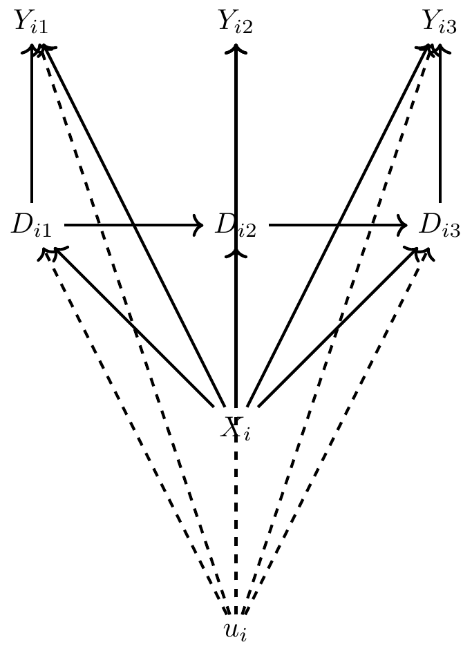{fig-align="center"}
:::
. . .

*DAG解读*

- $u_i$ 是时间不变的混淆变量（如能力、地理位置）
- $u_i$ 同时影响 $D_{it}$ 和 $Y_{it}$
- 固定效应通过*去均值化*消除 $u_i$ 的影响

## 固定效应模型（Within）估计量

**去均值化（Demeaning）**

对每个个体的所有观测值减去其时间平均值：

$$\bar{Y}_i = \frac{1}{T}\sum_{t=1}^{T} Y_{it}, \quad \bar{D}_i = \frac{1}{T}\sum_{t=1}^{T} D_{it}$$

. . .

**变换后的模型**

$$Y_{it} - \bar{Y}_i = \delta(D_{it} - \bar{D}_i) + (\varepsilon_{it} - \bar{\varepsilon}_i)$$

- $u_i$ 被消除了（因为它不随时间变化）
- 我们利用*个体内变异*（within variation）来估计 $\delta$

## 固定效应的直观理解

::: {.example-box}
**直观理解**

固定效应模型比较的是*同一个体在不同时间*的处理状态变化。

*例子*：研究教育对收入的影响

- 不是比较张三（高学历）和李四（低学历）的收入
- 而是比较张三获得额外教育*前后*的收入变化
:::

. . .

**关键假设**

严格外生性（Strict Exogeneity）：
$$E[\varepsilon_{it} | D_{i1}, ..., D_{iT}, u_i] = 0$$

- 时变误差项与所有时期的处理变量都不相关
- 排除了动态面板（$Y_{it-1}$ 影响 $D_{it}$）的情况

## 固定效应的局限性

::: {.warning-box}
**局限一：无法解决反向因果**

如果 $Y_{it}$ 影响 $D_{it}$（同时性），固定效应无法解决。

*例子*：警察与犯罪

- 犯罪率高的城市会部署更多警察
- 固定效应无法消除这种反向因果
:::

. . .

**局限二：无法处理时变混淆变量**

固定效应只能消除*不随时间变化*的混淆变量。

- 如果存在时变混淆 $X_{it}$ 与 $D_{it}$ 相关，估计仍然有偏
- 需要额外假设或工具变量来解决

## 何时使用固定效应

::: {.example-box}
**适用场景**

- 存在不随时间变化的个体特征（能力、偏好、地理位置）
- 这些特征与处理变量相关
- 处理变量在个体内有变异（有人从0变1，或从1变0）
:::

. . .

**不适用场景**

- 处理变量在个体内无变异（如性别、种族）
- 存在时变混淆变量
- 存在反向因果或 simultaneity

# 双重差分法 {background-color="#AE0B2A"}

## 双重差分的核心思想

::: {.concept-box}
**基本思想**

比较处理组和对照组在处理前后的*变化差异*：

$$\text{DiD} = (\bar{Y}_{treatment, post} - \bar{Y}_{treatment, pre}) - (\bar{Y}_{control, post} - \bar{Y}_{control, pre})$$
:::

. . .

*直观理解*

- 处理组在处理后相对于处理前的变化
- 减去对照组同期的变化（counterfactual）
- 差分之差 = 处理效应

## John Snow与霍乱

**历史上第一个自然实验**

1854年伦敦霍乱爆发，[John Snow](https://en.wikipedia.org/wiki/John_Snow) 假设霍乱通过水传播。

. . .

**自然实验设计**

- **处理组**：由 Lambeth 公司（上游取水）供水的家庭
- **对照组**：由 Southwark & Vauxhall 公司（下游取水）供水的家庭
- **处理**：Lambeth 公司将取水口移到上游（避开污水）

. . .

**结果**

Lambeth 用户的霍乱死亡率从 130/10,000 降到 0，而对照组保持高位。

这就是*双重差分*的早期应用！

## 2×2 DiD设计
::: {.intro-mermaid}
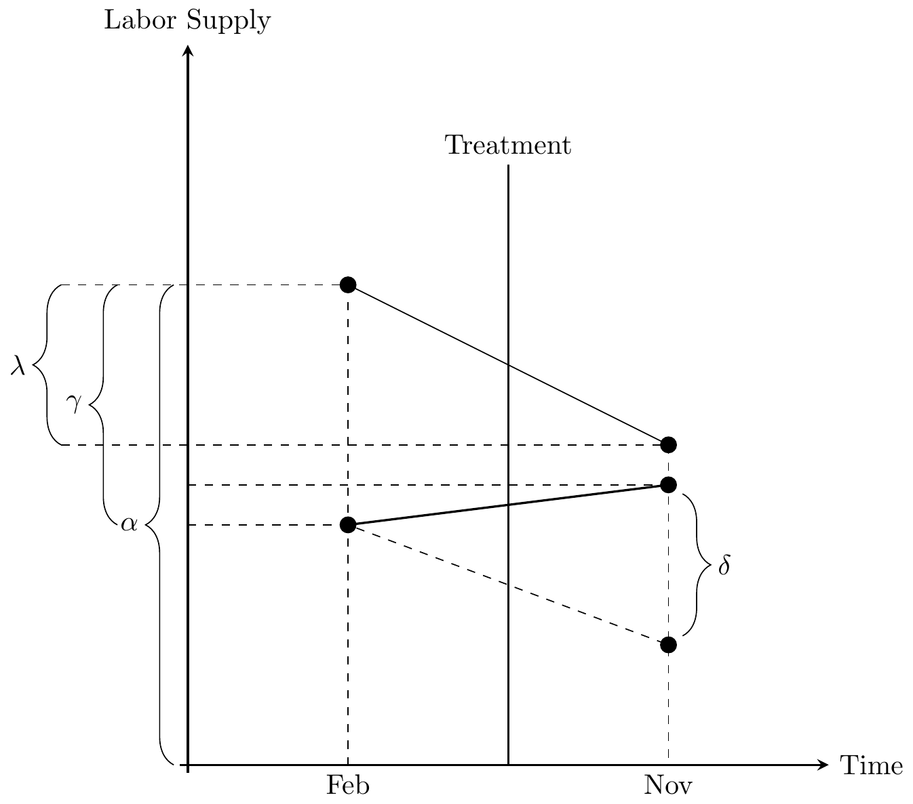{fig-align="center" width="50%"}
:::
. . .

**四组比较**

| | 处理前 | 处理后 | 变化 |
|:---|:---:|:---:|:---:|
| 处理组 | $\bar{Y}_{T,pre}$ | $\bar{Y}_{T,post}$ | $\Delta_T$ |
| 对照组 | $\bar{Y}_{C,pre}$ | $\bar{Y}_{C,post}$ | $\Delta_C$ |
| **差分** | | | $\Delta_T - \Delta_C$ |

## 平行趋势假设

::: {.concept-box}
**平行趋势假设（Parallel Trends）**

如果没有处理，处理组和对照组的结果变量会遵循相同的时间趋势：

$$E[Y(0)_{T,post} - Y(0)_{T,pre}] = E[Y(0)_{C,post} - Y(0)_{C,pre}]$$
:::

. . .

*为什么重要？*

- 平行趋势意味着对照组提供了处理组的*反事实路径*
- 如果趋势不同，DiD 估计会有偏

## 平行趋势假设的局限

::: {.warning-box}
**无法直接检验！**

我们只能观察处理前的趋势是否平行，但这不能保证处理后趋势也平行。
:::

*实践中的应对方案*

- 绘制**事件研究图**，检验处理前系数是否接近零
- 安慰剂检验：假设处理发生在更早时期

## DiD的估计方程

**双向固定效应（TWFE）模型**

$$Y_{it} = \alpha + \delta D_{it} + \gamma_i + \lambda_t + \varepsilon_{it}$$

. . .

*各组成部分*

- $\gamma_i$：个体固定效应（控制不随时间变化的特征）
- $\lambda_t$：时间固定效应（控制所有个体共同面对的冲击）
- $D_{it}$：处理变量（处理组且处理后 = 1，否则 = 0）
- $\delta$：处理效应（DiD估计量）

. . .

*等价性*

对于2×2 DiD，TWFE估计量等于“差分之差”。

## 经典案例：Card & Krueger (1994)

**研究问题**：最低工资提高会导致失业增加吗？

. . .

**研究设计**

- **处理组**：新泽西州（NJ）快餐店，1992年最低工资从$4.25提高到$5.05
- **对照组**：宾夕法尼亚州（PA）东部快餐店（最低工资不变）
- **数据**：处理前后分别调查两州快餐店的雇佣人数

. . .

**预期结果**（传统经济学）

最低工资提高 → 劳动力成本上升 → 企业裁员 → 就业下降

## Card & Krueger 结果
::: {.intro-mermaid}
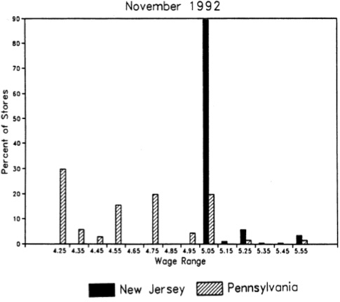{fig-align="center" width="70%"}
:::
. . .

**惊人发现**

- 新泽西州就业*增加*了 2.76 全时当量(Full-Time Equivalent, FTE: 每周40小时)
- 宾夕法尼亚州就业*减少*了 2.16 FTE
- **DiD 估计**：+4.92 FTE（统计不显著）

. . .

*结论*

**没有证据表明最低工资提高减少了快餐店就业**。挑战了传统经济学观点。

## 推断挑战：聚类标准误

::: {.warning-box}
**序列相关问题**

面板数据中，同一个体的观测值往往存在序列相关：

$$Cov(\varepsilon_{it}, \varepsilon_{is}) \neq 0, \quad t \neq s$$

传统标准误会严重低估真实的标准误！
:::

. . .

**解决方案**

在个体层面聚类标准误（clustered standard errors）：

- 允许同一个体内的误差项相关
- 更保守（更大的标准误）
- 在 DiD 中几乎是必须的

## 事件研究设计

**动态处理效应**

处理效应可能随时间变化：

- 立即效应
- 滞后效应
- 预期效应（anticipation）

. . .

**事件研究模型**

$$\begin{aligned}
Y_{it} = \alpha &+ \sum_{k=-m}^{-2} \beta_k D_{it}^k + \sum_{k=0}^{n} \beta_k D_{it}^k \\
               &+ \gamma_i + \lambda_t + \varepsilon_{it}
\end{aligned}$$

- $D_{it}^k$：指示变量，表示个体 $i$ 在处理后 $k$ 期（或前 $|k|$ 期）
- 省略处理前一期（$k=-1$）作为参照

## 事件研究图
::: {.intro-mermaid}
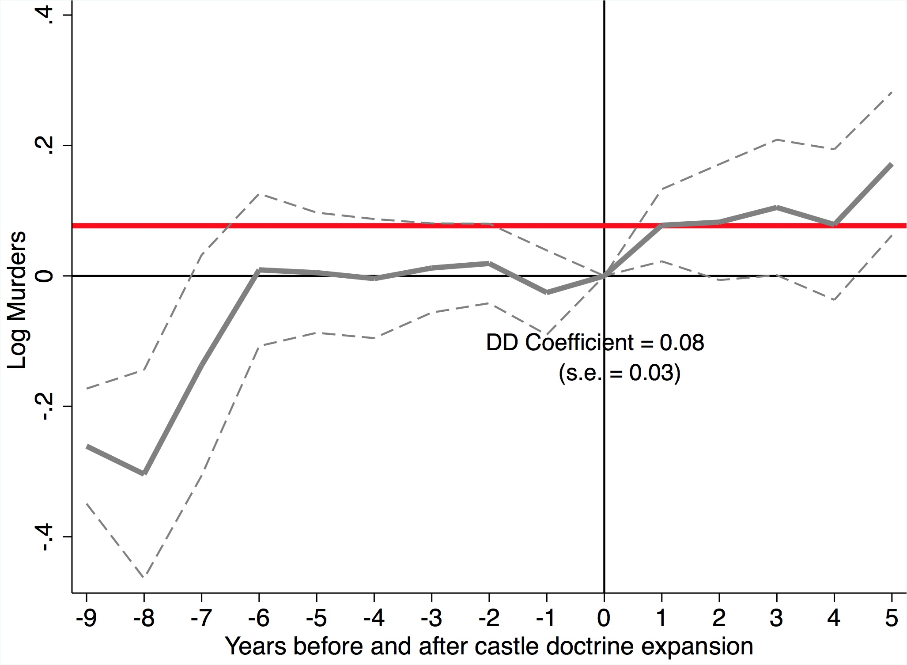{fig-align="center" width="60%"}
:::
. . .

*解读*

- 横轴：相对于处理发生的时间（事件时间）
- 纵轴：处理效应大小
- 预处理系数应接近零（检验平行趋势）
- 处理后系数显示动态效应

## 检验平行趋势

**预处理系数检验**

事件研究中，处理前的系数 $\beta_k$（$k < 0$）应该：

- 统计上不显著（接近零）
- 没有明显趋势

. . .

::: {.example-box}
**解读**

如果预处理系数显著不为零：

- 处理组和对照组在处理前趋势不同
- 平行趋势假设可能不成立
- DiD 估计可能有偏
:::

## 案例：ACA医疗补助扩展

**Miller et al. (2019)**

研究《平价医疗法案》（Affordable Care Act,ACA）医疗补助扩展对保险覆盖率和死亡率的影响。

. . .

**研究设计**

- **处理组**：采纳 ACA 医疗补助扩展的州
- **对照组**：未采纳扩展的州
- **处理时间**：2014年（大部分州）


## ACA医补助拓展

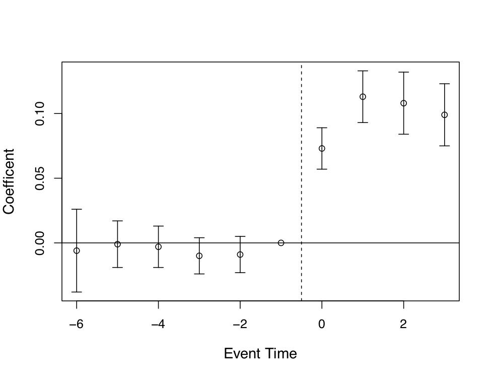{fig-align="center" width="48%"}
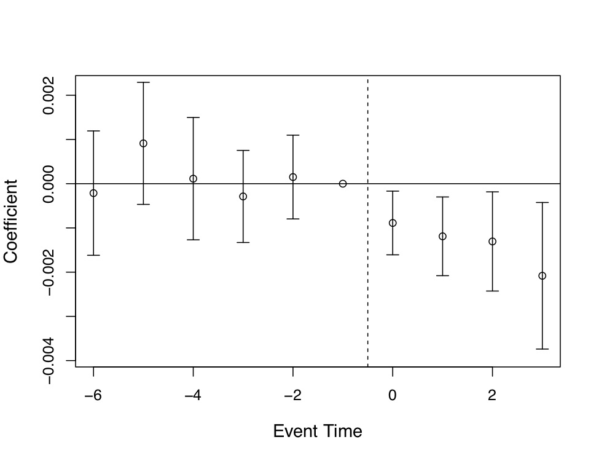{fig-align="center" width="48%"}

## 安慰剂检验

**逻辑**

如果我们随机分配“假处理”，应该*得不到显著的处理效应*。

. . .

**实施方法**

1. 随机选择处理组（保持处理组大小不变）
2. 估计 DiD
3. 重复多次（如1000次）
4. 构建安慰剂分布
5. 比较真实估计与安慰剂分布

. . .

*解释*

如果真实估计在安慰剂分布的尾部 → 真实效应显著

## 安慰剂检验典型结果展示
::: {.intro-mermaid}
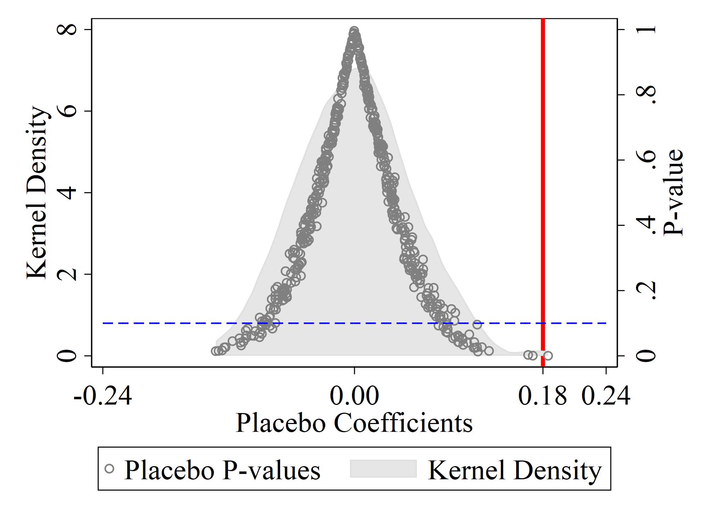{fig-align="center" width="50%"}
:::

## 三重差分（DDD）

**何时使用?**

当平行趋势假设在简单的 DiD 中不成立时，可以添加第三个维度。

. . .

**模型**

$$\begin{aligned}
Y_{it} = \alpha &+ \beta_1 Treat_i + \beta_2 Post_t + \beta_3 Group_i \\
        &+ \delta (Treat_i \times Post_t \times Group_i) + \varepsilon_{it}
\end{aligned}$$

. . .

*直观理解*

利用两个维度的差异来识别因果效应：

- *第一重差分*：处理前后
- *第二重差分*：处理组 vs 对照组
- *第三重差分*：子群体A vs 子群体B

## Gruber (1994) 案例

**研究问题**：强制产假福利对工资和就业的影响

. . .

**研究设计**

- 美国某些州通过了强制产假保险法
- 比较：有法律的州 vs 无法律的州
- 进一步比较：已婚女性（受益）vs 其他群体

. . .

**DDD 结果**

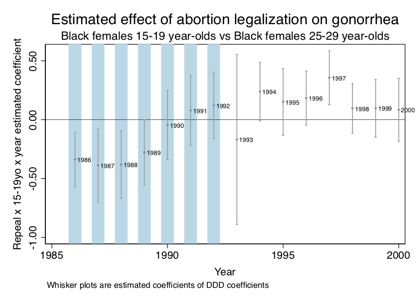{fig-align="center" width="75%"}

. . .

*发现*

强制产假福利导致已婚女性的工资下降（成本转嫁给员工）。

## 现代DiD：交错处理 (Staggered Treatment)

**现实复杂性**

大多数政策不是同时实施的：

- 不同州在不同时间采纳政策
- 处理时间是"交错"的（staggered）

. . .

**问题**

传统的双向固定效应（TWFE）在交错处理下可能有问题：

- 已经处理的单位被用作"对照组"
- 如果处理效应随时间变化，估计会有偏

. . .

## Goodman-Bacon分解

**Goodman-Bacon (2018) **: 

- 提出了一种方法，将交错处理的 TWFE 估计量分解为所有可能的 2×2 DiD 估计的加权平均。这样可以更清楚地理解 
  
- TWFE 估计量是如何由不同时间和组别的比较组成的

. . .

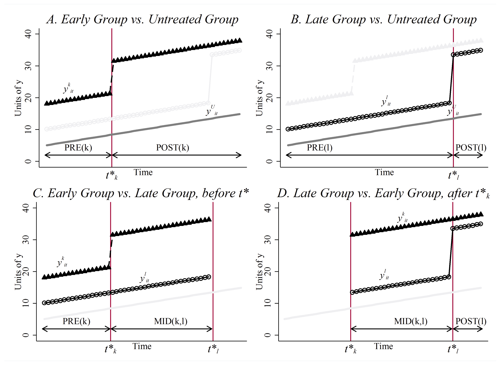{fig-align="center" width="70%"}

## Python实现：DiD模拟

::: {style="font-size: 1em;"}
```{python}
#| echo: true
#| eval: true
#| output: true

import numpy as np
import pandas as pd
import statsmodels.api as sm
from linearmodels.panel import PanelOLS
import warnings
warnings.filterwarnings('ignore')

# 设置随机种子
np.random.seed(42)

# 生成面板数据
n_units = 200  # 个体数
n_periods = 10  # 时间期数

# 创建面板数据结构
units = np.repeat(np.arange(n_units), n_periods)
periods = np.tile(np.arange(n_periods), n_units)

# 处理组（前50%为处理组）
treatment = (units < n_units // 2).astype(int)

# 处理发生在第5期
post = (periods >= 5).astype(int)

# 处理变量（处理组 & 处理后）
D = treatment * post

print(f"样本量: {n_units} 个个体 × {n_periods} 期 = {len(units)} 个观测")
print(f"处理组: {treatment.sum() // n_periods} 个")
print(f"对照组: {(1-treatment).sum() // n_periods} 个")
```
:::

## 数据生成过程

::: {style="font-size: 1em;"}
```{python}
#| echo: true
#| eval: true
#| output: true

# 个体固定效应（不随时间变化）
unit_fe = np.repeat(np.random.normal(0, 1, n_units), n_periods)

# 时间固定效应（所有个体共同）
time_fe = np.tile(np.linspace(0, 2, n_periods), n_units)

# 真实处理效应
true_effect = 2.0

# 生成结果变量
Y = (unit_fe + time_fe + true_effect * D +
     np.random.normal(0, 0.5, len(units)))

# 创建数据框
data = pd.DataFrame({
    'unit': units,
    'period': periods,
    'Y': Y,
    'D': D,
    'treatment': treatment,
    'post': post
})

print("数据结构:")
print(data.head(10))
print(f"\n处理组均值: {data[data['D']==1]['Y'].mean():.3f}")
print(f"对照组均值: {data[data['D']==0]['Y'].mean():.3f}")
```
:::

## TWFE估计

::: {style="font-size: 1em;"}
```{python}
#| echo: true
#| eval: true
#| output: true

# 设置面板索引
data = data.set_index(['unit', 'period'])

# TWFE估计（使用linearmodels）
model = PanelOLS(
    dependent=data['Y'],
    exog=sm.add_constant(data['D']),
    entity_effects=True,  # 个体固定效应
    time_effects=True     # 时间固定效应
)
result = model.fit(cov_type='clustered', cluster_entity=True)

print("TWFE估计结果:")
print("=" * 50)
print(f"真实处理效应: {true_effect:.3f}")
print(f"估计处理效应: {result.params['D']:.3f}")
print(f"标准误: {result.std_errors['D']:.3f}")
print(f"t统计量: {result.tstats['D']:.3f}")
print(f"p值: {result.pvalues['D']:.3f}")
print("=" * 50)
```
:::

## 关键假设总结

::: {.concept-box}
**DiD有效性的检查清单**

1. *平行趋势假设*：处理组和对照组在处理前有相似趋势
2. *无预期效应*：处理前没有提前反应
3. *无溢出效应*：处理不影响对照组
4. *处理不变性*：处理效应不依赖于其他单位的处理状态
5. *共同冲击*：时间固定效应能捕捉共同冲击
:::

. . .

**稳健性检验**

- 事件研究图（检验平行趋势）
- 安慰剂检验（随机分配处理）
- 不同对照组（检验结果稳健性）
- 排除特定时期（检验特定事件影响）

# 合成控制法 {background-color="#AE0B2A"}

## DiD无法解决的问题

**问题场景**

当只有一个（或极少数）处理单位时：

- 一个省份/城市实施政策
- 一个公司被收购
- 一个国家发生革命

. . .

**DiD的局限**

- 需要足够多的对照组来估计时间固定效应
- 单个处理单位时，对照组的选择主观性强
- 如何选择“合适”的对照组？

## 合成控制法的思想

::: {.concept-box}
**核心思想**

不要选择单一的对照组，而是*构建*一个"合成"的对照：

用多个对照单位的加权组合来近似处理单位在没有处理时的反事实。
:::

. . .

**优势**

- 数据驱动的权重选择（避免主观选择）
- 合成单位与处理单位在处理前有相似的预测变量
- 透明：可以看到哪些单位贡献了权重

## California Proposition 99

**经典案例：Abadie et al. (2010)**

- **背景**：1988年加州通过Proposition 99，大幅提高香烟税
- **目标**：评估该政策对香烟消费的影响
- **挑战**：加州是唯一的处理单位

. . .

**合成控制构建**

使用38个没有提高香烟税的州作为“捐赠池”（donor pool），寻找最优权重组合来合成“假加州”。

## 合成控制结果

*解读*

- 实线：加州实际香烟消费
- 虚线：合成加州（如果没有政策）
- 两者在处理前拟合很好
- 处理后差距扩大

. . .

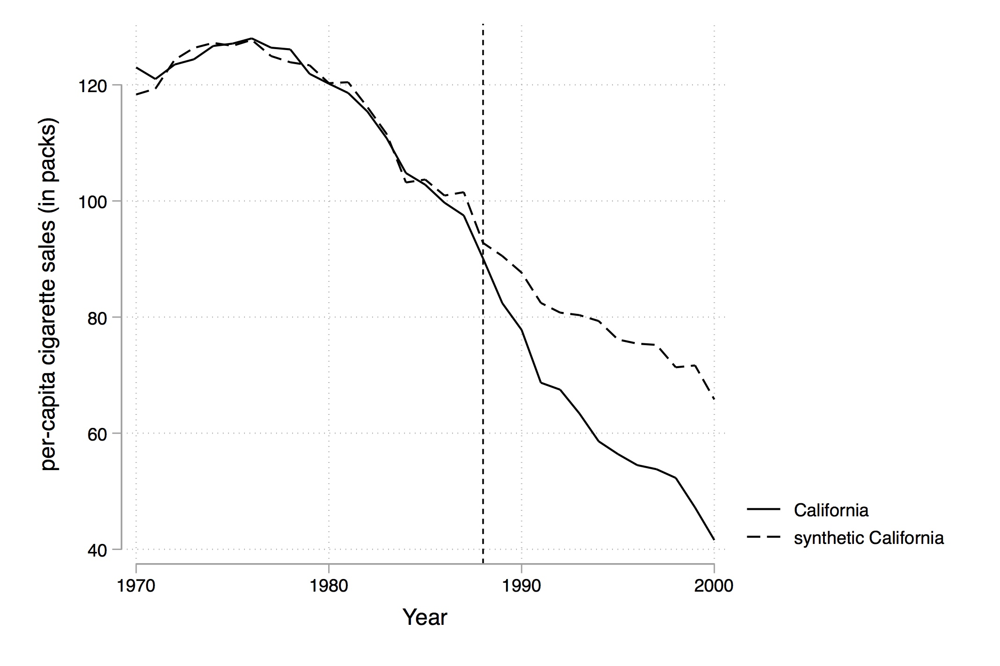{fig-align="center" width="85%"}

## 处理效应估计

*结果*

- 香烟税使加州的人均香烟消费**大幅下降**
- 效应随时间累积
- 大约减少了**20-30包/人/年**

. . .

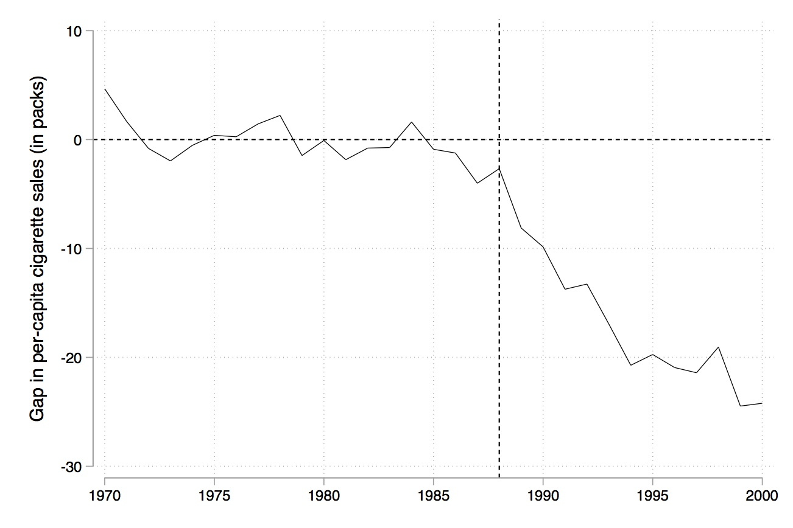{fig-align="center" width="85%"}

## 合成控制的形式化

**优化问题**

寻找权重向量 $\mathbf{W} = (w_2, ..., w_{J+1})$ 最小化：

$$\min_{\mathbf{W}} ||\mathbf{X}_1 - \mathbf{X}_0 \mathbf{W}||$$

约束条件：$w_j \geq 0$，$\sum w_j = 1$

. . .

*符号说明*

- $\mathbf{X}_1$：处理单位的预测变量
- $\mathbf{X}_0$：对照单位的预测变量矩阵
- $w_j$：第 $j$ 个对照单位的权重

## 安慰剂推断

**问题**

只有一个处理单位，无法进行传统的统计推断。

. . .

**空间安慰剂检验**

1. 依次将捐赠池中的每个单位作为“假处理单位”
2. 为其构建合成控制
3. 估计“假处理效应”
4. 比较真实效应与安慰剂分布

. . .

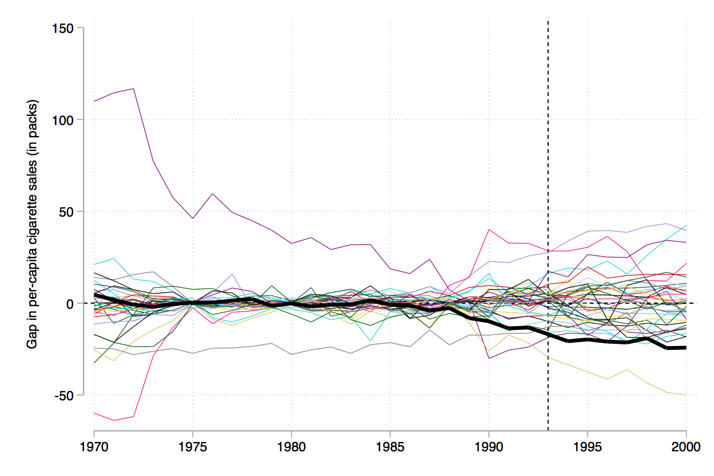{fig-align="center" width="85%"}

## 何时使用合成控制

::: {.example-box}
**适用场景**

- 只有少数处理单位（通常1个）
- 有大量潜在对照单位
- 处理前有足够长时间序列数据
- 处理单位和捐赠池单位有相似特征
:::

. . .

**与DiD的比较**

| | DiD | 合成控制 |
|:---|:---|:---|
| 处理单位数 | 多个 | 通常1个 |
| 对照组 | 预先指定 | 数据驱动构建 |
| 权重 | 等权重 | 最优权重 |
| 推断 | 传统标准误 | 安慰剂检验 |

# 方法比较与总结 {background-color="#AE0B2A"}

## 三种方法比较

::: {.concept-box}
| 方法 | 核心假设 | 适用场景 | 主要优势 |
|:---|:---|:---|:---|
| *固定效应* | 严格外生性 | 面板数据，时变处理 | 控制时不变混淆 |
| *DiD* | 平行趋势 | 政策评估，自然实验 | 直观，易于实施 |
| *合成控制* | 合成单位近似反事实 | 单一处理单位 | 数据驱动，透明 |
:::

. . .

**选择指南**

1. **多个处理单位 + 面板数据** → DiD
2. **单一处理单位 + 时间序列** → 合成控制
3. **处理在单位内有变异** → 固定效应
4. **政策 staggered adoption** → 现代 DiD 方法

## 本讲要点（一）

::: {.concept-box}

1. *面板数据结构*
   - 个体和时间两个维度
   - 可以控制不随时间变化的混淆变量

2. *固定效应模型*
   - 去均值化消除个体固定效应
   - 依赖个体内变异；严格外生性假设

:::

## 本讲要点（二）

::: {.concept-box}

3. *双重差分法*
   - 平行趋势假设是关键
   - 事件研究检验平行趋势
   - 现代进展处理 staggered adoption

4. *合成控制法*
   - 适用于单一处理单位
   - 数据驱动构建反事实
   - 空间安慰剂进行推断

:::

## 推荐工具

:::: {.columns}

::: {.column width="50%"}
::: {.callout-tip}
**Python**

- `linearmodels`：PanelOLS, IV2SLS
- `statsmodels`：基础回归
- `econml`：更高级的因果推断方法
:::
:::

::: {.column width="50%"}
::: {.callout-tip}
**R**

- `fixest`：快速固定效应估计（推荐）
- `did`：Callaway & Sant'Anna 的现代 DiD
- `Synth`：合成控制法
- `panelr`：面板数据处理
:::
:::

::::

## 下节课预告

**第七讲：断点回归设计 (Regression Discontinuity)**

- 清晰断点（Sharp RD）
- 模糊断点（Fuzzy RD）
- 带宽选择和稳健性检验
- 应用案例

. . .

::: {.concept-box}
*核心思想*

在断点附近的个体可以认为是可比较的，处理效应由断点处的跳跃识别。
:::

# 参考文献

- Abadie, A., Diamond, A., & Hainmueller, J. (2010). Synthetic Control Methods for Comparative Case Studies: Estimating the Effect of California's Tobacco Control Program. Journal of the American Statistical Association, 105(490), 493-505.

- Angrist, J. D., & Pischke, J. S. (2009). Mostly Harmless Econometrics: An Empiricist's Companion. Princeton University Press.

- Callaway, B., & Sant'Anna, P. H. (2021). Difference-in-Differences with Multiple Time Periods. Journal of Econometrics, 225(2), 200-230.

- Card, D., & Krueger, A. B. (1994). Minimum Wages and Employment: A Case Study of the Fast-Food Industry in New Jersey and Pennsylvania. American Economic Review, 84(4), 772-793.

- Goodman-Bacon, A. (2021). Difference-in-Differences with Variation in Treatment Timing. Journal of Econometrics, 225(2), 254-277.

- Gruber, J. (1994). The Incidence of Mandated Maternity Benefits. American Economic Review, 84(3), 622-641.

- Miller, S., Johnson, N., & Wherry, L. R. (2019). Medicaid and Mortality: New Evidence From Linked Survey and Administrative Data. NBER Working Paper No. 26081.