## 上节课回顾

::: {.concept-box}
**面板数据与双重差分法**

- *面板数据*：个体 $\times$ 时间的二维结构，控制不随时间变化的混淆变量
- *固定效应模型*：去均值化消除个体异质性，依赖组内变异
- *双重差分法（DiD）*：平行趋势假设下识别因果效应
- *合成控制法*：数据驱动构建反事实，适用于单一处理单位
:::

. . .

*本节课目标*

- 理解机器学习的基本思想和与传统计量的区别
- 掌握偏差-方差权衡（Bias-Variance Tradeoff）
- 学会使用交叉验证选择模型
- 理解回归树和随机森林的原理与应用

# 从因果推断到机器学习 {background-color=“#AE0B2A“}

## 课程进入新阶段

::: {.concept-box}
**从“为什么”到“是什么”**

前六讲我们关注 *因果推断*——回答“X 是否导致 Y”。

从本讲开始，我们转向 *机器学习*——回答“如何最好地预测 Y”。
:::

. . .

:::: {.columns}

::: {.column width="50%"}
**因果推断**

- 目标：估计 $\beta$ 的无偏性
- 核心：识别策略
- 关注：内部有效性
:::

::: {.column width="50%"}
**机器学习**

- 目标：最小化预测误差
- 核心：泛化能力
- 关注：样本外表现
:::

::::

## 两种文化（Breiman, 2001）

::: {.example-box}
**统计建模的两种文化**

*“统计建模存在两种文化。一种假设数据由给定的随机数据模型生成。另一种使用算法模型，将数据生成机制视为未知……如果我们的目标是用数据解决问题，那么我们需要采用更加多样化的工具。”*

—— Leo Breiman (2001)
:::

. . .

| | 数据建模文化 | 算法建模文化 |
|:---|:---|:---|
| *代表* | 线性回归、Logit | 树模型、神经网络 |
| *目标* | 理解数据生成过程 | 最优预测 |
| *验证* | 拟合优度、显著性检验 | 交叉验证、测试集误差 |

## 什么是机器学习

::: {.concept-box}
**机器学习的核心思想**

机器学习让 *计算机从数据中自动学习* 模型 $\hat{f}(\mathbf{x})$，而不是预先指定参数模型 $y = \mathbf{x}'\boldsymbol{\beta} + \epsilon$。
:::

. . .

$$
\text{机器学习} \begin{cases}
\textbf{监督学习} \begin{cases}
\text{回归（Regression）：} y \text{ 是连续变量} \\
\text{分类（Classification）：} y \text{ 是类别变量}
\end{cases} \\
\textbf{非监督学习：} \text{聚类分析，无 } y
\end{cases}
$$

. . .

> 本课程聚焦 *监督学习中的回归问题*，这也是经济学中最常见的应用场景。

## 灵活性与可解释性的权衡

::: {.intro-mermaid}
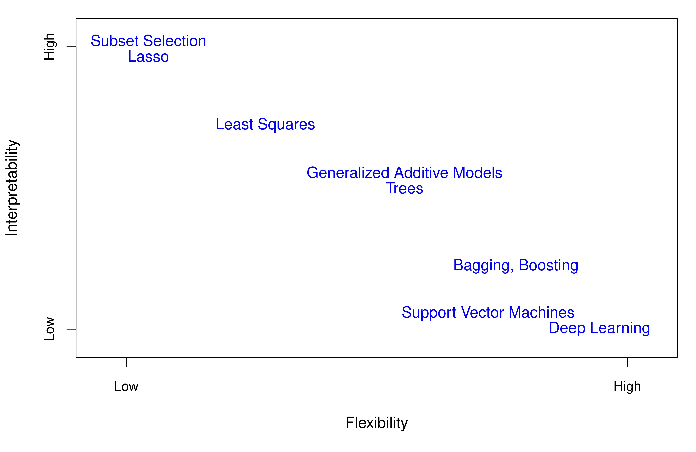{fig-align="center"}
:::

. . .

::: {.warning-box}
**关键权衡**

模型越灵活，预测能力越强，但可解释性越低。经济学往往需要在 *预测精度* 和 *参数解释* 之间取舍。
:::

## 计量经济学 vs. 机器学习

| 维度 | 计量经济学 | 机器学习 |
|:---|:---|:---|
| *核心目标* | 参数估计与因果推断 | 预测精度最大化 |
| *模型选择* | 经济理论驱动 | 数据驱动（交叉验证） |
| *评价标准* | 无偏性、一致性 | 测试集 MSE |
| *过拟合* | 较少关注 | 核心问题 |
| *变量选择* | 理论先验 | 自动化（LASSO、树等） |
| *样本需求* | 可处理小样本 | 通常需要大样本 |

. . .

> 但两者正在融合——*因果机器学习*（Causal ML）是后续讲义的重点。

# 偏差-方差权衡 {background-color=“#AE0B2A“}

## 过拟合问题

::: {.concept-box}
**什么是过拟合**

模型在 *训练集* 上表现很好，但在 *新数据* 上预测很差。

$$\hat{\boldsymbol{\epsilon}} = (\mathbf{y} - \mathbf{X}\hat{\beta}_{OLS}) = (I - \mathbf{X}(\mathbf{X'X})^{-1}\mathbf{X}')\boldsymbol{\epsilon}$$

当模型过于复杂时，$|\hat{\epsilon}_i| < |\epsilon_i|$——残差被人为压小了。
:::

. . .

*直观理解*

- 考试前把所有答案背下来 → 换一套题就不会了
- 模型“记住”了噪声，而不是学到了规律

## 训练误差 vs. 测试误差

::: {.intro-mermaid}
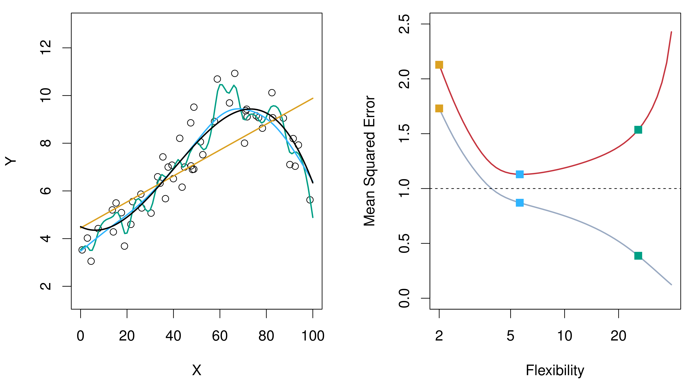{fig-align="center"}
:::

. . .

::: {.warning-box}
**核心发现**

训练 MSE 随模型复杂度单调递减，但测试 MSE 呈 U 形曲线。最优模型在 *复杂度适中* 时达到。
:::

## 偏差-方差分解

::: {.concept-box}
**测试误差的分解**

对于任意測试点 $x_0$，预测误差可以分解为三部分：

$$E\left[(y_0 - \hat{f}(x_0))^2\right] = \underbrace{\text{Var}(\hat{f}(x_0))}_{\text{方差}} + \underbrace{[\text{Bias}(\hat{f}(x_0))]^2}_{\text{偏差}^2} + \underbrace{\text{Var}(\epsilon)}_{\text{不可约误差}}$$
:::

. . .

| 模型复杂度 | 偏差 | 方差 | 总误差 |
|:---|:---|:---|:---|
| *低*（如线性回归） | 高 | 低 | 可能高 |
| *高*（如高次多项式） | 低 | 高 | 可能高 |
| *适中* | 适中 | 适中 | **最低** |

## 偏差-方差权衡图示

::: {.intro-mermaid}
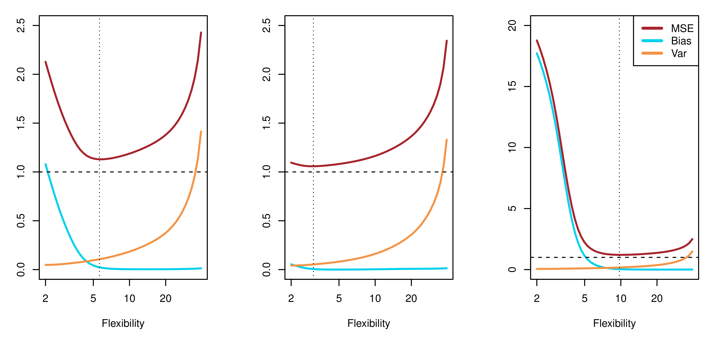{fig-align="center"}
:::

. . .

- *偏差*（Bias）：模型的系统性误差——模型本身不够灵活
- *方差*（Variance）：模型对训练数据的敏感程度——换一组数据，预测变化多大

## Python 演示：偏差-方差权衡

::: {style="font-size: 1em;"}
```{python}
#| echo: true
#| eval: true
#| output: true
#| fig-width: 12
#| fig-height: 5

import numpy as np
import matplotlib.pyplot as plt

np.random.seed(42)

# 真实函数
def f_true(x):
    return np.sin(2 * x) + 0.5 * x

# 生成数据
n = 30
x_train = np.sort(np.random.uniform(0, 5, n))
y_train = f_true(x_train) + np.random.normal(0, 0.5, n)

x_test = np.linspace(0, 5, 200)
y_true = f_true(x_test)

fig, axes = plt.subplots(1, 3, figsize=(12, 4))
titles = ['Underfitting (degree=1)', 'Good fit (degree=4)', 'Overfitting (degree=15)']
degrees = [1, 4, 15]

for ax, deg, title in zip(axes, degrees, titles):
    coeffs = np.polyfit(x_train, y_train, deg)
    y_pred = np.polyval(coeffs, x_test)
    ax.scatter(x_train, y_train, c='steelblue', alpha=0.6, s=30, label='Training data')
    ax.plot(x_test, y_true, 'k--', alpha=0.5, label='True function')
    ax.plot(x_test, y_pred, 'r-', linewidth=2, label=f'Polynomial (d={deg})')
    ax.set_title(title, fontsize=13)
    ax.set_ylim(-2, 6)
    ax.legend(fontsize=9)

plt.tight_layout()
plt.show()
```

:::

# 交叉验证 {background-color=“#AE0B2A“}

## 为什么需要交叉验证

::: {.concept-box}
**核心问题**

我们无法观测真正的测试误差，只能观测训练误差。如何估计模型在新数据上的表现？
:::

. . .

*解决思路*

- 将手中的数据模拟“训练-测试”的过程
- 用一部分数据训练，另一部分数据验证

. . .

两种常见的过拟合惩罚方法：

1. *信息准则*：AIC、BIC（添加参数个数惩罚）
2. *交叉验证*：直接估计样本外预测误差 ← **本节重点**

## 验证集方法

::: {.intro-mermaid}
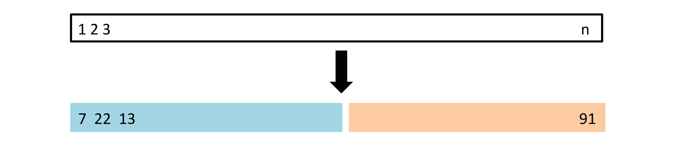{fig-align="center"}
:::

. . .

::: {.warning-box}
**局限性**

验证集方法简单直观，但结果 *高度依赖* 数据的随机划分——不同的划分可能给出截然不同的结论。
:::

## 验证集方法的不稳定性

::: {.intro-mermaid}
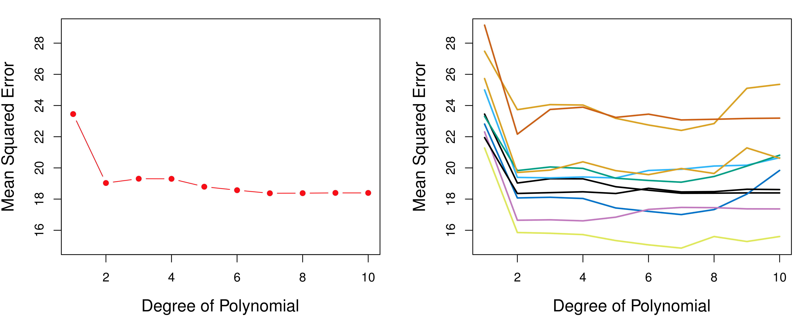{fig-align="center"}
:::

. . .

每次随机划分都给出不同的验证 MSE 曲线。如何获得更稳定的估计？

→ **K 折交叉验证**

## K 折交叉验证（K-Fold CV）

::: {.concept-box}
**K-Fold CV 算法**

1. 将数据随机分为 $K$ 个大小相近的折（fold）
2. 依次用第 $k$ 折作为验证集，其余 $K-1$ 折作为训练集
3. 计算每折的验证误差，取平均

$$CV_{(K)} = \frac{1}{K}\sum_{k=1}^{K} MSE_k = \frac{1}{K}\sum_{k=1}^{K}\frac{1}{n_k}\sum_{i \in C_k}(y_i - \hat{y}_i^{(-k)})^2$$
:::

. . .

::: {.intro-mermaid}
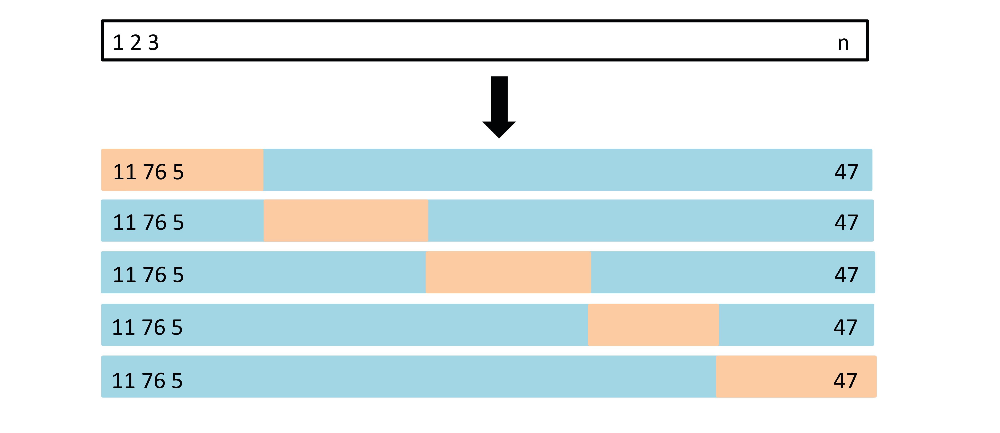{fig-align="center"}
:::

## K 的选择

| K 值 | 偏差 | 方差 | 计算量 | 常用场景 |
|:---|:---|:---|:---|:---|
| *K = 5* | 略高 | 较低 | 适中 | 大多数场景 |
| *K = 10* | 较低 | 适中 | 适中 | 默认推荐 |
| *K = n*（LOOCV） | 最低 | 最高 | 最大 | 小样本 |

. . .

::: {.intro-mermaid}
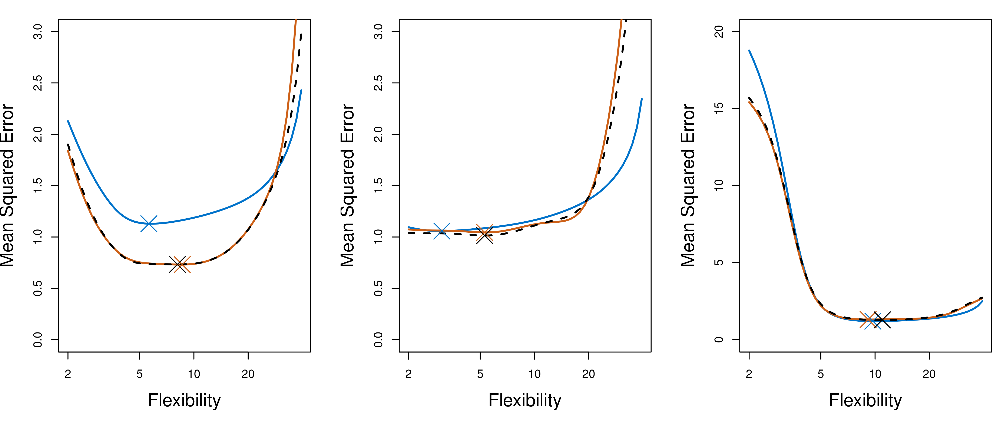{fig-align="center"}
:::

## Python 演示：K 折交叉验证

::: {style="font-size: 1em;"}
```{python}
#| echo: true
#| eval: true
#| output: true
#| fig-width: 10
#| fig-height: 5

from sklearn.model_selection import cross_val_score
from sklearn.preprocessing import PolynomialFeatures
from sklearn.linear_model import LinearRegression
from sklearn.pipeline import make_pipeline

np.random.seed(42)
n = 100
X = np.sort(np.random.uniform(0, 5, n)).reshape(-1, 1)
y = np.sin(2 * X.ravel()) + 0.5 * X.ravel() + np.random.normal(0, 0.5, n)

degrees = range(1, 16)
cv_means, cv_stds, train_scores = [], [], []

for d in degrees:
    model = make_pipeline(PolynomialFeatures(d), LinearRegression())
    scores = cross_val_score(model, X, y, cv=10, scoring='neg_mean_squared_error')
    cv_means.append(-scores.mean())
    cv_stds.append(scores.std())
    model.fit(X, y)
    train_scores.append(np.mean((y - model.predict(X))**2))

fig, ax = plt.subplots(figsize=(10, 5))
ax.plot(degrees, train_scores, 'b--o', label='Training MSE', markersize=5)
ax.plot(degrees, cv_means, 'r-o', label='10-Fold CV MSE', markersize=5)
ax.fill_between(degrees,
                np.array(cv_means) - np.array(cv_stds),
                np.array(cv_means) + np.array(cv_stds), alpha=0.2, color='red')
ax.set_xlabel('Polynomial Degree', fontsize=12)
ax.set_ylabel('Mean Squared Error', fontsize=12)
ax.set_title('Training MSE vs. Cross-Validation MSE', fontsize=14)
ax.legend(fontsize=11)
ax.set_ylim(0, max(cv_means) * 1.5)

best_d = list(degrees)[np.argmin(cv_means)]
ax.axvline(x=best_d, color='green', linestyle=':', alpha=0.7, label=f'Best degree = {best_d}')
ax.legend(fontsize=11)
plt.tight_layout()
plt.show()
```

:::

# 回归树 {background-color=“#AE0B2A“}

## 从线性模型到树模型

::: {.concept-box}
**回归树的核心思想**

通过 *递归地将特征空间划分为矩形区域*，在每个区域内用均值进行预测。

不假设 $y$ 和 $\mathbf{x}$ 之间的函数形式——完全由数据决定。
:::

. . .

*为什么需要树模型？*

- 线性模型假设 $y = \mathbf{x}'\beta + \epsilon$——如果真实关系是非线性的呢？
- 当存在 *交互效应* 和 *阈值效应* 时，树模型更自然
- 树模型的结果容易可视化和解释

## 一个直观例子

::: {.intro-mermaid}
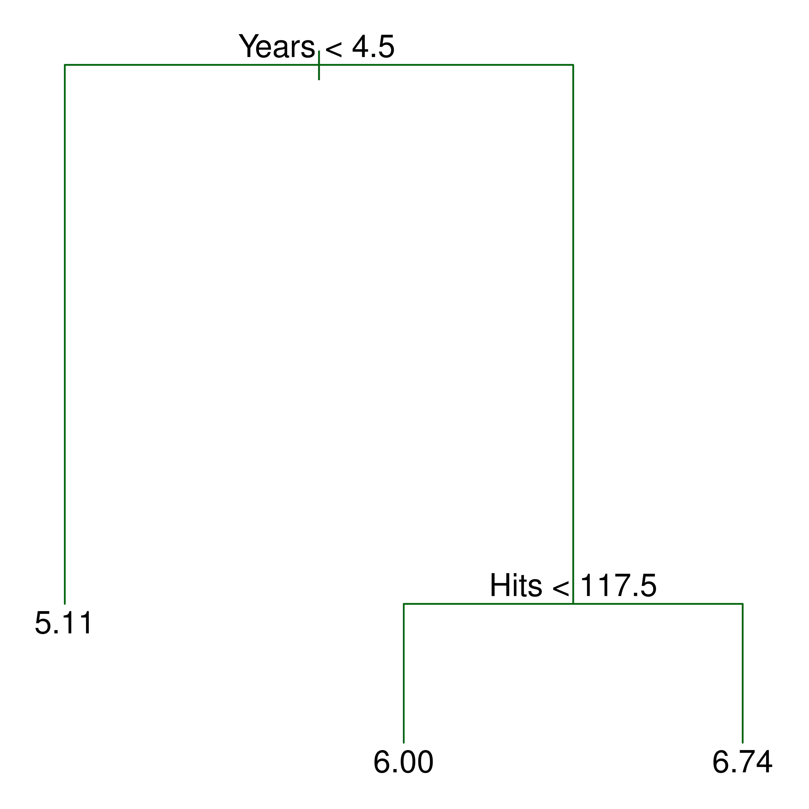{fig-align="center"}
:::

. . .

::: {.example-box}
**Hitters 数据集: 预测棒球运动员的薪资**

树的每个内部节点是一个分裂条件，叶节点给出预测值（$\log$ 薪资的均值）。
:::

## 特征空间的划分

::: {.intro-mermaid}
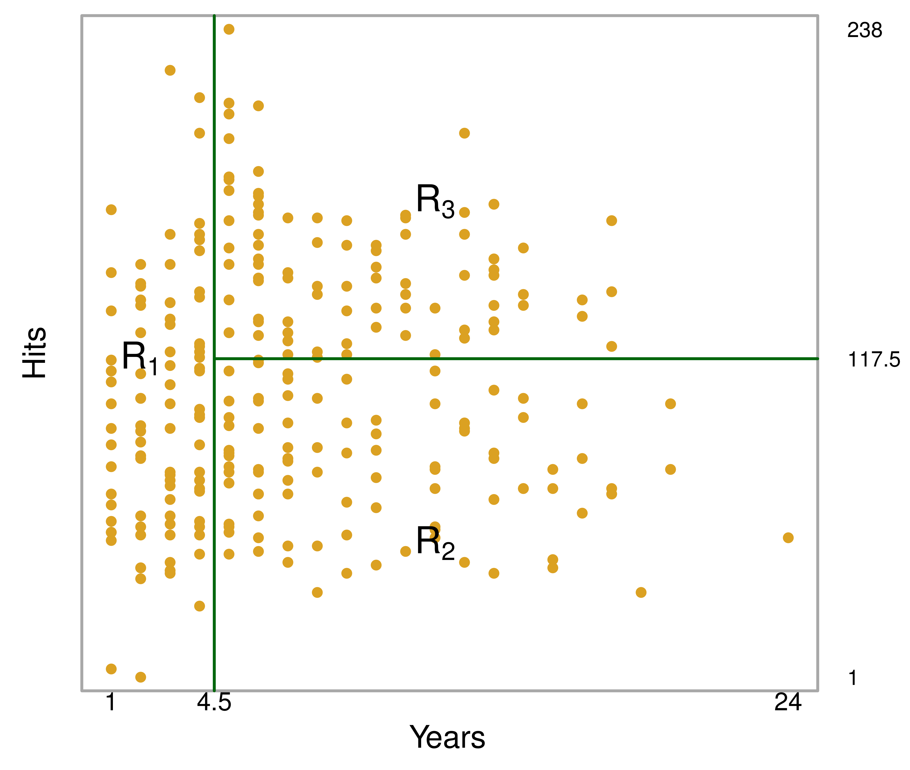{fig-align="center"}
:::

. . .

每个矩形区域 $R_j$ 对应树的一个叶节点。区域内所有观测值的预测值相同：

$$\hat{y}_i = \bar{y}_{R_j}, \quad \text{若 } x_i \in R_j$$

## 回归树算法

::: {.concept-box}
**递归二元分裂（Recursive Binary Splitting）**

目标：找到区域 $\{R_1, R_2, \ldots, R_J\}$ 最小化残差平方和

$$\min_{R_1, \ldots, R_J} \sum_{j=1}^{J} \sum_{i \in R_j} (y_i - \hat{y}_{R_j})^2$$
:::

. . .

*贪心算法*：每一步选择使 RSS 下降最多的分裂

$$Q(k, c) = \underbrace{\sum_{i: X_{ik} \leq c}(y_i - \bar{y}_{k,c}^L)^2}_{\text{左子节点 RSS}} + \underbrace{\sum_{i: X_{ik} > c}(y_i - \bar{y}_{k,c}^R)^2}_{\text{右子节点 RSS}}$$

选择 $(k, c)$ 使 $Q(k, c)$ 最小。

## 递归分裂过程

::: {.intro-mermaid}
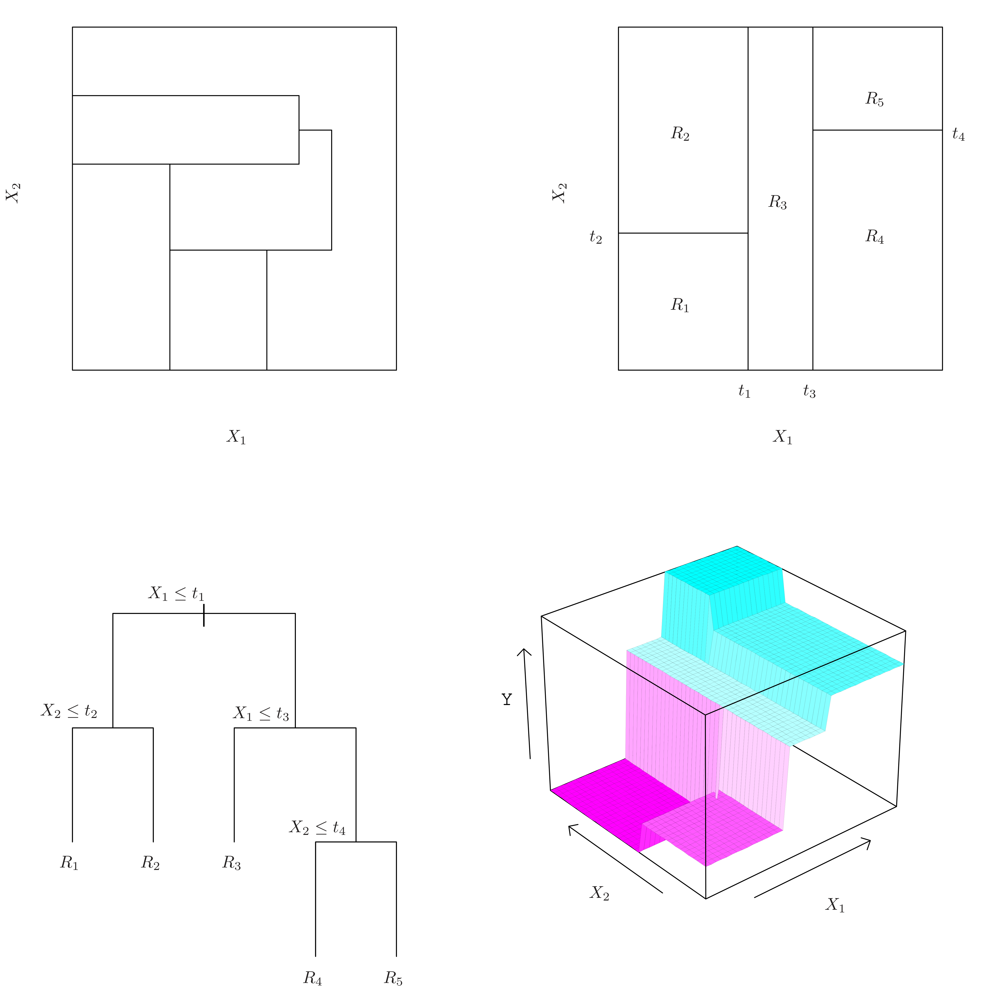{fig-align="center"}
:::

. . .

每一步分裂将一个区域一分为二，直到满足停止条件（如最小节点大小或最大深度）。

## 树剪枝（Pruning）

::: {.warning-box}
**深树的问题**

不加限制地生长树会导致过拟合——每个叶节点可能只有极少数观测值。
:::

. . .

::: {.concept-box}
**代价复杂度剪枝（Cost Complexity Pruning）**

在 RSS 中加入对树大小的惩罚项：

$$\min_{T} \sum_{j=1}^{|T|}\sum_{i \in R_j}(y_i - \hat{y}_{R_j})^2 + \lambda|T|$$

其中 $|T|$ 是叶节点数，$\lambda$ 通过交叉验证选择。
:::

## 剪枝效果

::: {.intro-mermaid}
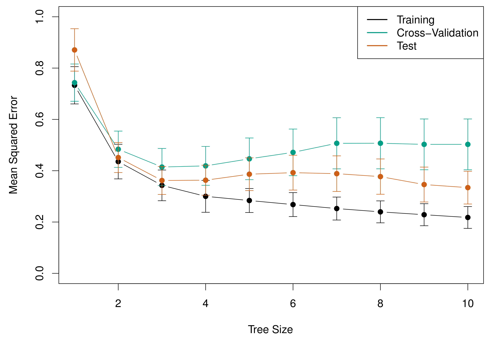{fig-align="center"}
:::

. . .

- 交叉验证帮助选择最优的树大小
- 过小的树（欠拟合）和过大的树（过拟合）都不理想

## 树模型 vs. 线性模型

::: {.intro-mermaid}
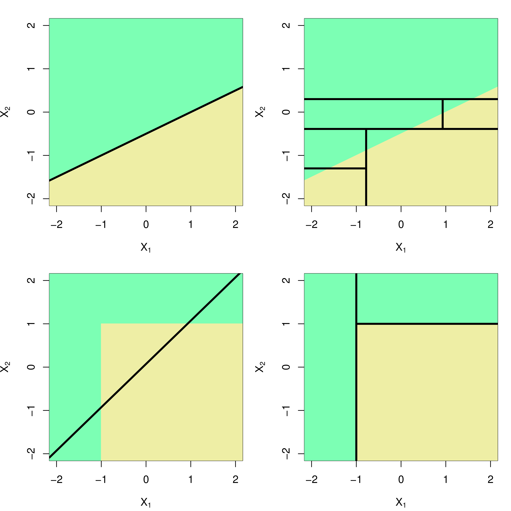{fig-align="center"}
:::

. . .

- 当真实关系接近线性时，线性回归更好（左图）
- 当真实关系复杂且存在交互效应时，树模型更优（右图）

## Python 演示：回归树

::: {style="font-size: 1em;"}
```{python}
#| echo: true
#| eval: true
#| output: true
#| fig-width: 12
#| fig-height: 5

from sklearn.tree import DecisionTreeRegressor, plot_tree

np.random.seed(42)
n = 200
X = np.sort(np.random.uniform(0, 10, n)).reshape(-1, 1)
y = np.sin(X.ravel()) + 0.3 * X.ravel() + np.random.normal(0, 0.5, n)

fig, axes = plt.subplots(1, 3, figsize=(12, 4.5))

max_depths = [2, 4, 10]
for ax, depth in zip(axes, max_depths):
    tree = DecisionTreeRegressor(max_depth=depth, random_state=42)
    tree.fit(X, y)
    X_plot = np.linspace(0, 10, 500).reshape(-1, 1)
    y_pred = tree.predict(X_plot)

    ax.scatter(X, y, c='steelblue', alpha=0.3, s=15)
    ax.plot(X_plot, y_pred, 'r-', linewidth=2)
    train_mse = np.mean((y - tree.predict(X))**2)
    ax.set_title(f'max_depth={depth}, Train MSE={train_mse:.3f}', fontsize=12)
    ax.set_xlabel('X')
    ax.set_ylabel('y')

plt.tight_layout()
plt.show()
```

:::

## 回归树的优缺点

:::: {.columns}

::: {.column width="50%"}
::: {.callout-tip}
**优点**

- 直观易解释，可可视化
- 自动处理非线性和交互效应
- 不需要特征标准化
- 对异常值相对稳健
:::
:::

::: {.column width="50%"}
::: {.callout-warning}
**缺点**

- 预测精度通常不如其他方法
- 对数据微小变化敏感（高方差）
- 不擅长捕捉线性关系
- 决策边界是轴平行的矩形
:::
:::

::::

. . .

> 如何克服这些缺点？→ **集成方法**（Ensemble Methods）

# 随机森林 {background-color=“#AE0B2A“}

## 从单棵树到森林

::: {.concept-box}
**集成学习的核心思想**

“三个臭皮匠，赛过一个诸葛亮”

单棵树方差大、不稳定。如果我们训练 *很多棵树*，然后取平均，方差就会大幅降低。
:::

. . .

*为什么平均能降低方差？*

- 如果 $Z_1, \ldots, Z_B$ 是 i.i.d. 随机变量，$\text{Var}(Z_i) = \sigma^2$
- 那么 $\text{Var}(\bar{Z}) = \sigma^2 / B$

→ 但问题是：**从同一数据集训练的多棵树是高度相关的**

## Bagging（自助聚合）

::: {.concept-box}
**Bootstrap Aggregation**

1. 从训练集中 *有放回地* 抽取 $B$ 个自助样本
2. 在每个自助样本上训练一棵完整的深树
3. 对 $B$ 棵树的预测取平均：

$$\hat{f}_{bag}(x) = \frac{1}{B}\sum_{b=1}^{B}\hat{f}_b(x)$$
:::

. . .

::: {.warning-box}
**Bagging 的局限**

如果某个特征非常强（如 $X_1$），每棵树的顶层分裂都会选择 $X_1$——树与树高度相关，平均的降方差效果有限。
:::

## 随机森林

::: {.concept-box}
**Random Forest 的关键创新**

在 Bagging 基础上，*每次分裂时只随机选择 $m$ 个特征* 进行考虑（而非全部 $p$ 个）。

- 通常取 $m = \sqrt{p}$ 或 $m = p/3$
- 通过 *去相关*（decorrelation）进一步降低方差
:::

. . .

*算法步骤*

1. 对 $b = 1, 2, \ldots, B$：
   - 自助抽样生成训练集
   - 在每个分裂节点，随机选择 $m$ 个候选特征
   - 从中选择最优分裂
2. 输出所有树的预测均值

## 随机森林的直觉

::: {.example-box}
**类比：专家委员会**

想象你要预测房价：

- *单棵决策树*：一个房产专家自己做判断
- *Bagging*：100 个房产专家独立判断后取平均——但每人看的信息相同
- *随机森林*：100 个专家，每人只看 *不同的几个因素*（有人看位置，有人看面积，有人看学区），最后投票
:::

. . .

强制专家“看不同的角度” → 观点更多样 → 集体决策更准确

## 随机森林与核回归

随机森林本质上是一种 *自适应加权平均*：

$$\hat{\mu}_{RF}(x) = \sum_{i=1}^{n}\alpha_i(x) \cdot y_i, \quad \sum_{i=1}^{n}\alpha_i(x) = 1, \quad \alpha_i(x) \geq 0$$

. . .

::: {.concept-box}
**与传统核回归的区别**

- 权重 $\alpha_i(x)$ 由数据自动决定（哪些观测与 $x$ 落在同一叶节点）
- 能自动忽略不相关的特征（*稀疏性*）
- 不受维度灾难的严重影响
:::

## Bagging 与随机森林效果

::: {.intro-mermaid}
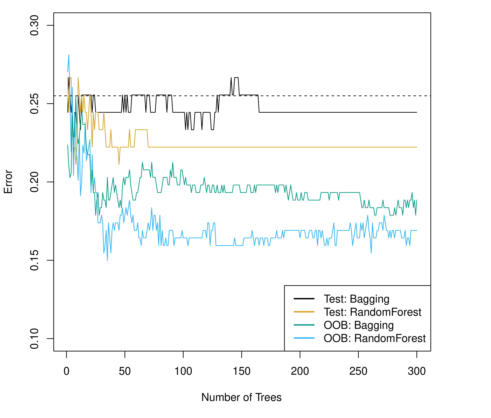{fig-align="center"}
:::

. . .

- *绿色*：Bagging（$m = p$）；*橙色*：随机森林（$m = \sqrt{p}$）
- 随机森林通常优于 Bagging，特别是当存在强预测变量时

## 变量重要性

::: {.intro-mermaid}
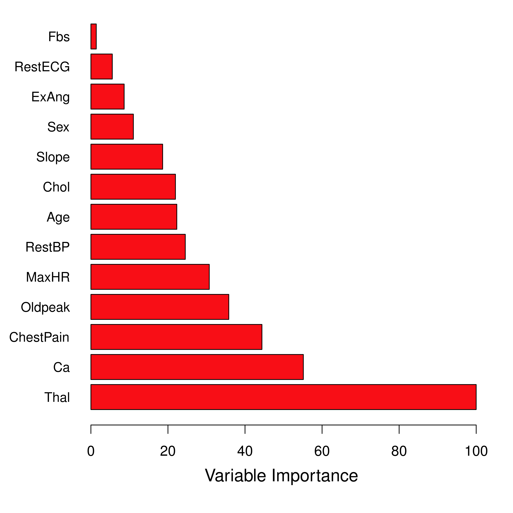{fig-align="center"}
:::

. . .

::: {.concept-box}
**如何衡量变量重要性**

计算每个变量在所有树的所有分裂中带来的 RSS 减少总量。分裂越频繁、RSS 减少越大的变量越重要。
:::

## Python 演示：随机森林

::: {style="font-size: 1em;"}
```{python}
#| echo: true
#| eval: true
#| output: true
#| fig-width: 12
#| fig-height: 5

from sklearn.ensemble import RandomForestRegressor
from sklearn.model_selection import cross_val_score

np.random.seed(42)
n = 300
X_rf = np.random.uniform(0, 10, (n, 5))
y_rf = (np.sin(X_rf[:, 0]) + 0.5 * X_rf[:, 1] +
        0.2 * X_rf[:, 0] * X_rf[:, 1] + np.random.normal(0, 0.5, n))

fig, axes = plt.subplots(1, 2, figsize=(12, 5))

# Left: Single tree vs Random Forest prediction
tree_single = DecisionTreeRegressor(max_depth=5, random_state=42)
rf = RandomForestRegressor(n_estimators=100, max_depth=5, random_state=42)

x1_grid = np.linspace(0, 10, 100)
X_plot_rf = np.column_stack([x1_grid, np.full(100, 5), np.full(100, 5),
                             np.full(100, 5), np.full(100, 5)])

tree_single.fit(X_rf, y_rf)
rf.fit(X_rf, y_rf)

axes[0].plot(x1_grid, tree_single.predict(X_plot_rf), 'b--', alpha=0.7, label='Single Tree')
axes[0].plot(x1_grid, rf.predict(X_plot_rf), 'r-', linewidth=2, label='Random Forest')
axes[0].set_xlabel('$X_1$', fontsize=12)
axes[0].set_ylabel('Predicted y', fontsize=12)
axes[0].set_title('Single Tree vs. Random Forest', fontsize=13)
axes[0].legend(fontsize=11)

# Right: Variable importance
importances = rf.feature_importances_
features = ['$X_1$', '$X_2$', '$X_3$', '$X_4$', '$X_5$']
sorted_idx = np.argsort(importances)
axes[1].barh(range(5), importances[sorted_idx], color='steelblue')
axes[1].set_yticks(range(5))
axes[1].set_yticklabels([features[i] for i in sorted_idx])
axes[1].set_xlabel('Importance', fontsize=12)
axes[1].set_title('Variable Importance', fontsize=13)

plt.tight_layout()
plt.show()
```

:::

## 超参数调优

::: {.concept-box}
**随机森林的主要超参数**

| 参数 | 含义 | 典型值 |
|:---|:---|:---|
| *n_estimators* | 树的数量 $B$ | 100–500 |
| *max_depth* | 每棵树的最大深度 | None 或 5–20 |
| *max_features* | 每次分裂考虑的特征数 $m$ | $\sqrt{p}$ 或 $p/3$ |
| *min_samples_leaf* | 叶节点最小样本数 | 1–10 |
:::

. . .

> 所有超参数都应通过 *交叉验证* 选择——这就是本讲各部分的串联逻辑。

# 总结与展望 {background-color=“#AE0B2A“}

## 本讲要点（一）

::: {.concept-box}

1. *从因果推断到机器学习*
   - 因果推断关注“为什么”，机器学习关注“如何预测”
   - 两者正在融合——后续讲义的核心

2. *偏差-方差权衡*
   - 模型复杂度需要平衡偏差和方差
   - 测试误差 = 偏差² + 方差 + 不可约误差

3. *交叉验证*
   - K 折 CV 是估计测试误差的标准方法
   - 通常取 K = 5 或 10

:::

## 本讲要点（二）

::: {.concept-box}

4. *回归树*
   - 递归二元分裂，通过代价复杂度剪枝控制复杂度
   - 直观可解释，但预测精度有限

5. *随机森林*
   - Bagging + 随机特征选择 → 去相关 → 降低方差
   - 强大且稳健的预测工具

:::

## 推荐工具

:::: {.columns}

::: {.column width="50%"}
::: {.callout-tip}
**Python**

- `scikit-learn`：DecisionTreeRegressor, RandomForestRegressor
- `cross_val_score`：交叉验证
- `matplotlib`：可视化
:::
:::

::: {.column width="50%"}
::: {.callout-tip}
**R**

- `rpart`：回归树
- `randomForest`：经典随机森林
- `ranger`：快速随机森林（推荐）
- `caret`/`tidymodels`：统一建模框架
:::
:::

::::

## 下节课预告

**第八讲：机器学习基础 II——梯度提升、正则化与模型选择**

- 正则化方法（LASSO、Ridge）
- 梯度提升（Gradient Boosting）
- 模型选择与评估
- 从预测到因果：如何桥接

. . .

::: {.concept-box}
*核心思想*

正则化和梯度提升从不同角度解决过拟合问题。掌握这些工具后，我们将进入因果机器学习的核心——用 ML 方法估计异质性处理效应。
:::

# 参考文献

- Breiman, L. (2001). Statistical Modeling: The Two Cultures. Statistical Science, 16(3), 199-231.

- James, G., Witten, D., Hastie, T., & Tibshirani, R. (2021). An Introduction to Statistical Learning: with Applications in Python. Springer. Chapters 2, 5, 8.

- Hastie, T., Tibshirani, R., & Friedman, J. (2009). The Elements of Statistical Learning (2nd ed.). Springer. Chapters 9, 15.

- Athey, S., & Imbens, G. W. (2019). Machine Learning Methods That Economists Should Know About. Annual Review of Economics, 11, 685-725.

- Mullainathan, S., & Spiess, J. (2017). Machine Learning: An Applied Econometric Approach. Journal of Economic Perspectives, 31(2), 87-106.
