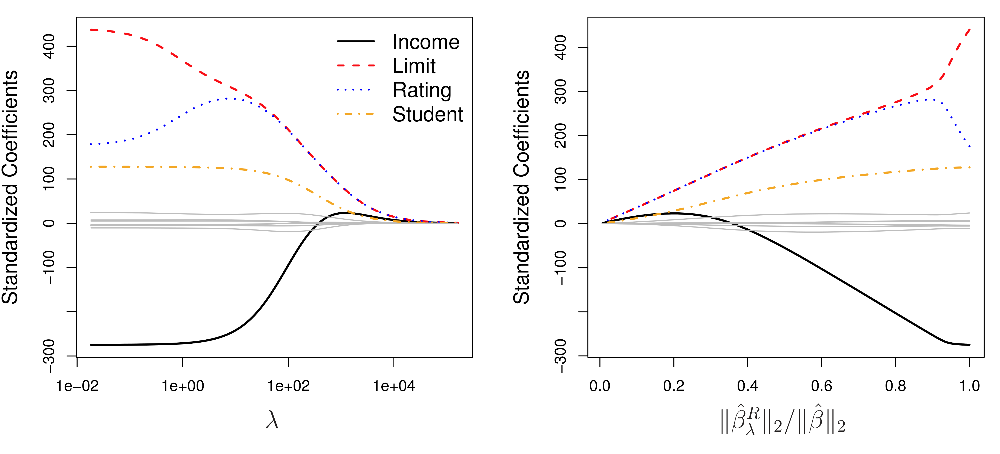
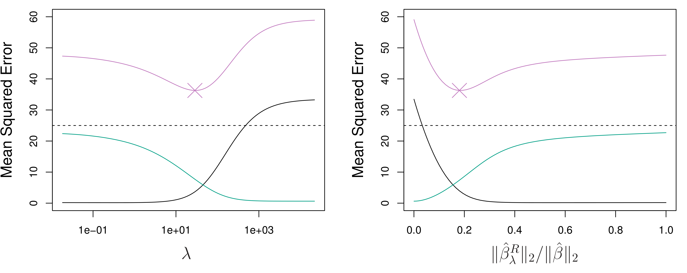
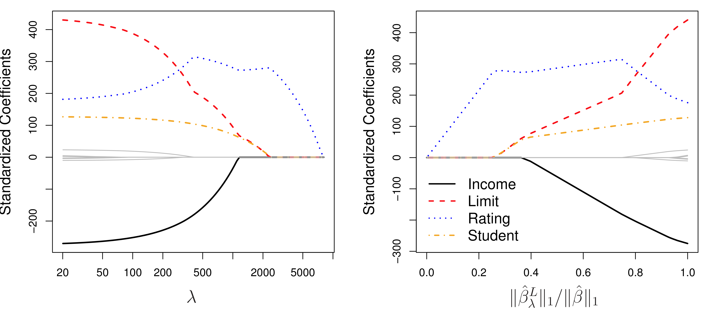
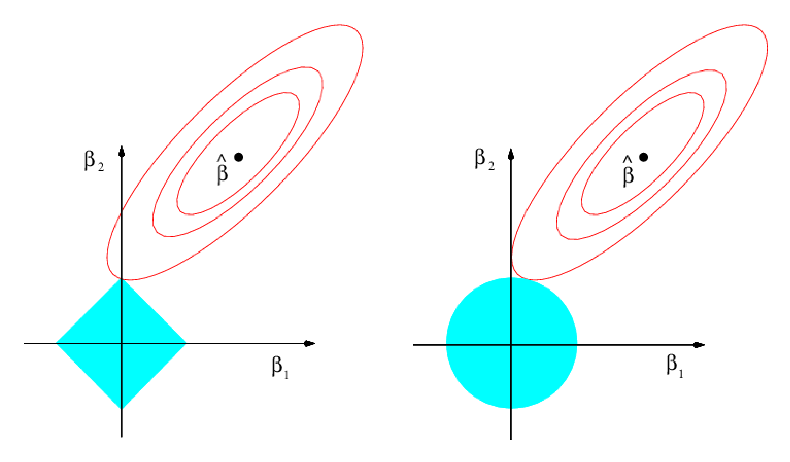
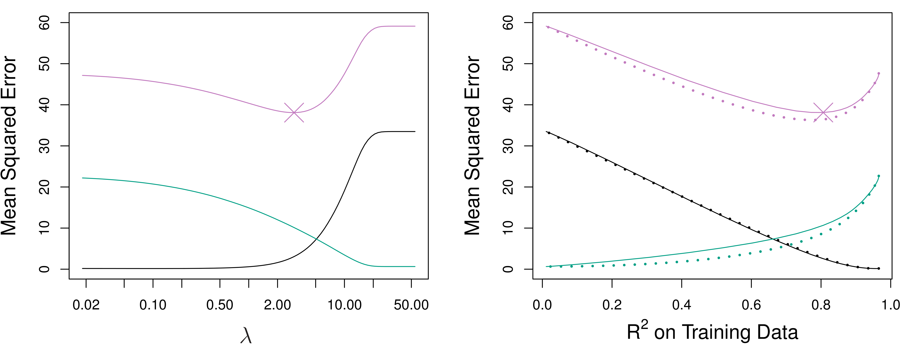
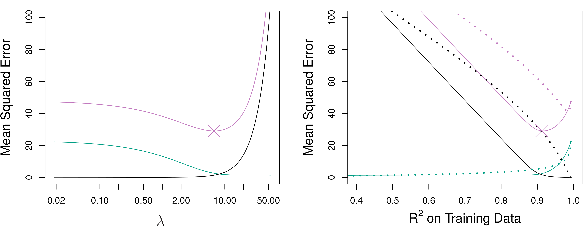
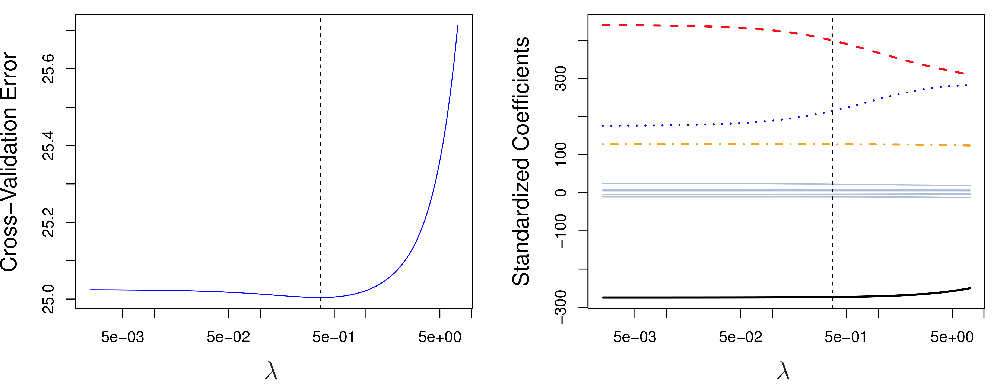
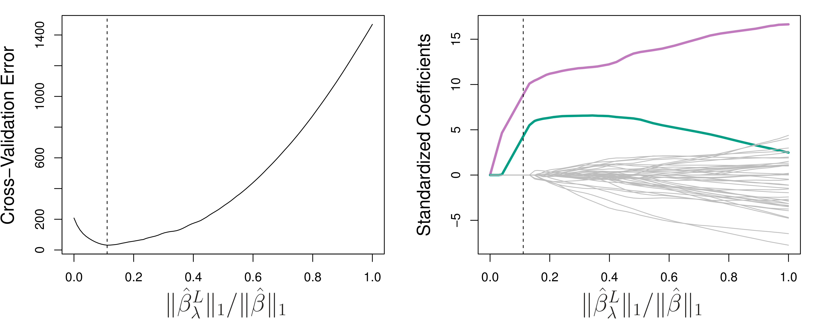
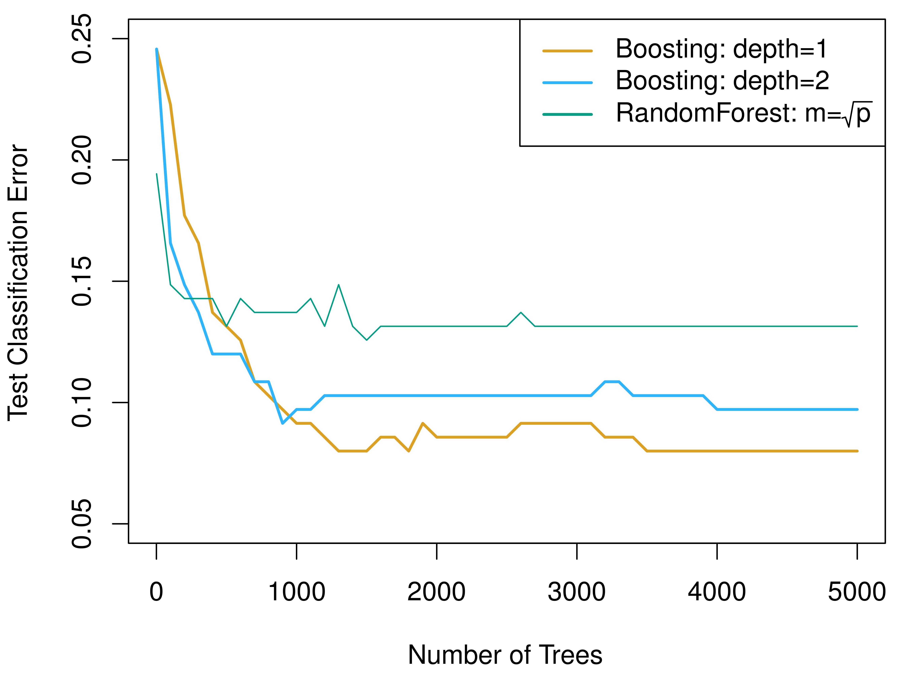
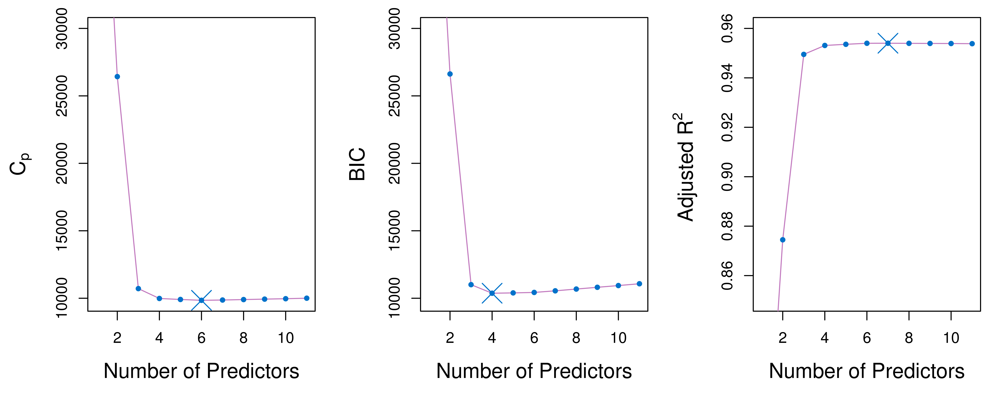

## 上节课回顾

::: {.concept-box}
**机器学习基础 I**

- *偏差-方差权衡*：模型复杂度需要平衡偏差和方差，测试误差呈 U 形
- *交叉验证*：K 折 CV 估计样本外预测误差，通常取 $K = 5$ 或 $10$
- *回归树*：递归二元分裂 + 代价复杂度剪枝，直观但高方差
- *随机森林*：Bagging + 随机特征选择 → 去相关 → 降低方差
:::

. . .

*本节课目标*

- 掌握正则化方法（Ridge、LASSO）的原理与适用场景
- 理解梯度提升的算法思想
- 学会模型选择的信息准则与交叉验证方法
- 理解 ML 方法如何桥接因果推断

# 正则化线性回归 {background-color="#AE0B2A"}

## 为什么需要正则化

::: {.concept-box}
**高维回归的困境**

当特征数 $p$ 相对于样本量 $n$ 较大时，OLS 面临严重问题：

$$\hat{\beta}_{OLS} = (\mathbf{X}'\mathbf{X})^{-1}\mathbf{X}'\mathbf{y}$$

- 当 $p > n$ 时，$\mathbf{X}'\mathbf{X}$ 不可逆，OLS 无解
- 即使 $p < n$，当 $p/n$ 较大时，OLS 估计方差极大
:::

. . .

*解决思路*：往目标函数中加入 *惩罚项*，限制系数大小

$$\min_{\beta} \underbrace{\sum_{i=1}^{n}(y_i - X_i'\beta)^2}_{\text{拟合优度}} + \underbrace{\lambda \cdot \text{Penalty}(\beta)}_{\text{复杂度惩罚}}$$

## 正则化的统一框架

::: {.concept-box}
**惩罚回归的一般形式**

$$\min_{\beta} \sum_{i=1}^{n}(y_i - X_i'\beta)^2 + \lambda \left(\sum_{k=1}^{p}|\beta_k|^q\right)^{1/q}$$

其中 $\lambda \geq 0$ 为惩罚强度，通过交叉验证选择。
:::

. . .

| $q$ 的取值 | 方法名称 | 特点 |
|:---|:---|:---|
| *$q = 1$* | LASSO | 产生稀疏解（自动变量选择） |
| *$q = 2$* | Ridge 回归 | 系数均匀收缩，不产生零 |
| *$q \to 0$* | 最优子集回归 | NP 难，计算不可行 |

## Ridge 回归（$q = 2$）

::: {.concept-box}
**Ridge 回归**

$$\min_{\beta} \sum_{i=1}^{n}(y_i - X_i'\beta)^2 + \lambda \sum_{k=1}^{p}\beta_k^2$$

闭式解：$\hat{\beta}_{Ridge} = (\mathbf{X}'\mathbf{X} + \lambda \mathbf{I})^{-1}\mathbf{X}'\mathbf{y}$
:::

. . .

::: {.intro-mermaid}
{fig-align="center"}
:::

## Ridge 回归的偏差-方差权衡

::: {.intro-mermaid}
{fig-align="center"}
:::

. . .

- $\lambda = 0$：退化为 OLS，偏差最小但方差最大
- $\lambda \to \infty$：所有系数趋于零，方差最小但偏差最大
- *最优 $\lambda$*：使测试 MSE（紫色曲线）最小

## LASSO（$q = 1$）

::: {.concept-box}
**LASSO（Least Absolute Shrinkage and Selection Operator）**

$$\min_{\beta} \sum_{i=1}^{n}(y_i - X_i'\beta)^2 + \lambda \sum_{k=1}^{p}|\beta_k|$$

与 Ridge 不同，LASSO 可以将部分系数 *精确地压缩为零*——自动实现变量选择。
:::

. . .

::: {.intro-mermaid}
{fig-align="center"}
:::

## 为什么 LASSO 产生稀疏解

::: {.intro-mermaid}
{fig-align="center"}
:::

. . .

::: {.example-box}
**几何直觉**

- *左图*（LASSO）：$L_1$ 约束区域是菱形，等高线最先碰到角点 → 系数为零
- *右图*（Ridge）：$L_2$ 约束区域是圆形，等高线碰到曲面 → 系数接近零但不为零
:::

## LASSO vs Ridge 性能对比

:::: {.columns}

::: {.column width="50%"}
::: {.intro-mermaid}
{fig-align="center"}
:::

*多数系数非零时*：Ridge 可能更好
:::

::: {.column width="50%"}
::: {.intro-mermaid}
{fig-align="center"}
:::

*只有少数系数非零时*：LASSO 更好
:::

::::

. . .

> 现实中我们不知道真实模型是密集还是稀疏——Elastic Net 是折中方案。

## Elastic Net 与混合方法

::: {.concept-box}
**Elastic Net**

结合 LASSO 和 Ridge 的优点：

$$\min_{\beta} \sum_{i=1}^{n}(y_i - X_i'\beta)^2 + \lambda \left[\alpha \sum_{k=1}^{p}|\beta_k| + (1-\alpha)\sum_{k=1}^{p}\beta_k^2 \right]$$

- $\alpha = 1$：退化为 LASSO
- $\alpha = 0$：退化为 Ridge
- $0 < \alpha < 1$：兼顾变量选择和系数收缩
:::

. . .

::: {.warning-box}
**Relaxed LASSO**

先用 LASSO 选择非零变量，再对选中的变量做 OLS——结合了变量选择和无偏估计。
:::

## 超参数选择：交叉验证

::: {.intro-mermaid}
{fig-align="center"}
:::

. . .

- *左图*：对不同 $\lambda$ 值计算 10 折 CV 误差
- *右图*：对应的系数路径
- 虚线标记最优 $\lambda$——即 CV 误差最小处

## LASSO 的交叉验证选择

::: {.intro-mermaid}
{fig-align="center"}
:::

. . .

::: {.concept-box}
**"一个标准误"规则**

实践中常选择 CV 误差在最小值 *一个标准误以内* 的最简模型——遵循奥卡姆剃刀原则。
:::

## Python 演示：LASSO 与 Ridge

::: {style="font-size: 1em;"}
```{python}
#| echo: true
#| eval: true
#| output: true
#| fig-width: 12
#| fig-height: 5

import numpy as np
import matplotlib.pyplot as plt
from sklearn.linear_model import Ridge, Lasso, LassoCV, RidgeCV
from sklearn.preprocessing import StandardScaler
from sklearn.model_selection import cross_val_score

np.random.seed(42)
n, p = 100, 20
X = np.random.randn(n, p)
beta_true = np.zeros(p)
beta_true[:5] = [3, -2, 1.5, -1, 0.5]  # 只有5个非零系数
y = X @ beta_true + np.random.randn(n) * 0.5

scaler = StandardScaler()
X_scaled = scaler.fit_transform(X)

# 系数路径
alphas = np.logspace(-3, 3, 100)
ridge_coefs, lasso_coefs = [], []

for a in alphas:
    ridge_coefs.append(Ridge(alpha=a).fit(X_scaled, y).coef_)
    lasso_coefs.append(Lasso(alpha=a, max_iter=10000).fit(X_scaled, y).coef_)

fig, axes = plt.subplots(1, 2, figsize=(12, 5))

for i in range(p):
    color = 'red' if i < 5 else 'gray'
    alpha_line = 0.9 if i < 5 else 0.3
    axes[0].plot(np.log10(alphas), [c[i] for c in ridge_coefs],
                 color=color, alpha=alpha_line)
    axes[1].plot(np.log10(alphas), [c[i] for c in lasso_coefs],
                 color=color, alpha=alpha_line)

axes[0].set_xlabel('log₁₀(λ)', fontsize=12)
axes[0].set_ylabel('Coefficients', fontsize=12)
axes[0].set_title('Ridge Regression', fontsize=14)
axes[0].axhline(y=0, color='black', linestyle='-', linewidth=0.5)

axes[1].set_xlabel('log₁₀(λ)', fontsize=12)
axes[1].set_ylabel('Coefficients', fontsize=12)
axes[1].set_title('LASSO', fontsize=14)
axes[1].axhline(y=0, color='black', linestyle='-', linewidth=0.5)

plt.tight_layout()
plt.show()
```

:::

## 正则化在经济学中的重要性

::: {.example-box}
**高维控制变量问题**

在因果推断中，我们经常需要控制大量混淆变量：

$$Y_i = \tau D_i + X_i'\beta + \epsilon_i$$

当控制变量 $X$ 的维度很高时，OLS 估计 $\tau$ 可能不可靠。LASSO 可以帮助选择重要的控制变量。
:::

. . .

::: {.warning-box}
**但不能直接用 LASSO 估计因果效应**

LASSO 对 $\beta$ 的估计是有偏的（收缩偏差）。直接用 LASSO 估计 $\tau$ 会导致正则化偏差。

→ 解决方案：*双重机器学习*（Double ML），第 13 讲将详细介绍。
:::

# 梯度提升 {background-color="#AE0B2A"}

## 集成学习的两条路径

::: {.concept-box}
**并行 vs 顺序集成**

| 方法 | 核心思想 | 代表算法 |
|:---|:---|:---|
| *并行集成*（Bagging） | 独立训练多个模型，取平均 | 随机森林 |
| *顺序集成*（Boosting） | 每个新模型修正前一个的错误 | 梯度提升 |
:::

. . .

*类比*

- *随机森林*：100 个独立专家各自判断，投票表决
- *梯度提升*：一个学生反复练习，每次专注纠正上次做错的题

## Boosting 的核心思想

::: {.concept-box}
**从错误中学习**

Boosting 的关键洞察：将一系列 *弱学习器*（weak learner）逐步组合成一个 *强学习器*。

每一轮新增一棵小树（通常深度只有 1-3），专门拟合前一轮的 *残差*。
:::

. . .

$$\hat{f}(x) = \sum_{b=1}^{B} \lambda \cdot \hat{f}_b(x)$$

其中每棵树 $\hat{f}_b$ 拟合的不是原始 $y$，而是上一轮的残差：

$$r_i^{(b)} = y_i - \hat{f}^{(b-1)}(x_i)$$

## 梯度提升算法

::: {.concept-box}
**Gradient Boosting 算法步骤**

1. 初始化：$\hat{f}^{(0)}(x) = \bar{y}$

2. 对 $b = 1, 2, \ldots, B$：

   a. 计算残差：$r_i^{(b)} = y_i - \hat{f}^{(b-1)}(x_i)$

   b. 对残差拟合一棵深度为 $d$ 的回归树 $\hat{f}_b(x)$

   c. 更新模型：$\hat{f}^{(b)}(x) = \hat{f}^{(b-1)}(x) + \lambda \cdot \hat{f}_b(x)$

3. 输出：$\hat{f}^{(B)}(x) = \sum_{b=1}^{B}\lambda\hat{f}_b(x)$
:::

. . .

> 学习率 $\lambda$（shrinkage）控制每棵树贡献的大小——通常取 $0.01 \sim 0.1$。

## Boosting 的关键超参数

| 参数 | 含义 | 影响 | 典型值 |
|:---|:---|:---|:---|
| *$B$*（树的数量） | 迭代次数 | 太大 → 过拟合 | 100–5000 |
| *$\lambda$*（学习率） | 每棵树的贡献权重 | 越小越稳健，但需要更多树 | 0.01–0.1 |
| *$d$*（树深度） | 每棵树的交互阶 | $d=1$（树桩）= 加法模型 | 1–6 |

. . .

::: {.warning-box}
**$d$ 的含义**

深度 $d$ 决定了模型能捕捉的交互效应阶数。$d=1$ 限制为加法模型（无交互），$d=2$ 允许两两交互……大多数应用中 $d=4\sim6$ 就已足够。
:::

## Boosting vs Random Forest

::: {.intro-mermaid}
{fig-align="center"}
:::

. . .

- *Boosting*（深度 1 和 2）与 *随机森林* 在预测精度上通常相当
- Boosting 的优势在于可以通过调节 $d$ 控制模型复杂度

## XGBoost：工业级梯度提升

::: {.concept-box}
**XGBoost 的关键改进**

在传统梯度提升基础上，XGBoost（Chen & Guestrin, 2016）引入：

- *正则化目标函数*：同时惩罚树的复杂度和叶节点权重
- *二阶泰勒展开*：使用 Newton 步长代替一阶梯度
- *列采样*：类似随机森林的特征子采样
- *高效实现*：并行计算、缓存优化、稀疏数据处理
:::

. . .

> XGBoost 是 Kaggle 竞赛中最常用的算法之一，也广泛应用于工业界。

## Python 演示：梯度提升

::: {style="font-size: 1em;"}
```{python}
#| echo: true
#| eval: true
#| output: true
#| fig-width: 12
#| fig-height: 5

from sklearn.ensemble import GradientBoostingRegressor, RandomForestRegressor
from sklearn.model_selection import cross_val_score
import numpy as np
import matplotlib.pyplot as plt

np.random.seed(42)
n = 500
X = np.random.uniform(0, 10, (n, 5))
y = (np.sin(X[:, 0]) + 0.5 * X[:, 1] +
     0.3 * X[:, 0] * X[:, 1] + np.random.normal(0, 0.5, n))

fig, axes = plt.subplots(1, 2, figsize=(12, 5))

# Left: Boosting with different learning rates
n_trees_range = [10, 50, 100, 200, 500]
for lr, style in [(0.01, '--'), (0.1, '-'), (0.5, ':')]:
    scores = []
    for n_trees in n_trees_range:
        gb = GradientBoostingRegressor(n_estimators=n_trees,
                                        learning_rate=lr, max_depth=3,
                                        random_state=42)
        cv = -cross_val_score(gb, X, y, cv=5,
                              scoring='neg_mean_squared_error').mean()
        scores.append(cv)
    axes[0].plot(n_trees_range, scores, style, marker='o',
                 markersize=4, label=f'λ={lr}')

axes[0].set_xlabel('Number of Trees (B)', fontsize=12)
axes[0].set_ylabel('5-Fold CV MSE', fontsize=12)
axes[0].set_title('Gradient Boosting: Learning Rate Effect', fontsize=13)
axes[0].legend(fontsize=10)

# Right: GBM vs RF comparison
methods = {'Random Forest': RandomForestRegressor(n_estimators=200,
                                                   max_depth=5,
                                                   random_state=42),
           'GBM (d=1)': GradientBoostingRegressor(n_estimators=200,
                                                    learning_rate=0.1,
                                                    max_depth=1,
                                                    random_state=42),
           'GBM (d=3)': GradientBoostingRegressor(n_estimators=200,
                                                    learning_rate=0.1,
                                                    max_depth=3,
                                                    random_state=42),
           'GBM (d=5)': GradientBoostingRegressor(n_estimators=200,
                                                    learning_rate=0.1,
                                                    max_depth=5,
                                                    random_state=42)}

names, mse_vals = [], []
for name, model in methods.items():
    cv = -cross_val_score(model, X, y, cv=5,
                          scoring='neg_mean_squared_error').mean()
    names.append(name)
    mse_vals.append(cv)

colors = ['steelblue', '#e8b339', '#d4690e', '#AE0B2A']
axes[1].barh(names, mse_vals, color=colors)
axes[1].set_xlabel('5-Fold CV MSE', fontsize=12)
axes[1].set_title('Method Comparison', fontsize=13)
axes[1].invert_yaxis()

plt.tight_layout()
plt.show()
```

:::

## Boosting 的最佳实践

::: {.warning-box}
**常见陷阱**

- 树太多 + 学习率太大 → 过拟合
- 树太深 + 样本太少 → 过拟合
- 忘记标准化特征 → 对正则化无影响，但对 Ridge/LASSO 影响大
:::

. . .

::: {.callout-tip}
**实践建议**

- 设置较小的学习率（$\lambda \leq 0.1$），配合较多的树
- 使用 *Early Stopping*：监控验证集误差，在误差不再下降时停止
- 通过交叉验证联合调优 $B$、$\lambda$、$d$
:::

# 模型选择与评估 {background-color="#AE0B2A"}

## 模型选择的两种思路

::: {.concept-box}
**如何选择最优模型**

| 策略 | 方法 | 核心思想 |
|:---|:---|:---|
| *间接估计测试误差* | $C_p$、AIC、BIC | 在训练误差基础上加惩罚项 |
| *直接估计测试误差* | 交叉验证 | 模拟训练-测试过程 |
:::

. . .

> 上节课我们详细讲了交叉验证；本节补充信息准则方法。

## 信息准则

::: {.concept-box}
**三种常用信息准则**

- *调整 $R^2$*：$\bar{R}^2 = 1 - \frac{(1-R^2)(n-1)}{n-k-1}$

- *AIC*（Akaike 信息准则）：$AIC = 2k + n\ln\left(\frac{RSS}{n}\right)$

- *BIC*（贝叶斯信息准则）：$BIC = k\ln(n) - 2\text{LLF}$
:::

. . .

::: {.intro-mermaid}
{fig-align="center"}
:::

## AIC vs BIC

| 准则 | 惩罚项 | 特点 |
|:---|:---|:---|
| *AIC* | $2k$ | 偏向保留更多变量 |
| *BIC* | $k\ln(n)$ | 当 $n \geq 8$ 时，$k\ln(n) > 2k$，惩罚更重 |

. . .

::: {.example-box}
**何时用哪个**

- *AIC*：目标是预测——宁可保留一些不显著的变量
- *BIC*：目标是发现真实模型——更倾向简约模型
- *交叉验证*：最灵活，不依赖模型假设——但计算量更大
:::

## 模型选择策略比较

::: {.concept-box}
**子集选择 vs 正则化 vs 交叉验证**

| 策略 | 优点 | 缺点 |
|:---|:---|:---|
| *最优子集* | 考虑所有组合 | $2^p$ 种模型，计算爆炸 |
| *前向/后向选择* | 贪心但快速 | 可能错过最优组合 |
| *LASSO* | 自动选择 + 连续路径 | 系数有偏 |
| *Ridge + CV* | 稳定收缩 | 不做变量选择 |
| *Elastic Net* | 兼顾两者 | 多一个超参数 $\alpha$ |
:::

. . .

> 实践中，*LASSO + 交叉验证* 是最常用的组合方案。

## ML 方法综合比较

| 方法 | 是否线性 | 自动变量选择 | 处理交互 | 可解释性 |
|:---|:---:|:---:|:---:|:---:|
| *OLS* | ✓ | ✗ | 需手动 | 高 |
| *Ridge* | ✓ | ✗ | 需手动 | 高 |
| *LASSO* | ✓ | ✓ | 需手动 | 高 |
| *回归树* | ✗ | ✓ | ✓ | 高 |
| *随机森林* | ✗ | ✓ | ✓ | 中 |
| *梯度提升* | ✗ | ✓ | ✓ | 低-中 |

. . .

> 没有"最好"的方法——选择取决于数据特征、目标和约束。

## Python 演示：多方法对比

::: {style="font-size: 1em;"}
```{python}
#| echo: true
#| eval: true
#| output: true
#| fig-width: 10
#| fig-height: 5

from sklearn.linear_model import LinearRegression, Ridge, Lasso, ElasticNet
from sklearn.tree import DecisionTreeRegressor
from sklearn.ensemble import RandomForestRegressor, GradientBoostingRegressor
from sklearn.model_selection import cross_val_score
import numpy as np
import matplotlib.pyplot as plt

np.random.seed(42)
n = 300
X = np.random.randn(n, 10)
y = (2*X[:, 0] - 1.5*X[:, 1] + np.sin(3*X[:, 2]) +
     0.5*X[:, 0]*X[:, 1] + np.random.randn(n)*0.5)

models = {
    'OLS': LinearRegression(),
    'Ridge': Ridge(alpha=1.0),
    'LASSO': Lasso(alpha=0.1),
    'Elastic Net': ElasticNet(alpha=0.1, l1_ratio=0.5),
    'Decision Tree': DecisionTreeRegressor(max_depth=5, random_state=42),
    'Random Forest': RandomForestRegressor(n_estimators=100, max_depth=5,
                                           random_state=42),
    'Gradient Boost': GradientBoostingRegressor(n_estimators=100,
                                                 learning_rate=0.1,
                                                 max_depth=3, random_state=42),
}

results = {}
for name, model in models.items():
    scores = cross_val_score(model, X, y, cv=10,
                             scoring='neg_mean_squared_error')
    results[name] = {'mean': -scores.mean(), 'std': scores.std()}

fig, ax = plt.subplots(figsize=(10, 5))
names = list(results.keys())
means = [results[n]['mean'] for n in names]
stds = [results[n]['std'] for n in names]

colors = ['#666', '#4a90d9', '#4a90d9', '#4a90d9',
          '#e8b339', '#2d8659', '#AE0B2A']
bars = ax.barh(names, means, xerr=stds, color=colors, capsize=3)
ax.set_xlabel('10-Fold CV MSE (lower is better)', fontsize=12)
ax.set_title('Model Comparison on Simulated Data', fontsize=14)
ax.invert_yaxis()

plt.tight_layout()
plt.show()
```

:::

# 从预测到因果 {background-color="#AE0B2A"}

## ML 与因果推断的关系

::: {.concept-box}
**预测 ≠ 因果，但 ML 可以辅助因果推断**

- *预测问题*：给定 $X$，预测 $Y$——不关心"为什么"
- *因果问题*：改变 $D$，$Y$ 会如何变化——需要识别策略

两者的本质区别在于 *反事实*：因果推断需要回答"如果没有干预，结果会怎样？"
:::

. . .

> ML 不能替代因果推断，但能在 *三个关键环节* 提供强大支持。

## ML 在因果推断中的三大角色

::: {.example-box}
**ML 如何辅助因果推断**

| 角色 | 问题 | ML 方法 | 对应课程 |
|:---|:---|:---|:---|
| *高维控制* | 如何从大量变量中选择控制变量 | LASSO、Elastic Net | 第 13 讲 |
| *异质性效应* | 处理效应是否因人而异 | 因果森林、GRF | 第 11-12 讲 |
| *去偏估计* | 如何消除 ML 带来的正则化偏差 | DML、交叉拟合 | 第 13 讲 |
:::

. . .

> 这三个方向构成了 *因果机器学习*（Causal ML）的核心框架。

## 课程路线图

```{mermaid}
%%| fig-responsive: true
flowchart LR
    A["第 7-8 讲\nML 基础"] --> B["第 9 讲\n广义随机森林\nGRF"]
    A --> C["第 13 讲\n双重机器学习\nDML"]
    B --> D["第 10 讲\n因果森林"]
    D --> E["异质性\n处理效应"]
    C --> F["去偏\n因果估计"]
    E --> G["第 14 讲\n前沿专题"]
    F --> G

    style A fill:#AE0B2A,color:#fff,stroke:#8a0922
    style B fill:#4a90d9,color:#fff,stroke:#3a7bc8
    style C fill:#4a90d9,color:#fff,stroke:#3a7bc8
    style D fill:#4a90d9,color:#fff,stroke:#3a7bc8
    style E fill:#2d8659,color:#fff,stroke:#1d7649
    style F fill:#2d8659,color:#fff,stroke:#1d7649
    style G fill:#e8b339,color:#000,stroke:#d4a030
```

. . .

::: {.concept-box}
*核心思想*

ML 提供强大的预测工具，因果推断提供识别策略。将两者结合，才能在高维复杂场景中可靠地回答因果问题。
:::

# 总结与展望 {background-color="#AE0B2A"}

## 本讲要点（一）

::: {.concept-box}

1. *正则化线性回归*
   - Ridge（$L_2$ 惩罚）均匀收缩系数，LASSO（$L_1$ 惩罚）自动变量选择
   - Elastic Net 结合两者优点，$\lambda$ 通过交叉验证选择

2. *梯度提升*
   - 顺序地训练弱学习器（浅树），每轮拟合残差
   - 关键超参数：树数量 $B$、学习率 $\lambda$、树深度 $d$
   - XGBoost 是工业级实现

:::

## 本讲要点（二）

::: {.concept-box}

3. *模型选择*
   - 信息准则（AIC、BIC）间接估计测试误差
   - 交叉验证直接估计测试误差——更灵活更可靠

4. *从预测到因果*
   - ML 在因果推断中三大角色：高维控制、异质性效应、去偏估计
   - 后续课程将深入 GRF、因果森林、双重 ML

:::

## 推荐工具

:::: {.columns}

::: {.column width="50%"}
::: {.callout-tip}
**Python**

- `scikit-learn`：Ridge, Lasso, ElasticNet, GradientBoostingRegressor
- `xgboost`：XGBRegressor（推荐）
- `lightgbm`：LGBMRegressor（更快）
:::
:::

::: {.column width="50%"}
::: {.callout-tip}
**R**

- `glmnet`：Ridge, LASSO, Elastic Net（推荐）
- `xgboost`：梯度提升
- `caret`/`tidymodels`：统一建模框架
:::
:::

::::

## 下节课预告

**第九讲：广义随机森林——异质性处理效应**

- 从随机森林到因果森林的理论基础
- 异质性处理效应（HTE）的估计
- 广义随机森林（GRF）的算法与置信区间
- 实证应用案例

. . .

::: {.concept-box}
*核心思想*

随机森林不仅可以用来预测，还可以用来估计 *条件平均处理效应*（CATE）——不同个体对政策干预的反应差异。
:::

# 参考文献

- James, G., Witten, D., Hastie, T., & Tibshirani, R. (2021). An Introduction to Statistical Learning: with Applications in Python. Springer. Chapters 6, 8.

- Hastie, T., Tibshirani, R., & Friedman, J. (2009). The Elements of Statistical Learning (2nd ed.). Springer. Chapter 10.

- Tibshirani, R. (1996). Regression Shrinkage and Selection via the Lasso. Journal of the Royal Statistical Society: Series B, 58(1), 267-288.

- Chen, T., & Guestrin, C. (2016). XGBoost: A Scalable Tree Boosting System. KDD 2016, 785-794.

- Friedman, J. H. (2001). Greedy Function Approximation: A Gradient Boosting Machine. Annals of Statistics, 29(5), 1189-1232.

- Athey, S., & Imbens, G. W. (2019). Machine Learning Methods That Economists Should Know About. Annual Review of Economics, 11, 685-725.

- Mullainathan, S., & Spiess, J. (2017). Machine Learning: An Applied Econometric Approach. Journal of Economic Perspectives, 31(2), 87-106.
